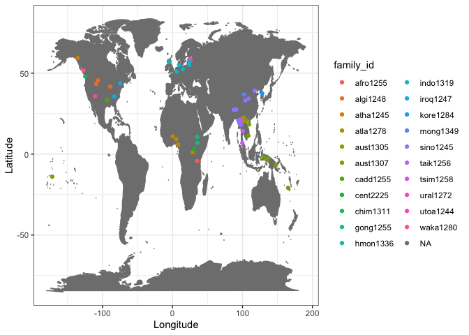

Tono DB preliminary analyses
================
Steven Moran and Lilja Maria Sæbø
2023-06-09

``` r
library(tidyverse)
library(knitr)
```

Load the [CLDF data](https://github.com/cldf-datasets/tonodb/).

``` r
values <- 
  read_csv(url('https://raw.githubusercontent.com/cldf-datasets/tonodb/main/cldf/values.csv'))
languages <- 
  read_csv(url('https://raw.githubusercontent.com/cldf-datasets/tonodb/main/cldf/languages.csv'))
contributions <- 
  read_csv(url('https://raw.githubusercontent.com/cldf-datasets/tonodb/main/cldf/contributions.csv'))
parameters <- 
  read_csv(url('https://raw.githubusercontent.com/cldf-datasets/tonodb/main/cldf/parameters.csv'))
```

We have this many languages in our sample.

``` r
nrow(languages)
```

    ## [1] 79

And this many observations.

``` r
nrow(values)
```

    ## [1] 229

Let’s map our data points.

``` r
ggplot(data=languages, aes(x=Longitude, y=Latitude)) + 
  borders("world", colour="gray50", fill="gray50") + 
  geom_point() +
  theme_bw()
```

    ## Warning: Removed 23 rows containing missing values (`geom_point()`).

<!-- -->

Note that 23 data points are removed due to NAs in the data. TODO: fix
these by adjusting the Glottocodes in the spreadsheet.

``` r
languages %>% filter(is.na(Latitude)) %>% kable()
```

| ID       | Name                            | Macroarea     | Latitude | Longitude | Glottocode | ISO639P3code | family_id | parent_id | bookkeeping | level   | description | markup_description | child_family_count | child_language_count | child_dialect_count | country_ids |
|:---------|:--------------------------------|:--------------|---------:|----------:|:-----------|:-------------|:----------|:----------|:------------|:--------|:------------|:-------------------|-------------------:|---------------------:|--------------------:|:------------|
| atha1247 | Athabaskan                      | NA            |       NA |        NA | atha1247   | NA           | atha1245  | atha1246  | FALSE       | family  | NA          | NA                 |                 25 |                   44 |                  57 | NA          |
| auks1239 | Aukshtaitish                    | Eurasia       |       NA |        NA | auks1239   | NA           | indo1319  | lith1251  | FALSE       | dialect | NA          | NA                 |                  0 |                    0 |                   3 | NA          |
| cant1236 | Cantonese                       | Eurasia       |       NA |        NA | cant1236   | NA           | sino1245  | yueh1236  | FALSE       | dialect | NA          | NA                 |                  0 |                    0 |                   5 | NA          |
| cent2346 | Central Tibetan                 | NA            |       NA |        NA | cent2346   | NA           | sino1245  | late1253  | FALSE       | family  | NA          | NA                 |                  7 |                   16 |                  33 | NA          |
| coas1300 | Coast Tsimshian                 | North America |       NA |        NA | coas1300   | NA           | tsim1258  | nucl1649  | FALSE       | dialect | NA          | NA                 |                  0 |                    0 |                   0 | NA          |
| east2280 | Eastern Baltic                  | NA            |       NA |        NA | east2280   | NA           | indo1319  | balt1263  | FALSE       | family  | NA          | NA                 |                  0 |                    2 |                  12 | NA          |
| extr1245 | Extreme Southern New Caledonian | NA            |       NA |        NA | extr1245   | NA           | aust1307  | sout3313  | FALSE       | family  | NA          | NA                 |                  0 |                    2 |                   6 | NA          |
| kere1287 | Keresan                         | NA            |       NA |        NA | kere1287   | NA           | NA        | NA        | FALSE       | family  | NA          | NA                 |                  0 |                    2 |                   6 | NA          |
| mang1393 | Mangbetu-Asua                   | NA            |       NA |        NA | mang1393   | NA           | cent2225  | cent2225  | FALSE       | family  | NA          | NA                 |                  1 |                    3 |                   5 | NA          |
| metn1237 | Metnyo                          | Papunesia     |       NA |        NA | metn1237   | NA           | aust1307  | waig1244  | FALSE       | dialect | NA          | NA                 |                  0 |                    0 |                   0 | NA          |
| midd1319 | Middle Franconian               | Eurasia       |       NA |        NA | midd1319   | NA           | indo1319  | high1287  | FALSE       | family  | NA          | NA                 |                  1 |                    3 |                  25 | NA          |
| moha1257 | Mohawk-Oneida                   | NA            |       NA |        NA | moha1257   | NA           | iroq1247  | nort2947  | FALSE       | family  | NA          | NA                 |                  0 |                    2 |                   0 | NA          |
| newc1243 | New Caledonian                  | NA            |       NA |        NA | newc1243   | NA           | aust1307  | sout3173  | FALSE       | family  | NA          | NA                 |                 20 |                   33 |                  20 | NA          |
| nort3160 | North Germanic                  | NA            |       NA |        NA | nort3160   | NA           | indo1319  | nort3152  | FALSE       | family  | NA          | NA                 |                  8 |                   15 |                  71 | NA          |
| podo1243 | Podoko                          | NA            |       NA |        NA | podo1243   | NA           | afro1255  | mand1472  | FALSE       | family  | NA          | NA                 |                  0 |                    2 |                   0 | NA          |
| pwoo1239 | Pwo                             | NA            |       NA |        NA | pwoo1239   | NA           | sino1245  | peri1254  | FALSE       | family  | NA          | NA                 |                  2 |                    4 |                  10 | NA          |
| raja1258 | Raja Ampat Maya                 | NA            |       NA |        NA | raja1258   | NA           | aust1307  | maya1288  | FALSE       | family  | NA          | NA                 |                  0 |                    4 |                   3 | NA          |
| sind1278 | Sindhi-Lahnda                   | NA            |       NA |        NA | sind1278   | NA           | indo1319  | indo1324  | FALSE       | family  | NA          | NA                 |                  8 |                   18 |                  50 | NA          |
| slav1255 | Slavic                          | NA            |       NA |        NA | slav1255   | NA           | indo1319  | balt1263  | FALSE       | family  | NA          | NA                 |                 11 |                   20 |                 102 | NA          |
| taik1256 | Tai-Kadai                       | NA            |       NA |        NA | taik1256   | NA           | NA        | NA        | FALSE       | family  | NA          | NA                 |                 55 |                   95 |                  88 | NA          |
| utsa1239 | Lhasa Tibetan                   | Eurasia       |       NA |        NA | utsa1239   | NA           | sino1245  | dbus1238  | FALSE       | dialect | NA          | NA                 |                  0 |                    0 |                   0 | NA          |
| yeni1252 | Yeniseian                       | NA            |       NA |        NA | yeni1252   | NA           | NA        | NA        | FALSE       | family  | NA          | NA                 |                  3 |                    5 |                   3 | NA          |
| zhuo1234 | Zhuoni                          | Eurasia       |       NA |        NA | zhuo1234   | NA           | sino1245  | chon1285  | FALSE       | dialect | NA          | NA                 |                  0 |                    0 |                   3 | NA          |

Here we can add some color by language family.

``` r
ggplot(data=languages, aes(x=Longitude, y=Latitude, color=family_id)) + 
  borders("world", colour="gray50", fill="gray50") + 
  geom_point() +
  theme_bw()
```

    ## Warning: Removed 23 rows containing missing values (`geom_point()`).

<!-- -->

How many data points per macroarea? (Note again several NAs.)

``` r
table(languages$Macroarea, exclude=FALSE)
```

    ## 
    ##        Africa       Eurasia North America     Papunesia          <NA> 
    ##             8            36            12             7            16

Recreate some of the tables.

First merge the tonodb tables.

``` r
tonodb <- left_join(values, languages, by=c("Language_ID"="ID"))
```

``` r
x <- tonodb %>% select(Macroarea, Language_ID) %>% distinct() %>% group_by(Macroarea) %>% summarise(Languages = n())
y <- tonodb %>% select(Macroarea, family_id) %>% distinct() %>% group_by(Macroarea) %>% summarize(Families = n())
z <- tonodb %>% select(Macroarea, TriggeringContext) %>% group_by(Macroarea) %>% summarize(`Cases of tonogenesis` = n())

tmp <- left_join(x, y)
```

    ## Joining with `by = join_by(Macroarea)`

``` r
tmp <- left_join(tmp, z)
```

    ## Joining with `by = join_by(Macroarea)`

``` r
tmp %>% kable()
```

| Macroarea     | Languages | Families | Cases of tonogenesis |
|:--------------|----------:|---------:|---------------------:|
| Africa        |         8 |        4 |                   11 |
| Eurasia       |        36 |        9 |                  115 |
| North America |        12 |        9 |                   19 |
| Papunesia     |         7 |        1 |                   10 |
| NA            |        17 |        8 |                   74 |

Number of languages in different families.

``` r
tonodb %>% select(family_id, Language_ID) %>% distinct() %>% group_by(family_id) %>% summarize(Languages = n())
```

    ## # A tibble: 22 × 2
    ##    family_id Languages
    ##    <chr>         <int>
    ##  1 afro1255          2
    ##  2 algi1248          3
    ##  3 atha1245          2
    ##  4 atla1278          4
    ##  5 aust1305          4
    ##  6 aust1307         12
    ##  7 cadd1255          1
    ##  8 cent2225          2
    ##  9 chim1311          1
    ## 10 gong1255          2
    ## # ℹ 12 more rows

``` r
tonodb %>% select(family_id, Language_ID) %>% distinct() %>% arrange(family_id, Language_ID) %>% group_by(family_id) %>% summarize(Languages = str_c(Language_ID, collapse=", ")) %>% kable()
```

| family_id | Languages                                                                                                                                                                |
|:----------|:-------------------------------------------------------------------------------------------------------------------------------------------------------------------------|
| afro1255  | iraq1241, podo1243                                                                                                                                                       |
| algi1248  | arap1274, chey1247, kick1244                                                                                                                                             |
| atha1245  | atha1247, tlin1245                                                                                                                                                       |
| atla1278  | bila1255, kohu1244, moba1244, nupe1254                                                                                                                                   |
| aust1305  | huuu1240, khmu1256, uuuu1243, viet1252                                                                                                                                   |
| aust1307  | cemu1238, east2563, extr1245, ires1239, matb1237, metn1237, morm1235, newc1243, raja1258, samo1305, tsat1238, yabe1254                                                   |
| cadd1255  | cadd1256                                                                                                                                                                 |
| cent2225  | lugb1240, mang1393                                                                                                                                                       |
| chim1311  | quil1240                                                                                                                                                                 |
| gong1255  | benc1235, boro1277                                                                                                                                                       |
| hmon1336  | hmon1333                                                                                                                                                                 |
| indo1319  | auks1239, dani1285, east2280, latv1249, limb1263, lith1251, midd1319, nort3160, prus1238, scot1245, sind1278, slav1255                                                   |
| iroq1247  | cher1273, moha1257, moha1258                                                                                                                                             |
| kore1284  | kore1280                                                                                                                                                                 |
| mong1349  | tuuu1240                                                                                                                                                                 |
| sino1245  | baim1244, bwek1238, cant1236, cent2346, dzon1239, geba1237, khal1275, kurt1248, lahu1253, midd1344, nucl1310, pwon1235, pwoo1239, sgaw1245, tian1238, utsa1239, zhuo1234 |
| taik1256  | shan1277, sout2746, thai1261                                                                                                                                             |
| tsim1258  | coas1300                                                                                                                                                                 |
| ural1272  | esto1258                                                                                                                                                                 |
| utoa1244  | hopi1249                                                                                                                                                                 |
| waka1280  | heil1246                                                                                                                                                                 |
| NA        | NA                                                                                                                                                                       |

Cases of tonogenesis sorted by triggering context.

``` r
x <- tonodb %>% group_by(Type) %>% summarize(`Cases of tonogenesis` = n()) %>% arrange()
y <- tonodb %>% select(Type, LanguageVariety) %>% distinct() %>% group_by(Type) %>% summarize(`Number of languages` = n()) %>% arrange()
contexts <- left_join(x, y)
```

    ## Joining with `by = join_by(Type)`

``` r
contexts %>% kable()
```

| Type              | Cases of tonogenesis | Number of languages |
|:------------------|---------------------:|--------------------:|
| coda              |                   53 |                  33 |
| coda, wordtype    |                    3 |                   3 |
| nucleus           |                   16 |                  10 |
| nucleus, onset    |                    1 |                   1 |
| onset             |                  123 |                  34 |
| onset, coda       |                    1 |                   1 |
| other             |                    2 |                   2 |
| stress            |                    9 |                   7 |
| wordtype          |                   20 |                  15 |
| wordtype, nucleus |                    1 |                   1 |

Tonogenesis triggered by onsets in the DoTE.

``` r
table(tonodb$Onset, tonodb$EffectOnPitch) %>% kable()
```

|                                                                   | elevating | falling | level | lowering | mid | rising |
|:------------------------------------------------------------------|----------:|--------:|------:|---------:|----:|-------:|
| aspirated                                                         |         0 |       0 |     0 |        0 |   0 |      0 |
| aspirated, fricative                                              |         0 |       0 |     0 |        0 |   0 |      0 |
| breathy voiced                                                    |         0 |       0 |     0 |        0 |   0 |      1 |
| cluster                                                           |         0 |       0 |     0 |        0 |   0 |      0 |
| no aspiration                                                     |         0 |       0 |     0 |        0 |   0 |      0 |
| other                                                             |         0 |       0 |     0 |        0 |   0 |      0 |
| sonorant                                                          |         1 |       0 |     0 |        0 |   0 |      0 |
| voiced                                                            |         0 |       0 |     0 |        3 |   0 |      0 |
| voiced fricative                                                  |         0 |       0 |     0 |        0 |   0 |      0 |
| voiced obstruent, other                                           |         0 |       0 |     0 |        1 |   0 |      0 |
| voiced stop                                                       |         7 |       0 |     0 |       10 |   0 |      0 |
| voiced stop, sonorant                                             |         0 |       0 |     0 |        1 |   0 |      0 |
| voiced stop, voiced affricate                                     |         0 |       0 |     0 |        1 |   0 |      0 |
| voiced unaspirated, voiceless aspirated, prenazalised             |         0 |       0 |     0 |        0 |   0 |      0 |
| voiced, cluster                                                   |         0 |       0 |     0 |        0 |   0 |      0 |
| voiced, voiceless                                                 |         0 |       0 |     0 |        0 |   0 |      0 |
| voiceless                                                         |         3 |       0 |     0 |        0 |   0 |      0 |
| voiceless aspirated                                               |         0 |       0 |     0 |        0 |   0 |      0 |
| voiceless aspirated stop, preaspirated nasal                      |         2 |       0 |     0 |        0 |   3 |      0 |
| voiceless aspirated, prenasalized aspirated voiceless stop        |         0 |       0 |     0 |        3 |   0 |      0 |
| voiceless aspirated, voiceless                                    |         0 |       0 |     0 |        0 |   0 |      0 |
| voiceless fricative                                               |         0 |       0 |     0 |        0 |   0 |      0 |
| voiceless stop                                                    |         4 |       0 |     0 |        0 |   0 |      0 |
| voiceless stop, glottalized voiced                                |         0 |       0 |     0 |        0 |   2 |      0 |
| voiceless stop, preaspirated nasal                                |         0 |       0 |     0 |        3 |   0 |      0 |
| voiceless stop, preglottalized nasal, prenasalised voiceless stop |         0 |       0 |     0 |        0 |   4 |      0 |
| voiceless stop, voiced preglottalized stop                        |         3 |       0 |     0 |        0 |   0 |      0 |
| voiceless stop, voiceless sonorant                                |         1 |       0 |     0 |        0 |   0 |      0 |
| voiceless unaspirated, voiced                                     |         0 |       0 |     0 |        0 |   0 |      0 |
| voiceless, other                                                  |         0 |       0 |     0 |        0 |   0 |      0 |
| voiceless, cluster                                                |         0 |       0 |     0 |        0 |   0 |      0 |
| voiceless, voiced                                                 |         0 |       0 |     0 |        0 |   0 |      0 |

The effect of voicing on tone in the DoTE (number of languages). TODO:
double check, Lilja.

``` r
tmp <- tonodb %>% filter(Onset %in% c('voiceless', 'voiced'))
table(tmp$Onset, tmp$EffectOnPitch) %>% kable()
```

|           | elevating | lowering |
|:----------|----------:|---------:|
| voiced    |         0 |        3 |
| voiceless |         3 |        0 |

Tonogenesis triggered by codas in the DoTE (number of cases of
tonogenesis).

``` r
table(tonodb$Coda, tonodb$EffectOnPitch) %>% kable()
```

|                                         | elevating | falling | level | lowering | mid | rising |
|:----------------------------------------|----------:|--------:|------:|---------:|----:|-------:|
| /h/                                     |         0 |       0 |     0 |        0 |   0 |      0 |
| absence of glottalization               |         0 |       0 |     0 |        0 |   0 |      0 |
| breathy voiced                          |         0 |       1 |     0 |        0 |   0 |      0 |
| creaky                                  |         0 |       0 |     0 |        0 |   0 |      0 |
| glottal consonant                       |         0 |       0 |     0 |        0 |   0 |      0 |
| glottal constriction                    |         0 |       0 |     0 |        0 |   0 |      0 |
| glottal stop                            |         0 |       0 |     0 |        0 |   0 |      0 |
| glottalic                               |         0 |       0 |     0 |        0 |   0 |      0 |
| glottalized                             |         0 |       0 |     0 |        0 |   0 |      0 |
| laryngeal                               |         0 |       0 |     0 |        0 |   0 |      0 |
| loss of glottalization                  |         0 |       0 |     0 |        0 |   0 |      0 |
| no glotalic coda                        |         0 |       0 |     0 |        0 |   0 |      0 |
| no glottal stop                         |         0 |       0 |     0 |        0 |   0 |      0 |
| not glottalized                         |         0 |       0 |     0 |        0 |   0 |      0 |
| obstruent                               |         0 |       0 |     0 |        0 |   0 |      0 |
| open                                    |         0 |       0 |     0 |        0 |   0 |      0 |
| open, nasal                             |         0 |       0 |     1 |        0 |   0 |      0 |
| open, semivowel, sonorant, other        |         0 |       0 |     0 |        0 |   0 |      0 |
| other                                   |         1 |       0 |     0 |        0 |   0 |      0 |
| preaspirated, /h/                       |         0 |       0 |     0 |        0 |   0 |      0 |
| sonorant                                |         0 |       0 |     0 |        0 |   0 |      0 |
| sonorant, open                          |         0 |       0 |     0 |        0 |   0 |      0 |
| stop                                    |         0 |       0 |     0 |        0 |   0 |      0 |
| stop, glottal stop                      |         0 |       0 |     0 |        0 |   0 |      1 |
| voiced                                  |         0 |       0 |     0 |        0 |   0 |      0 |
| voiceless fricative                     |         0 |       1 |     0 |        0 |   0 |      0 |
| voiceless fricative, voiceless sonorant |         0 |       0 |     0 |        0 |   0 |      0 |
| voiceless stop                          |         0 |       0 |     0 |        0 |   0 |      0 |

Tonogenesis triggered by vowel quantity in the DoTE. TODO: these are all
zeros.

``` r
table(tonodb$`long vowel`, tonodb$EffectOnPitch) %>% kable()
```

|             | elevating | falling | level | lowering | mid | rising |
|:------------|----------:|--------:|------:|---------:|----:|-------:|
| -ATR        |         0 |       0 |     0 |        0 |   0 |      0 |
| /a/         |         0 |       0 |     0 |        0 |   0 |      0 |
| +ATR        |         0 |       0 |     0 |        0 |   0 |      0 |
| high vowel  |         0 |       0 |     0 |        0 |   0 |      0 |
| long vowel  |         0 |       0 |     0 |        0 |   0 |      0 |
| low vowel   |         0 |       0 |     0 |        0 |   0 |      0 |
| other       |         0 |       0 |     0 |        0 |   0 |      0 |
| short vowel |         0 |       0 |     0 |        0 |   0 |      0 |
