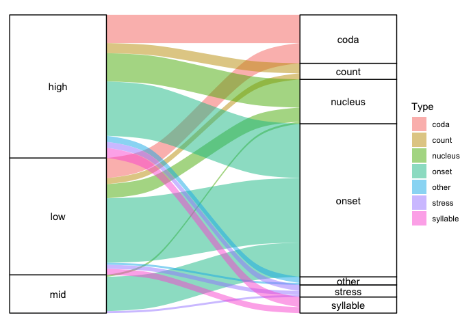
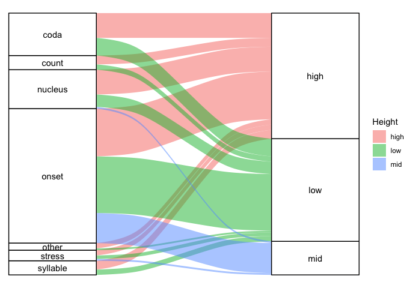
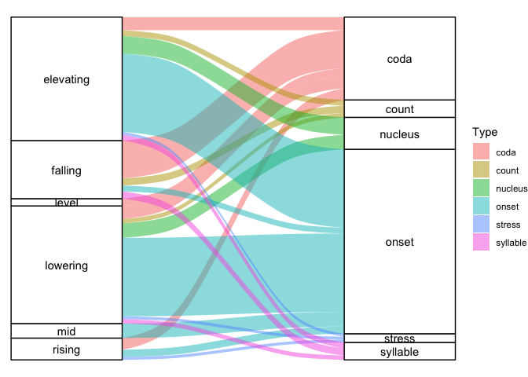

TonoDB analyses
================
Steven Moran and Lilja Maria Sæbø

13 February, 2024

- [Setup](#setup)
- [Basics of the database contents](#basics-of-the-database-contents)
- [Tables for the paper](#tables-for-the-paper)
  - [Distribution of the languages, families and cases of tonogenesis
    across different
    areas](#distribution-of-the-languages-families-and-cases-of-tonogenesis-across-different-areas)
  - [Number of languages in different
    families](#number-of-languages-in-different-families)
  - [Cases of tonogenesis sorted by triggering
    context](#cases-of-tonogenesis-sorted-by-triggering-context)
  - [Tonogenesis conditioned by voiced and voiceless (unaspirated)
    obstruents](#tonogenesis-conditioned-by-voiced-and-voiceless-unaspirated-obstruents)
  - [Tonogenesis triggered by coda
    consonants](#tonogenesis-triggered-by-coda-consonants)
  - [Tonogenesis based on vowel
    length](#tonogenesis-based-on-vowel-length)
  - [Tonogenesis based on vowel
    length](#tonogenesis-based-on-vowel-length-1)
  - [Tonogenesis based on ATR](#tonogenesis-based-on-atr)
  - [Effect of voicing on tone](#effect-of-voicing-on-tone)
  - [Tonogenesis triggered by codas](#tonogenesis-triggered-by-codas)
  - [Onset Voicing by effect on
    pitch](#onset-voicing-by-effect-on-pitch)
  - [Effect of voicing on pitch](#effect-of-voicing-on-pitch)
  - [Effect of voice on pitch](#effect-of-voice-on-pitch)
  - [Effect of coda glottal on pitch](#effect-of-coda-glottal-on-pitch)
  - [Effect of vowel height on pitch](#effect-of-vowel-height-on-pitch)
  - [Effect of nucleus length on
    pitch](#effect-of-nucleus-length-on-pitch)
  - [Effect of nuclear +/iATR on
    pitch](#effect-of-nuclear-iatr-on-pitch)
  - [Number of cases/varieties of different types for each
    region](#number-of-casesvarieties-of-different-types-for-each-region)
    - [Africa](#africa)
    - [Asia](#asia)
    - [Europe](#europe)
    - [North America](#north-america)
    - [Papunesia](#papunesia)
    - [South America](#south-america)
  - [Area and tonogenesis specific
    tables](#area-and-tonogenesis-specific-tables)
    - [Onset aspiration in Asia](#onset-aspiration-in-asia)
    - [Coda glottal in Asia](#coda-glottal-in-asia)
    - [Coda manner in Asia](#coda-manner-in-asia)
    - [Coda phonation type in Asia](#coda-phonation-type-in-asia)
    - [Nucleus height in Asia](#nucleus-height-in-asia)
    - [Onset voicing in Asia](#onset-voicing-in-asia)
  - [Tonogenetic events by macroarea](#tonogenetic-events-by-macroarea)
    - [Worldwide](#worldwide)
    - [Africa](#africa-1)
    - [Asia](#asia-1)
    - [Europe](#europe-1)
    - [North America](#north-america-1)
    - [South America](#south-america-1)
    - [Papunesia](#papunesia-1)
- [Examples from the database for the
  paper](#examples-from-the-database-for-the-paper)
- [A table showing the number of cases/langauges for each type in each
  region](#a-table-showing-the-number-of-caseslangauges-for-each-type-in-each-region)
- [Multiple paths to the same
  result](#multiple-paths-to-the-same-result)
- [Patterns in level vs contour
  height](#patterns-in-level-vs-contour-height)

Todos:

- syllable-count (instead of wordtype)

# Setup

Load the libraries.

``` r
library(tidyverse)
library(knitr)
library(kableExtra)
library(xtable)
library(ggalluvial)
```

Load the tonodb [CLDF data](https://github.com/cldf-datasets/tonodb/).

``` r
values <- 
  read_csv(url('https://raw.githubusercontent.com/cldf-datasets/tonodb/main/cldf/values.csv'))
languages <- 
  read_csv(url('https://raw.githubusercontent.com/cldf-datasets/tonodb/main/cldf/languages.csv'))
contributions <- 
  read_csv(url('https://raw.githubusercontent.com/cldf-datasets/tonodb/main/cldf/contributions.csv'))
parameters <- 
  read_csv(url('https://raw.githubusercontent.com/cldf-datasets/tonodb/main/cldf/parameters.csv'))
```

# Basics of the database contents

We have this many languages in our sample.

``` r
nrow(languages)
```

    ## [1] 96

And this many observations.

``` r
nrow(values)
```

    ## [1] 250

Let’s map our data points. We note some rows are removed because the
lat/long figures are NA due to them being listed as dialects or language
families.

``` r
ggplot(data=languages, aes(x=Longitude, y=Latitude)) + 
  borders("world", colour="gray50", fill="gray50") + 
  geom_point() +
  theme_bw()
```

    ## Warning: Removed 24 rows containing missing values (`geom_point()`).

<!-- -->

These are the missing data points for geographic location.

``` r
languages %>% filter(is.na(Latitude)) %>% select(ID, Name, Macroarea, Latitude, Longitude) %>% kable()
```

<table>
<thead>
<tr>
<th style="text-align:left;">
ID
</th>
<th style="text-align:left;">
Name
</th>
<th style="text-align:left;">
Macroarea
</th>
<th style="text-align:right;">
Latitude
</th>
<th style="text-align:right;">
Longitude
</th>
</tr>
</thead>
<tbody>
<tr>
<td style="text-align:left;">
atha1247
</td>
<td style="text-align:left;">
Athabaskan
</td>
<td style="text-align:left;">
NA
</td>
<td style="text-align:right;">
NA
</td>
<td style="text-align:right;">
NA
</td>
</tr>
<tr>
<td style="text-align:left;">
auks1239
</td>
<td style="text-align:left;">
Aukshtaitish
</td>
<td style="text-align:left;">
Eurasia
</td>
<td style="text-align:right;">
NA
</td>
<td style="text-align:right;">
NA
</td>
</tr>
<tr>
<td style="text-align:left;">
cant1236
</td>
<td style="text-align:left;">
Cantonese
</td>
<td style="text-align:left;">
Eurasia
</td>
<td style="text-align:right;">
NA
</td>
<td style="text-align:right;">
NA
</td>
</tr>
<tr>
<td style="text-align:left;">
cent2346
</td>
<td style="text-align:left;">
Central Tibetan
</td>
<td style="text-align:left;">
NA
</td>
<td style="text-align:right;">
NA
</td>
<td style="text-align:right;">
NA
</td>
</tr>
<tr>
<td style="text-align:left;">
coas1300
</td>
<td style="text-align:left;">
Coast Tsimshian
</td>
<td style="text-align:left;">
North America
</td>
<td style="text-align:right;">
NA
</td>
<td style="text-align:right;">
NA
</td>
</tr>
<tr>
<td style="text-align:left;">
east2280
</td>
<td style="text-align:left;">
Eastern Baltic
</td>
<td style="text-align:left;">
NA
</td>
<td style="text-align:right;">
NA
</td>
<td style="text-align:right;">
NA
</td>
</tr>
<tr>
<td style="text-align:left;">
extr1245
</td>
<td style="text-align:left;">
Extreme Southern New Caledonian
</td>
<td style="text-align:left;">
NA
</td>
<td style="text-align:right;">
NA
</td>
<td style="text-align:right;">
NA
</td>
</tr>
<tr>
<td style="text-align:left;">
kere1287
</td>
<td style="text-align:left;">
Keresan
</td>
<td style="text-align:left;">
NA
</td>
<td style="text-align:right;">
NA
</td>
<td style="text-align:right;">
NA
</td>
</tr>
<tr>
<td style="text-align:left;">
mang1393
</td>
<td style="text-align:left;">
Mangbetu-Asua
</td>
<td style="text-align:left;">
NA
</td>
<td style="text-align:right;">
NA
</td>
<td style="text-align:right;">
NA
</td>
</tr>
<tr>
<td style="text-align:left;">
metn1237
</td>
<td style="text-align:left;">
Metnyo
</td>
<td style="text-align:left;">
Papunesia
</td>
<td style="text-align:right;">
NA
</td>
<td style="text-align:right;">
NA
</td>
</tr>
<tr>
<td style="text-align:left;">
midd1319
</td>
<td style="text-align:left;">
Middle Franconian
</td>
<td style="text-align:left;">
Eurasia
</td>
<td style="text-align:right;">
NA
</td>
<td style="text-align:right;">
NA
</td>
</tr>
<tr>
<td style="text-align:left;">
moha1257
</td>
<td style="text-align:left;">
Mohawk-Oneida
</td>
<td style="text-align:left;">
NA
</td>
<td style="text-align:right;">
NA
</td>
<td style="text-align:right;">
NA
</td>
</tr>
<tr>
<td style="text-align:left;">
newc1243
</td>
<td style="text-align:left;">
New Caledonian
</td>
<td style="text-align:left;">
NA
</td>
<td style="text-align:right;">
NA
</td>
<td style="text-align:right;">
NA
</td>
</tr>
<tr>
<td style="text-align:left;">
nort3160
</td>
<td style="text-align:left;">
North Germanic
</td>
<td style="text-align:left;">
NA
</td>
<td style="text-align:right;">
NA
</td>
<td style="text-align:right;">
NA
</td>
</tr>
<tr>
<td style="text-align:left;">
podo1243
</td>
<td style="text-align:left;">
Podoko
</td>
<td style="text-align:left;">
NA
</td>
<td style="text-align:right;">
NA
</td>
<td style="text-align:right;">
NA
</td>
</tr>
<tr>
<td style="text-align:left;">
pwoo1239
</td>
<td style="text-align:left;">
Pwo
</td>
<td style="text-align:left;">
NA
</td>
<td style="text-align:right;">
NA
</td>
<td style="text-align:right;">
NA
</td>
</tr>
<tr>
<td style="text-align:left;">
raja1258
</td>
<td style="text-align:left;">
Raja Ampat Maya
</td>
<td style="text-align:left;">
NA
</td>
<td style="text-align:right;">
NA
</td>
<td style="text-align:right;">
NA
</td>
</tr>
<tr>
<td style="text-align:left;">
sind1278
</td>
<td style="text-align:left;">
Sindhi-Lahnda
</td>
<td style="text-align:left;">
NA
</td>
<td style="text-align:right;">
NA
</td>
<td style="text-align:right;">
NA
</td>
</tr>
<tr>
<td style="text-align:left;">
slav1255
</td>
<td style="text-align:left;">
Slavic
</td>
<td style="text-align:left;">
NA
</td>
<td style="text-align:right;">
NA
</td>
<td style="text-align:right;">
NA
</td>
</tr>
<tr>
<td style="text-align:left;">
taik1256
</td>
<td style="text-align:left;">
Tai-Kadai
</td>
<td style="text-align:left;">
NA
</td>
<td style="text-align:right;">
NA
</td>
<td style="text-align:right;">
NA
</td>
</tr>
<tr>
<td style="text-align:left;">
tere1281
</td>
<td style="text-align:left;">
Terena
</td>
<td style="text-align:left;">
South America
</td>
<td style="text-align:right;">
NA
</td>
<td style="text-align:right;">
NA
</td>
</tr>
<tr>
<td style="text-align:left;">
utsa1239
</td>
<td style="text-align:left;">
Lhasa Tibetan
</td>
<td style="text-align:left;">
Eurasia
</td>
<td style="text-align:right;">
NA
</td>
<td style="text-align:right;">
NA
</td>
</tr>
<tr>
<td style="text-align:left;">
yeni1252
</td>
<td style="text-align:left;">
Yeniseian
</td>
<td style="text-align:left;">
NA
</td>
<td style="text-align:right;">
NA
</td>
<td style="text-align:right;">
NA
</td>
</tr>
<tr>
<td style="text-align:left;">
zhuo1234
</td>
<td style="text-align:left;">
Zhuoni
</td>
<td style="text-align:left;">
Eurasia
</td>
<td style="text-align:right;">
NA
</td>
<td style="text-align:right;">
NA
</td>
</tr>
</tbody>
</table>

We’ve gone through by hand and added approximate geocoordinates for
visualization purposes, e.g., using Glottolog’s Swedish latitude and
longitude for North Germanic.

Merge in the hand attributed geocoordinates.

``` r
# There must be a saner way to do this!
hc <- read_csv('hand_coordinates.csv')
tmp <- left_join(languages, hc, by=c("ID"="ID", "Name"="Name"))
tmp <- tmp %>% mutate(Latitude.x = coalesce(Latitude.x, Latitude.y))
tmp <- tmp %>% mutate(Longitude.x = coalesce(Longitude.x, Longitude.y))
tmp <- tmp %>% select(-Latitude.y, Longitude.y)
tmp <- tmp %>% rename(Latitude = Latitude.x)
tmp <- tmp %>% rename(Longitude = Longitude.x)
languages <- tmp
```

Redo the map.

``` r
ggplot(data=languages, aes(x=Longitude, y=Latitude)) + 
  borders("world", colour="gray50", fill="gray50") + 
  geom_point() +
  theme_bw()
```

<!-- -->

Here we can add some color by language family.

``` r
ggplot(data=languages, aes(x=Longitude, y=Latitude, color=family_id)) + 
  borders("world", colour="gray50", fill="gray50") + 
  geom_point() +
  theme_bw() +
  theme(legend.position="none")
```

<!-- -->

``` r
  # ggtitle("Language varieties colored for language family")
```

How many data points per macroarea? (Note again several NAs.)

``` r
table(languages$Macroarea, exclude=FALSE)
```

    ## 
    ##        Africa       Eurasia North America     Papunesia South America 
    ##            11            40            16             7             6 
    ##          <NA> 
    ##            16

Some Glottolog macroareas are missing, e.g., languages that don’t have
Glottocodes or are family level codes.

``` r
languages %>% filter(is.na(Macroarea))
```

    ## # A tibble: 16 × 18
    ##    ID       Name  Macroarea Latitude Longitude Glottocode ISO639P3code family_id
    ##    <chr>    <chr> <chr>        <dbl>     <dbl> <chr>      <chr>        <chr>    
    ##  1 atha1247 Atha… <NA>        60.5      -151.  atha1247   <NA>         atha1245 
    ##  2 cent2346 Cent… <NA>        28.4        90.2 cent2346   <NA>         sino1245 
    ##  3 east2280 East… <NA>        56.8        24.3 east2280   <NA>         indo1319 
    ##  4 extr1245 Extr… <NA>       -22.1       167.  extr1245   <NA>         aust1307 
    ##  5 kere1287 Kere… <NA>        35.5      -106.  kere1287   <NA>         <NA>     
    ##  6 mang1393 Mang… <NA>         0.268      27.3 mang1393   <NA>         cent2225 
    ##  7 moha1257 Moha… <NA>        43.7       -74.7 moha1257   <NA>         iroq1247 
    ##  8 newc1243 New … <NA>       -20.9       167.  newc1243   <NA>         aust1307 
    ##  9 nort3160 Nort… <NA>        59.8        17.4 nort3160   <NA>         indo1319 
    ## 10 podo1243 Podo… <NA>        10.9        14.0 podo1243   <NA>         afro1255 
    ## 11 pwoo1239 Pwo   <NA>        18.0        99.6 pwoo1239   <NA>         sino1245 
    ## 12 raja1258 Raja… <NA>        -0.173     130.  raja1258   <NA>         aust1307 
    ## 13 sind1278 Sind… <NA>        30.1        75.3 sind1278   <NA>         indo1319 
    ## 14 slav1255 Slav… <NA>        49.9        15.1 slav1255   <NA>         indo1319 
    ## 15 taik1256 Tai-… <NA>        24.1       110.  taik1256   <NA>         <NA>     
    ## 16 yeni1252 Yeni… <NA>        63.8        87.5 yeni1252   <NA>         <NA>     
    ## # ℹ 10 more variables: parent_id <chr>, bookkeeping <lgl>, level <chr>,
    ## #   description <lgl>, markup_description <lgl>, child_family_count <dbl>,
    ## #   child_language_count <dbl>, child_dialect_count <dbl>, country_ids <chr>,
    ## #   Longitude.y <dbl>

``` r
# tmp <- languages %>% filter(is.na(Macroarea)) %>% select(ID, Name, Macroarea)
# write_csv(tmp, 'get_macroareas.csv')

# There must be a saner way to do this!
hc <- read_csv('hand_macroareas.csv')
tmp <- left_join(languages, hc, by=c("ID"="ID", "Name"="Name"))
tmp <- tmp %>% mutate(Macroarea.x = coalesce(Macroarea.x, Macroarea.y))
tmp <- tmp %>% select(-Macroarea.y)
tmp <- tmp %>% rename(Macroarea = Macroarea.x)
languages <- tmp
table(languages$Macroarea, exclude = FALSE)
```

    ## 
    ##        Africa       Eurasia North America     Papunesia South America 
    ##            13            48            19            10             6

And a quick look at our areas.

``` r
table(contributions$Area, exclude=FALSE)
```

    ## 
    ##        Africa          Asia        Europe North America     Papunesia 
    ##            13            39            14            20            10 
    ## South America 
    ##             6

# Tables for the paper

Recreate some of the tables. First merge the tonodb tables.

``` r
tonodb <- left_join(values, languages, by=c("Language_ID"="ID"))

# Reduce the Contributor table and get the TonoDB Area column
tmp <- contributions %>% select(ID, Family, Area)
tonodb <- left_join(tonodb, tmp, by=c("Inventory_ID"="ID"))

# tonodb %>% filter(is.na(family_id))

# Rename wordtype to syllable-count -- TODO replace when database is updated
tonodb <- tonodb %>% mutate(Type = str_replace(Type, "wordtype", "syllable"))
```

## Distribution of the languages, families and cases of tonogenesis across different areas

``` r
x <- tonodb %>% select(Area, Language_ID) %>% distinct() %>% group_by(Area) %>% summarise(Languages = n())
y <- tonodb %>% select(Area, family_id) %>% distinct() %>% group_by(Area) %>% summarize(Families = n())
z <- tonodb %>% select(Area, TriggeringContext) %>% group_by(Area) %>% summarize(`Cases of tonogenesis` = n())

tmp <- left_join(x, y)
tmp <- left_join(tmp, z)
tmp <- tmp %>% arrange(desc(`Cases of tonogenesis`))
tmp %>% kable()
```

<table>
<thead>
<tr>
<th style="text-align:left;">
Area
</th>
<th style="text-align:right;">
Languages
</th>
<th style="text-align:right;">
Families
</th>
<th style="text-align:right;">
Cases of tonogenesis
</th>
</tr>
</thead>
<tbody>
<tr>
<td style="text-align:left;">
Asia
</td>
<td style="text-align:right;">
37
</td>
<td style="text-align:right;">
9
</td>
<td style="text-align:right;">
154
</td>
</tr>
<tr>
<td style="text-align:left;">
North America
</td>
<td style="text-align:right;">
19
</td>
<td style="text-align:right;">
10
</td>
<td style="text-align:right;">
29
</td>
</tr>
<tr>
<td style="text-align:left;">
Europe
</td>
<td style="text-align:right;">
12
</td>
<td style="text-align:right;">
2
</td>
<td style="text-align:right;">
22
</td>
</tr>
<tr>
<td style="text-align:left;">
Africa
</td>
<td style="text-align:right;">
13
</td>
<td style="text-align:right;">
5
</td>
<td style="text-align:right;">
21
</td>
</tr>
<tr>
<td style="text-align:left;">
Papunesia
</td>
<td style="text-align:right;">
10
</td>
<td style="text-align:right;">
1
</td>
<td style="text-align:right;">
16
</td>
</tr>
<tr>
<td style="text-align:left;">
South America
</td>
<td style="text-align:right;">
6
</td>
<td style="text-align:right;">
3
</td>
<td style="text-align:right;">
8
</td>
</tr>
</tbody>
</table>

``` r
# Still getting some NAs, let's drop them
table(tonodb$family_id, exclude = FALSE)
```

    ## 
    ## afro1255 algi1248 araw1281 atha1245 atla1278 aust1305 aust1307 cadd1255 
    ##        3        5        1        5        6       15       25        1 
    ## cent2225 chim1311 gong1255 hmon1336 indo1319 iroq1247 koma1264 kore1284 
    ##        4        1        2       10       23        7        6        2 
    ## maya1287 mong1349 nada1235 sino1245 taik1256 tsim1258 tuca1253 ural1272 
    ##        4        1        3       58       28        1        4        1 
    ## utoa1244 waka1280     <NA> 
    ##        1        2       31

``` r
tmp <- tmp %>% filter(!is.na(Area))
tmp %>% kable()
```

<table>
<thead>
<tr>
<th style="text-align:left;">
Area
</th>
<th style="text-align:right;">
Languages
</th>
<th style="text-align:right;">
Families
</th>
<th style="text-align:right;">
Cases of tonogenesis
</th>
</tr>
</thead>
<tbody>
<tr>
<td style="text-align:left;">
Asia
</td>
<td style="text-align:right;">
37
</td>
<td style="text-align:right;">
9
</td>
<td style="text-align:right;">
154
</td>
</tr>
<tr>
<td style="text-align:left;">
North America
</td>
<td style="text-align:right;">
19
</td>
<td style="text-align:right;">
10
</td>
<td style="text-align:right;">
29
</td>
</tr>
<tr>
<td style="text-align:left;">
Europe
</td>
<td style="text-align:right;">
12
</td>
<td style="text-align:right;">
2
</td>
<td style="text-align:right;">
22
</td>
</tr>
<tr>
<td style="text-align:left;">
Africa
</td>
<td style="text-align:right;">
13
</td>
<td style="text-align:right;">
5
</td>
<td style="text-align:right;">
21
</td>
</tr>
<tr>
<td style="text-align:left;">
Papunesia
</td>
<td style="text-align:right;">
10
</td>
<td style="text-align:right;">
1
</td>
<td style="text-align:right;">
16
</td>
</tr>
<tr>
<td style="text-align:left;">
South America
</td>
<td style="text-align:right;">
6
</td>
<td style="text-align:right;">
3
</td>
<td style="text-align:right;">
8
</td>
</tr>
</tbody>
</table>

``` r
print(xtable(tmp, type = "latex", caption="Distribution of the languages, families and cases of tonogenesis across different areas"), include.rownames=FALSE)
```

    ## % latex table generated in R 4.3.2 by xtable 1.8-4 package
    ## % Tue Feb 13 22:51:46 2024
    ## \begin{table}[ht]
    ## \centering
    ## \begin{tabular}{lrrr}
    ##   \hline
    ## Area & Languages & Families & Cases of tonogenesis \\ 
    ##   \hline
    ## Asia &  37 &   9 & 154 \\ 
    ##   North America &  19 &  10 &  29 \\ 
    ##   Europe &  12 &   2 &  22 \\ 
    ##   Africa &  13 &   5 &  21 \\ 
    ##   Papunesia &  10 &   1 &  16 \\ 
    ##   South America &   6 &   3 &   8 \\ 
    ##    \hline
    ## \end{tabular}
    ## \caption{Distribution of the languages, families and cases of tonogenesis across different areas} 
    ## \end{table}

## Number of languages in different families

``` r
tmp <- tonodb %>% select(family_id, LanguageVariety) %>% distinct() %>% arrange(family_id, LanguageVariety) %>% group_by(family_id) %>% summarize(`Number of varieties` = n(), Languages = str_c(LanguageVariety, collapse=", "))

# We need the Glottolog family names
glottolog <- read_csv('data/languoid.csv')
families <- glottolog %>% filter(id %in% tmp$family_id) %>% select(id, name)
tmp <- left_join(tmp, families, by=c("family_id"="id"))
tmp <- tmp %>% select(name, `Number of varieties`, Languages)
tmp <- tmp %>% rename(Family = name)

tmp %>% kable()
```

<table>
<thead>
<tr>
<th style="text-align:left;">
Family
</th>
<th style="text-align:right;">
Number of varieties
</th>
<th style="text-align:left;">
Languages
</th>
</tr>
</thead>
<tbody>
<tr>
<td style="text-align:left;">
Afro-Asiatic
</td>
<td style="text-align:right;">
2
</td>
<td style="text-align:left;">
Iraqw, Podoko
</td>
</tr>
<tr>
<td style="text-align:left;">
Algic
</td>
<td style="text-align:right;">
3
</td>
<td style="text-align:left;">
Arapaho, Cheyenne, Kickapoo
</td>
</tr>
<tr>
<td style="text-align:left;">
Arawakan
</td>
<td style="text-align:right;">
1
</td>
<td style="text-align:left;">
Terena
</td>
</tr>
<tr>
<td style="text-align:left;">
Athabaskan-Eyak-Tlingit
</td>
<td style="text-align:right;">
3
</td>
<td style="text-align:left;">
Proto-Athabaskan (tonal dialects) group one, Proto-Athabaskan (tonal
dialects) group two, Sanya-Henya Tlingit
</td>
</tr>
<tr>
<td style="text-align:left;">
Atlantic-Congo
</td>
<td style="text-align:right;">
5
</td>
<td style="text-align:left;">
Bantu D30, Bila, Kohumono, Moba, Nupe
</td>
</tr>
<tr>
<td style="text-align:left;">
Austroasiatic
</td>
<td style="text-align:right;">
4
</td>
<td style="text-align:left;">
Hu, Kammu, U, Vietnamese
</td>
</tr>
<tr>
<td style="text-align:left;">
Austronesian
</td>
<td style="text-align:right;">
12
</td>
<td style="text-align:left;">
Cem, Central North New Caledonian languages, Far South New Caledonian
langauges, Magey Matbat, Metnyo Ambel, Moor, Phan Rang Cham,
Proto-Maˈya, Samoan, Utsat, Yabem, Yerisiam
</td>
</tr>
<tr>
<td style="text-align:left;">
Caddoan
</td>
<td style="text-align:right;">
1
</td>
<td style="text-align:left;">
Caddo
</td>
</tr>
<tr>
<td style="text-align:left;">
Central Sudanic
</td>
<td style="text-align:right;">
2
</td>
<td style="text-align:left;">
Languages of the Mangbetu-Asua subgroup with three tones, Western
Lugbara
</td>
</tr>
<tr>
<td style="text-align:left;">
Chimakuan
</td>
<td style="text-align:right;">
1
</td>
<td style="text-align:left;">
Quileute
</td>
</tr>
<tr>
<td style="text-align:left;">
Ta-Ne-Omotic
</td>
<td style="text-align:right;">
2
</td>
<td style="text-align:left;">
Gimira, Shinasha
</td>
</tr>
<tr>
<td style="text-align:left;">
Hmong-Mien
</td>
<td style="text-align:right;">
1
</td>
<td style="text-align:left;">
White Hmong
</td>
</tr>
<tr>
<td style="text-align:left;">
Indo-European
</td>
<td style="text-align:right;">
14
</td>
<td style="text-align:left;">
Auktaitian dialects of Lithuanian, Central Franconian, Central
Scandinavian, East Baltic (Latvian and Lithuanian), East Slesvig, Late
Proto-Slavic, Latvian, Limburgish, Lithuanian, Proto-Nordic, Punjabi,
Scottish gaelic (Bernera), West Baltic (Prussian, Zealand Danish
</td>
</tr>
<tr>
<td style="text-align:left;">
Iroquoian
</td>
<td style="text-align:right;">
3
</td>
<td style="text-align:left;">
Cherokee, Mohawk, Proto-Mohawk-Oneida
</td>
</tr>
<tr>
<td style="text-align:left;">
Koman
</td>
<td style="text-align:right;">
2
</td>
<td style="text-align:left;">
Proto-Gwama, Proto-Opo
</td>
</tr>
<tr>
<td style="text-align:left;">
Koreanic
</td>
<td style="text-align:right;">
1
</td>
<td style="text-align:left;">
Korean
</td>
</tr>
<tr>
<td style="text-align:left;">
Mayan
</td>
<td style="text-align:right;">
4
</td>
<td style="text-align:left;">
Mocho’, San Bartolo Tzotzil, Uspanteko, Yucatec
</td>
</tr>
<tr>
<td style="text-align:left;">
Mongolic-Khitan
</td>
<td style="text-align:right;">
1
</td>
<td style="text-align:left;">
Mongour
</td>
</tr>
<tr>
<td style="text-align:left;">
Naduhup
</td>
<td style="text-align:right;">
1
</td>
<td style="text-align:left;">
Eastern Naduhup
</td>
</tr>
<tr>
<td style="text-align:left;">
Sino-Tibetan
</td>
<td style="text-align:right;">
20
</td>
<td style="text-align:left;">
Baima Tibetan, Brokpa, Burmese, Cantonese, Chitabu (bwe), Dzongkha,
Geba, Khaling, Kurtöp, Lahu, Lhasa Tibetan, Middle Chinese, Phlong, Pwo
Karen, Rikeze Tibetan, Sgaw Karen, Tokpe Gola (Tibetan), T’ientsin,
Zhibo Tibetan, Zhuoni Tibetan
</td>
</tr>
<tr>
<td style="text-align:left;">
Tai-Kadai
</td>
<td style="text-align:right;">
4
</td>
<td style="text-align:left;">
Nakhon Si Thammarat Thai, Proto-Tai, Shan, Yung Chiang Kam
</td>
</tr>
<tr>
<td style="text-align:left;">
Tsimshian
</td>
<td style="text-align:right;">
1
</td>
<td style="text-align:left;">
Coast Tsimshian
</td>
</tr>
<tr>
<td style="text-align:left;">
Tucanoan
</td>
<td style="text-align:right;">
4
</td>
<td style="text-align:left;">
Barasana, Kubeo, Máíhɨ̃ki, Tatuyo
</td>
</tr>
<tr>
<td style="text-align:left;">
Uralic
</td>
<td style="text-align:right;">
1
</td>
<td style="text-align:left;">
Estonian
</td>
</tr>
<tr>
<td style="text-align:left;">
Uto-Aztecan
</td>
<td style="text-align:right;">
1
</td>
<td style="text-align:left;">
Hopi
</td>
</tr>
<tr>
<td style="text-align:left;">
Wakashan
</td>
<td style="text-align:right;">
1
</td>
<td style="text-align:left;">
Heiltsuk
</td>
</tr>
<tr>
<td style="text-align:left;">
NA
</td>
<td style="text-align:right;">
7
</td>
<td style="text-align:left;">
Blimaw, Dong, Keres, Kra-Dai languages, Pre-proto-Yeniseian, Szu ta
Chai, Takelma
</td>
</tr>
</tbody>
</table>

``` r
# print(xtable(tmp, type = "latex", caption="Number of languages in different language families"), include.rownames=FALSE)
```

## Cases of tonogenesis sorted by triggering context

``` r
z <- tonodb %>% select(Type, LanguageVariety) %>% separate_rows(Type)
x <- z %>% group_by(Type) %>% summarize(`Cases of tonogenesis` = n()) %>% arrange()
y <- z %>% select(Type, LanguageVariety) %>% distinct() %>% group_by(Type) %>% summarize(`Number of languages` = n()) %>% arrange()

tmp <- left_join(x, y)
```

    ## Joining with `by = join_by(Type)`

``` r
tmp <- tmp %>% arrange(desc(`Cases of tonogenesis`))

# Remove NAs
# tmp <- tmp %>% filter(!is.na(Type))
# tmp %>% kable()

# rename to syllable-count
tmp <- tmp %>% mutate(Type = str_replace(Type, "syllable", "syllable-count"))

tmp %>% kable()
```

<table>
<thead>
<tr>
<th style="text-align:left;">
Type
</th>
<th style="text-align:right;">
Cases of tonogenesis
</th>
<th style="text-align:right;">
Number of languages
</th>
</tr>
</thead>
<tbody>
<tr>
<td style="text-align:left;">
onset
</td>
<td style="text-align:right;">
133
</td>
<td style="text-align:right;">
40
</td>
</tr>
<tr>
<td style="text-align:left;">
coda
</td>
<td style="text-align:right;">
66
</td>
<td style="text-align:right;">
42
</td>
</tr>
<tr>
<td style="text-align:left;">
syllable-count
</td>
<td style="text-align:right;">
25
</td>
<td style="text-align:right;">
19
</td>
</tr>
<tr>
<td style="text-align:left;">
nucleus
</td>
<td style="text-align:right;">
22
</td>
<td style="text-align:right;">
13
</td>
</tr>
<tr>
<td style="text-align:left;">
stress
</td>
<td style="text-align:right;">
11
</td>
<td style="text-align:right;">
8
</td>
</tr>
<tr>
<td style="text-align:left;">
other
</td>
<td style="text-align:right;">
5
</td>
<td style="text-align:right;">
4
</td>
</tr>
</tbody>
</table>

``` r
print(xtable(tmp, type = "latex", caption="Cases of tonogenesis by category"), include.rownames=FALSE)
```

    ## % latex table generated in R 4.3.2 by xtable 1.8-4 package
    ## % Tue Feb 13 22:51:46 2024
    ## \begin{table}[ht]
    ## \centering
    ## \begin{tabular}{lrr}
    ##   \hline
    ## Type & Cases of tonogenesis & Number of languages \\ 
    ##   \hline
    ## onset & 133 &  40 \\ 
    ##   coda &  66 &  42 \\ 
    ##   syllable-count &  25 &  19 \\ 
    ##   nucleus &  22 &  13 \\ 
    ##   stress &  11 &   8 \\ 
    ##   other &   5 &   4 \\ 
    ##    \hline
    ## \end{tabular}
    ## \caption{Cases of tonogenesis by category} 
    ## \end{table}

## Tonogenesis conditioned by voiced and voiceless (unaspirated) obstruents

``` r
# tmp <- tonodb %>% select(OnsetVoicing, EffectOnPitch)
# table(tmp)

# tmp <- tonodb %>% select(OnsetVoicing, EffectOnPitch) %>% filter(OnsetVoicing != "") %>% filter(EffectOnPitch != "")
# table(tmp)

# tmp <- tonodb %>% select(OnsetVoicing, EffectOnPitch) %>% 
#  filter(OnsetVoicing != "") %>% 
#  filter(EffectOnPitch != "") %>%
#  filter(OnsetVoicing %in% c("Voiced", "Voiceless"))
# table(tmp)

# tmp <- tonodb %>% select(OnsetVoicing, EffectOnPitch) %>% 
#  filter(OnsetVoicing != "") %>% 
#  filter(EffectOnPitch != "") %>%
#  filter(OnsetVoicing %in% c("Voiced", "Voiceless"))
# table(tmp)

tmp <- tonodb %>% select(OnsetVoicing, EffectOnPitch) %>% 
  filter(OnsetVoicing != "") %>% 
  filter(EffectOnPitch != "") %>%
  filter(OnsetVoicing %in% c("Voiced", "Voiceless"))

t <- data.frame(unclass(table(tmp$OnsetVoicing, tmp$EffectOnPitch)))
t <- t %>% select(lowering, mid, elevating, rising, falling)

# print(xtable(t, type = "latex", caption="Tonogenesis conditioned by voiced and voiceless (unaspirated) obstruents"))
```

## Tonogenesis triggered by coda consonants

``` r
tmp <- tonodb %>% select(CodaGlottal, EffectOnPitch) %>%
  filter(!is.na(CodaGlottal)) %>%
  filter(CodaGlottal != "") %>%
  filter(EffectOnPitch != "") %>%
  filter(EffectOnPitch %in% c("level", "rising", "falling"))
table(tmp) %>% kable()
```

<table>
<thead>
<tr>
<th style="text-align:left;">
</th>
<th style="text-align:right;">
falling
</th>
<th style="text-align:right;">
rising
</th>
</tr>
</thead>
<tbody>
<tr>
<td style="text-align:left;">
/h/
</td>
<td style="text-align:right;">
1
</td>
<td style="text-align:right;">
0
</td>
</tr>
<tr>
<td style="text-align:left;">
/h/, glottal stop
</td>
<td style="text-align:right;">
1
</td>
<td style="text-align:right;">
1
</td>
</tr>
<tr>
<td style="text-align:left;">
glottal stop
</td>
<td style="text-align:right;">
2
</td>
<td style="text-align:right;">
3
</td>
</tr>
<tr>
<td style="text-align:left;">
glottalized
</td>
<td style="text-align:right;">
1
</td>
<td style="text-align:right;">
2
</td>
</tr>
<tr>
<td style="text-align:left;">
laryngeal
</td>
<td style="text-align:right;">
6
</td>
<td style="text-align:right;">
0
</td>
</tr>
<tr>
<td style="text-align:left;">
non-glottalized
</td>
<td style="text-align:right;">
1
</td>
<td style="text-align:right;">
0
</td>
</tr>
</tbody>
</table>

``` r
# print(xtable(table(tmp), type = "latex", caption="Tonogenesis triggered by coda consonants"))
```

## Tonogenesis based on vowel length

``` r
table(tonodb$Nucleus, tonodb$EffectOnPitch) %>% kable()
```

<table>
<thead>
<tr>
<th style="text-align:left;">
</th>
<th style="text-align:right;">
elevating
</th>
<th style="text-align:right;">
falling
</th>
<th style="text-align:right;">
level
</th>
<th style="text-align:right;">
lowering
</th>
<th style="text-align:right;">
lowering, elevating
</th>
<th style="text-align:right;">
mid
</th>
<th style="text-align:right;">
no change
</th>
<th style="text-align:right;">
rising
</th>
<th style="text-align:right;">
rising-falling
</th>
<th style="text-align:right;">
rising, elevating
</th>
<th style="text-align:right;">
rising, lowering
</th>
</tr>
</thead>
<tbody>
<tr>
<td style="text-align:left;">
-ATR
</td>
<td style="text-align:right;">
0
</td>
<td style="text-align:right;">
0
</td>
<td style="text-align:right;">
0
</td>
<td style="text-align:right;">
1
</td>
<td style="text-align:right;">
0
</td>
<td style="text-align:right;">
0
</td>
<td style="text-align:right;">
0
</td>
<td style="text-align:right;">
0
</td>
<td style="text-align:right;">
0
</td>
<td style="text-align:right;">
0
</td>
<td style="text-align:right;">
0
</td>
</tr>
<tr>
<td style="text-align:left;">
-ATR and non-high vowel
</td>
<td style="text-align:right;">
0
</td>
<td style="text-align:right;">
0
</td>
<td style="text-align:right;">
0
</td>
<td style="text-align:right;">
1
</td>
<td style="text-align:right;">
0
</td>
<td style="text-align:right;">
0
</td>
<td style="text-align:right;">
0
</td>
<td style="text-align:right;">
0
</td>
<td style="text-align:right;">
0
</td>
<td style="text-align:right;">
0
</td>
<td style="text-align:right;">
0
</td>
</tr>
<tr>
<td style="text-align:left;">
+ATR
</td>
<td style="text-align:right;">
1
</td>
<td style="text-align:right;">
0
</td>
<td style="text-align:right;">
0
</td>
<td style="text-align:right;">
0
</td>
<td style="text-align:right;">
0
</td>
<td style="text-align:right;">
0
</td>
<td style="text-align:right;">
0
</td>
<td style="text-align:right;">
0
</td>
<td style="text-align:right;">
0
</td>
<td style="text-align:right;">
0
</td>
<td style="text-align:right;">
0
</td>
</tr>
<tr>
<td style="text-align:left;">
+ATR and high vowel
</td>
<td style="text-align:right;">
1
</td>
<td style="text-align:right;">
0
</td>
<td style="text-align:right;">
0
</td>
<td style="text-align:right;">
0
</td>
<td style="text-align:right;">
0
</td>
<td style="text-align:right;">
0
</td>
<td style="text-align:right;">
0
</td>
<td style="text-align:right;">
0
</td>
<td style="text-align:right;">
0
</td>
<td style="text-align:right;">
0
</td>
<td style="text-align:right;">
0
</td>
</tr>
<tr>
<td style="text-align:left;">
high vowel
</td>
<td style="text-align:right;">
3
</td>
<td style="text-align:right;">
0
</td>
<td style="text-align:right;">
0
</td>
<td style="text-align:right;">
1
</td>
<td style="text-align:right;">
0
</td>
<td style="text-align:right;">
0
</td>
<td style="text-align:right;">
0
</td>
<td style="text-align:right;">
0
</td>
<td style="text-align:right;">
0
</td>
<td style="text-align:right;">
0
</td>
<td style="text-align:right;">
0
</td>
</tr>
<tr>
<td style="text-align:left;">
long vowel
</td>
<td style="text-align:right;">
1
</td>
<td style="text-align:right;">
0
</td>
<td style="text-align:right;">
0
</td>
<td style="text-align:right;">
1
</td>
<td style="text-align:right;">
0
</td>
<td style="text-align:right;">
0
</td>
<td style="text-align:right;">
0
</td>
<td style="text-align:right;">
0
</td>
<td style="text-align:right;">
0
</td>
<td style="text-align:right;">
0
</td>
<td style="text-align:right;">
0
</td>
</tr>
<tr>
<td style="text-align:left;">
low vowel
</td>
<td style="text-align:right;">
1
</td>
<td style="text-align:right;">
0
</td>
<td style="text-align:right;">
0
</td>
<td style="text-align:right;">
2
</td>
<td style="text-align:right;">
0
</td>
<td style="text-align:right;">
0
</td>
<td style="text-align:right;">
0
</td>
<td style="text-align:right;">
0
</td>
<td style="text-align:right;">
0
</td>
<td style="text-align:right;">
0
</td>
<td style="text-align:right;">
0
</td>
</tr>
<tr>
<td style="text-align:left;">
other
</td>
<td style="text-align:right;">
0
</td>
<td style="text-align:right;">
0
</td>
<td style="text-align:right;">
0
</td>
<td style="text-align:right;">
1
</td>
<td style="text-align:right;">
0
</td>
<td style="text-align:right;">
0
</td>
<td style="text-align:right;">
0
</td>
<td style="text-align:right;">
0
</td>
<td style="text-align:right;">
0
</td>
<td style="text-align:right;">
0
</td>
<td style="text-align:right;">
0
</td>
</tr>
<tr>
<td style="text-align:left;">
short vowel
</td>
<td style="text-align:right;">
3
</td>
<td style="text-align:right;">
0
</td>
<td style="text-align:right;">
0
</td>
<td style="text-align:right;">
1
</td>
<td style="text-align:right;">
0
</td>
<td style="text-align:right;">
0
</td>
<td style="text-align:right;">
0
</td>
<td style="text-align:right;">
0
</td>
<td style="text-align:right;">
0
</td>
<td style="text-align:right;">
0
</td>
<td style="text-align:right;">
0
</td>
</tr>
<tr>
<td style="text-align:left;">
short, long
</td>
<td style="text-align:right;">
1
</td>
<td style="text-align:right;">
0
</td>
<td style="text-align:right;">
0
</td>
<td style="text-align:right;">
1
</td>
<td style="text-align:right;">
0
</td>
<td style="text-align:right;">
0
</td>
<td style="text-align:right;">
0
</td>
<td style="text-align:right;">
0
</td>
<td style="text-align:right;">
0
</td>
<td style="text-align:right;">
0
</td>
<td style="text-align:right;">
0
</td>
</tr>
<tr>
<td style="text-align:left;">
short, long, glottalic
</td>
<td style="text-align:right;">
2
</td>
<td style="text-align:right;">
0
</td>
<td style="text-align:right;">
0
</td>
<td style="text-align:right;">
1
</td>
<td style="text-align:right;">
0
</td>
<td style="text-align:right;">
0
</td>
<td style="text-align:right;">
0
</td>
<td style="text-align:right;">
0
</td>
<td style="text-align:right;">
0
</td>
<td style="text-align:right;">
0
</td>
<td style="text-align:right;">
0
</td>
</tr>
</tbody>
</table>

``` r
tmp <- tonodb %>% select(Nucleus, EffectOnPitch) %>%
  filter(Nucleus != "") %>%
  filter(EffectOnPitch != "") %>%
  filter(Nucleus %in% c("long vowel", "short vowel"))

# print(xtable(table(tmp), type = "latex", caption="Tonogenesis based on vowel length"))
```

## Tonogenesis based on vowel length

high/low is relative.

``` r
table(tonodb$Nucleus, tonodb$EffectOnPitch) %>% kable()
```

<table>
<thead>
<tr>
<th style="text-align:left;">
</th>
<th style="text-align:right;">
elevating
</th>
<th style="text-align:right;">
falling
</th>
<th style="text-align:right;">
level
</th>
<th style="text-align:right;">
lowering
</th>
<th style="text-align:right;">
lowering, elevating
</th>
<th style="text-align:right;">
mid
</th>
<th style="text-align:right;">
no change
</th>
<th style="text-align:right;">
rising
</th>
<th style="text-align:right;">
rising-falling
</th>
<th style="text-align:right;">
rising, elevating
</th>
<th style="text-align:right;">
rising, lowering
</th>
</tr>
</thead>
<tbody>
<tr>
<td style="text-align:left;">
-ATR
</td>
<td style="text-align:right;">
0
</td>
<td style="text-align:right;">
0
</td>
<td style="text-align:right;">
0
</td>
<td style="text-align:right;">
1
</td>
<td style="text-align:right;">
0
</td>
<td style="text-align:right;">
0
</td>
<td style="text-align:right;">
0
</td>
<td style="text-align:right;">
0
</td>
<td style="text-align:right;">
0
</td>
<td style="text-align:right;">
0
</td>
<td style="text-align:right;">
0
</td>
</tr>
<tr>
<td style="text-align:left;">
-ATR and non-high vowel
</td>
<td style="text-align:right;">
0
</td>
<td style="text-align:right;">
0
</td>
<td style="text-align:right;">
0
</td>
<td style="text-align:right;">
1
</td>
<td style="text-align:right;">
0
</td>
<td style="text-align:right;">
0
</td>
<td style="text-align:right;">
0
</td>
<td style="text-align:right;">
0
</td>
<td style="text-align:right;">
0
</td>
<td style="text-align:right;">
0
</td>
<td style="text-align:right;">
0
</td>
</tr>
<tr>
<td style="text-align:left;">
+ATR
</td>
<td style="text-align:right;">
1
</td>
<td style="text-align:right;">
0
</td>
<td style="text-align:right;">
0
</td>
<td style="text-align:right;">
0
</td>
<td style="text-align:right;">
0
</td>
<td style="text-align:right;">
0
</td>
<td style="text-align:right;">
0
</td>
<td style="text-align:right;">
0
</td>
<td style="text-align:right;">
0
</td>
<td style="text-align:right;">
0
</td>
<td style="text-align:right;">
0
</td>
</tr>
<tr>
<td style="text-align:left;">
+ATR and high vowel
</td>
<td style="text-align:right;">
1
</td>
<td style="text-align:right;">
0
</td>
<td style="text-align:right;">
0
</td>
<td style="text-align:right;">
0
</td>
<td style="text-align:right;">
0
</td>
<td style="text-align:right;">
0
</td>
<td style="text-align:right;">
0
</td>
<td style="text-align:right;">
0
</td>
<td style="text-align:right;">
0
</td>
<td style="text-align:right;">
0
</td>
<td style="text-align:right;">
0
</td>
</tr>
<tr>
<td style="text-align:left;">
high vowel
</td>
<td style="text-align:right;">
3
</td>
<td style="text-align:right;">
0
</td>
<td style="text-align:right;">
0
</td>
<td style="text-align:right;">
1
</td>
<td style="text-align:right;">
0
</td>
<td style="text-align:right;">
0
</td>
<td style="text-align:right;">
0
</td>
<td style="text-align:right;">
0
</td>
<td style="text-align:right;">
0
</td>
<td style="text-align:right;">
0
</td>
<td style="text-align:right;">
0
</td>
</tr>
<tr>
<td style="text-align:left;">
long vowel
</td>
<td style="text-align:right;">
1
</td>
<td style="text-align:right;">
0
</td>
<td style="text-align:right;">
0
</td>
<td style="text-align:right;">
1
</td>
<td style="text-align:right;">
0
</td>
<td style="text-align:right;">
0
</td>
<td style="text-align:right;">
0
</td>
<td style="text-align:right;">
0
</td>
<td style="text-align:right;">
0
</td>
<td style="text-align:right;">
0
</td>
<td style="text-align:right;">
0
</td>
</tr>
<tr>
<td style="text-align:left;">
low vowel
</td>
<td style="text-align:right;">
1
</td>
<td style="text-align:right;">
0
</td>
<td style="text-align:right;">
0
</td>
<td style="text-align:right;">
2
</td>
<td style="text-align:right;">
0
</td>
<td style="text-align:right;">
0
</td>
<td style="text-align:right;">
0
</td>
<td style="text-align:right;">
0
</td>
<td style="text-align:right;">
0
</td>
<td style="text-align:right;">
0
</td>
<td style="text-align:right;">
0
</td>
</tr>
<tr>
<td style="text-align:left;">
other
</td>
<td style="text-align:right;">
0
</td>
<td style="text-align:right;">
0
</td>
<td style="text-align:right;">
0
</td>
<td style="text-align:right;">
1
</td>
<td style="text-align:right;">
0
</td>
<td style="text-align:right;">
0
</td>
<td style="text-align:right;">
0
</td>
<td style="text-align:right;">
0
</td>
<td style="text-align:right;">
0
</td>
<td style="text-align:right;">
0
</td>
<td style="text-align:right;">
0
</td>
</tr>
<tr>
<td style="text-align:left;">
short vowel
</td>
<td style="text-align:right;">
3
</td>
<td style="text-align:right;">
0
</td>
<td style="text-align:right;">
0
</td>
<td style="text-align:right;">
1
</td>
<td style="text-align:right;">
0
</td>
<td style="text-align:right;">
0
</td>
<td style="text-align:right;">
0
</td>
<td style="text-align:right;">
0
</td>
<td style="text-align:right;">
0
</td>
<td style="text-align:right;">
0
</td>
<td style="text-align:right;">
0
</td>
</tr>
<tr>
<td style="text-align:left;">
short, long
</td>
<td style="text-align:right;">
1
</td>
<td style="text-align:right;">
0
</td>
<td style="text-align:right;">
0
</td>
<td style="text-align:right;">
1
</td>
<td style="text-align:right;">
0
</td>
<td style="text-align:right;">
0
</td>
<td style="text-align:right;">
0
</td>
<td style="text-align:right;">
0
</td>
<td style="text-align:right;">
0
</td>
<td style="text-align:right;">
0
</td>
<td style="text-align:right;">
0
</td>
</tr>
<tr>
<td style="text-align:left;">
short, long, glottalic
</td>
<td style="text-align:right;">
2
</td>
<td style="text-align:right;">
0
</td>
<td style="text-align:right;">
0
</td>
<td style="text-align:right;">
1
</td>
<td style="text-align:right;">
0
</td>
<td style="text-align:right;">
0
</td>
<td style="text-align:right;">
0
</td>
<td style="text-align:right;">
0
</td>
<td style="text-align:right;">
0
</td>
<td style="text-align:right;">
0
</td>
<td style="text-align:right;">
0
</td>
</tr>
</tbody>
</table>

``` r
tmp <- tonodb %>% select(Nucleus, EffectOnPitch) %>%
  filter(Nucleus != "") %>%
  filter(EffectOnPitch != "") %>%
  filter(Nucleus %in% c("high vowel", "low vowel"))

# print(xtable(table(tmp), type = "latex", caption="Tonogenesis based on vowel height – high/low is relative"))
```

## Tonogenesis based on ATR

High/low is relative.

``` r
table(tonodb$Nucleus, tonodb$EffectOnPitch) %>% kable()
```

<table>
<thead>
<tr>
<th style="text-align:left;">
</th>
<th style="text-align:right;">
elevating
</th>
<th style="text-align:right;">
falling
</th>
<th style="text-align:right;">
level
</th>
<th style="text-align:right;">
lowering
</th>
<th style="text-align:right;">
lowering, elevating
</th>
<th style="text-align:right;">
mid
</th>
<th style="text-align:right;">
no change
</th>
<th style="text-align:right;">
rising
</th>
<th style="text-align:right;">
rising-falling
</th>
<th style="text-align:right;">
rising, elevating
</th>
<th style="text-align:right;">
rising, lowering
</th>
</tr>
</thead>
<tbody>
<tr>
<td style="text-align:left;">
-ATR
</td>
<td style="text-align:right;">
0
</td>
<td style="text-align:right;">
0
</td>
<td style="text-align:right;">
0
</td>
<td style="text-align:right;">
1
</td>
<td style="text-align:right;">
0
</td>
<td style="text-align:right;">
0
</td>
<td style="text-align:right;">
0
</td>
<td style="text-align:right;">
0
</td>
<td style="text-align:right;">
0
</td>
<td style="text-align:right;">
0
</td>
<td style="text-align:right;">
0
</td>
</tr>
<tr>
<td style="text-align:left;">
-ATR and non-high vowel
</td>
<td style="text-align:right;">
0
</td>
<td style="text-align:right;">
0
</td>
<td style="text-align:right;">
0
</td>
<td style="text-align:right;">
1
</td>
<td style="text-align:right;">
0
</td>
<td style="text-align:right;">
0
</td>
<td style="text-align:right;">
0
</td>
<td style="text-align:right;">
0
</td>
<td style="text-align:right;">
0
</td>
<td style="text-align:right;">
0
</td>
<td style="text-align:right;">
0
</td>
</tr>
<tr>
<td style="text-align:left;">
+ATR
</td>
<td style="text-align:right;">
1
</td>
<td style="text-align:right;">
0
</td>
<td style="text-align:right;">
0
</td>
<td style="text-align:right;">
0
</td>
<td style="text-align:right;">
0
</td>
<td style="text-align:right;">
0
</td>
<td style="text-align:right;">
0
</td>
<td style="text-align:right;">
0
</td>
<td style="text-align:right;">
0
</td>
<td style="text-align:right;">
0
</td>
<td style="text-align:right;">
0
</td>
</tr>
<tr>
<td style="text-align:left;">
+ATR and high vowel
</td>
<td style="text-align:right;">
1
</td>
<td style="text-align:right;">
0
</td>
<td style="text-align:right;">
0
</td>
<td style="text-align:right;">
0
</td>
<td style="text-align:right;">
0
</td>
<td style="text-align:right;">
0
</td>
<td style="text-align:right;">
0
</td>
<td style="text-align:right;">
0
</td>
<td style="text-align:right;">
0
</td>
<td style="text-align:right;">
0
</td>
<td style="text-align:right;">
0
</td>
</tr>
<tr>
<td style="text-align:left;">
high vowel
</td>
<td style="text-align:right;">
3
</td>
<td style="text-align:right;">
0
</td>
<td style="text-align:right;">
0
</td>
<td style="text-align:right;">
1
</td>
<td style="text-align:right;">
0
</td>
<td style="text-align:right;">
0
</td>
<td style="text-align:right;">
0
</td>
<td style="text-align:right;">
0
</td>
<td style="text-align:right;">
0
</td>
<td style="text-align:right;">
0
</td>
<td style="text-align:right;">
0
</td>
</tr>
<tr>
<td style="text-align:left;">
long vowel
</td>
<td style="text-align:right;">
1
</td>
<td style="text-align:right;">
0
</td>
<td style="text-align:right;">
0
</td>
<td style="text-align:right;">
1
</td>
<td style="text-align:right;">
0
</td>
<td style="text-align:right;">
0
</td>
<td style="text-align:right;">
0
</td>
<td style="text-align:right;">
0
</td>
<td style="text-align:right;">
0
</td>
<td style="text-align:right;">
0
</td>
<td style="text-align:right;">
0
</td>
</tr>
<tr>
<td style="text-align:left;">
low vowel
</td>
<td style="text-align:right;">
1
</td>
<td style="text-align:right;">
0
</td>
<td style="text-align:right;">
0
</td>
<td style="text-align:right;">
2
</td>
<td style="text-align:right;">
0
</td>
<td style="text-align:right;">
0
</td>
<td style="text-align:right;">
0
</td>
<td style="text-align:right;">
0
</td>
<td style="text-align:right;">
0
</td>
<td style="text-align:right;">
0
</td>
<td style="text-align:right;">
0
</td>
</tr>
<tr>
<td style="text-align:left;">
other
</td>
<td style="text-align:right;">
0
</td>
<td style="text-align:right;">
0
</td>
<td style="text-align:right;">
0
</td>
<td style="text-align:right;">
1
</td>
<td style="text-align:right;">
0
</td>
<td style="text-align:right;">
0
</td>
<td style="text-align:right;">
0
</td>
<td style="text-align:right;">
0
</td>
<td style="text-align:right;">
0
</td>
<td style="text-align:right;">
0
</td>
<td style="text-align:right;">
0
</td>
</tr>
<tr>
<td style="text-align:left;">
short vowel
</td>
<td style="text-align:right;">
3
</td>
<td style="text-align:right;">
0
</td>
<td style="text-align:right;">
0
</td>
<td style="text-align:right;">
1
</td>
<td style="text-align:right;">
0
</td>
<td style="text-align:right;">
0
</td>
<td style="text-align:right;">
0
</td>
<td style="text-align:right;">
0
</td>
<td style="text-align:right;">
0
</td>
<td style="text-align:right;">
0
</td>
<td style="text-align:right;">
0
</td>
</tr>
<tr>
<td style="text-align:left;">
short, long
</td>
<td style="text-align:right;">
1
</td>
<td style="text-align:right;">
0
</td>
<td style="text-align:right;">
0
</td>
<td style="text-align:right;">
1
</td>
<td style="text-align:right;">
0
</td>
<td style="text-align:right;">
0
</td>
<td style="text-align:right;">
0
</td>
<td style="text-align:right;">
0
</td>
<td style="text-align:right;">
0
</td>
<td style="text-align:right;">
0
</td>
<td style="text-align:right;">
0
</td>
</tr>
<tr>
<td style="text-align:left;">
short, long, glottalic
</td>
<td style="text-align:right;">
2
</td>
<td style="text-align:right;">
0
</td>
<td style="text-align:right;">
0
</td>
<td style="text-align:right;">
1
</td>
<td style="text-align:right;">
0
</td>
<td style="text-align:right;">
0
</td>
<td style="text-align:right;">
0
</td>
<td style="text-align:right;">
0
</td>
<td style="text-align:right;">
0
</td>
<td style="text-align:right;">
0
</td>
<td style="text-align:right;">
0
</td>
</tr>
</tbody>
</table>

``` r
tmp <- tonodb %>% select(Nucleus, EffectOnPitch) %>%
  filter(Nucleus != "") %>%
  filter(EffectOnPitch != "") %>%
  filter(Nucleus %in% c("+ATR", "-ATR"))

# print(xtable(table(tmp), type = "latex", caption="Tonogenesis based on ATR – high/low is relative"))
```

## Effect of voicing on tone

In the DoTE (number of languages).

``` r
tmp <- tonodb %>% filter(Onset %in% c('voiceless', 'voiced'))
table(tmp$Onset, tmp$EffectOnPitch)
```

    ##            
    ##             elevating falling lowering rising
    ##   voiced            2       1       19      1
    ##   voiceless        15       0        1      0

``` r
t <- data.frame(unclass(table(tmp$Onset, tmp$EffectOnPitch)))
t <- t %>% select(lowering, elevating, rising, falling)
# print(xtable(t, type = "latex", caption="The effect of voicing on tone"))
```

## Tonogenesis triggered by codas

In the DoTE (number of cases of tonogenesis).

``` r
# table(tonodb$Coda, tonodb$EffectOnPitch) %>% kable()

# tmp <- tonodb %>% select(Coda, EffectOnPitch) %>% filter_at(vars(Coda, EffectOnPitch),any_vars(!is.na(.)))
# table(tmp$Coda, tmp$EffectOnPitch) %>% kable()

# tmp <- tonodb %>% select(Coda, EffectOnPitch) %>% filter_at(vars(Coda, EffectOnPitch),all_vars(!is.na(.)))
# table(tmp$Coda, tmp$EffectOnPitch) %>% kable()
```

## Onset Voicing by effect on pitch

``` r
tmp <- tonodb %>% select(OnsetAspiration, EffectOnPitch) %>%
  filter(OnsetAspiration != "") %>%
  filter(EffectOnPitch != "")
table(tmp) %>% kable()
```

<table>
<thead>
<tr>
<th style="text-align:left;">
</th>
<th style="text-align:right;">
elevating
</th>
<th style="text-align:right;">
falling
</th>
<th style="text-align:right;">
lowering
</th>
<th style="text-align:right;">
mid
</th>
<th style="text-align:right;">
rising
</th>
</tr>
</thead>
<tbody>
<tr>
<td style="text-align:left;">
Aspirated
</td>
<td style="text-align:right;">
5
</td>
<td style="text-align:right;">
0
</td>
<td style="text-align:right;">
6
</td>
<td style="text-align:right;">
3
</td>
<td style="text-align:right;">
0
</td>
</tr>
<tr>
<td style="text-align:left;">
Aspirated, unaspirated
</td>
<td style="text-align:right;">
5
</td>
<td style="text-align:right;">
1
</td>
<td style="text-align:right;">
1
</td>
<td style="text-align:right;">
0
</td>
<td style="text-align:right;">
0
</td>
</tr>
<tr>
<td style="text-align:left;">
Breathy
</td>
<td style="text-align:right;">
0
</td>
<td style="text-align:right;">
0
</td>
<td style="text-align:right;">
0
</td>
<td style="text-align:right;">
0
</td>
<td style="text-align:right;">
1
</td>
</tr>
<tr>
<td style="text-align:left;">
Unaspirated
</td>
<td style="text-align:right;">
4
</td>
<td style="text-align:right;">
0
</td>
<td style="text-align:right;">
3
</td>
<td style="text-align:right;">
6
</td>
<td style="text-align:right;">
0
</td>
</tr>
</tbody>
</table>

``` r
t <- data.frame(unclass(table(tmp)))
t <- t %>% select(lowering, mid, elevating, falling, rising)

# print(xtable(t, type = "latex", caption="The effect of voicing on tone"))
```

## Effect of voicing on pitch

``` r
tmp <- tonodb %>% select(CodaManner, EffectOnPitch) %>% separate_rows(CodaManner) %>%
  filter(CodaManner != "") %>%
  filter(EffectOnPitch != "")
table(tmp) %>% kable()
```

<table>
<thead>
<tr>
<th style="text-align:left;">
</th>
<th style="text-align:right;">
elevating
</th>
<th style="text-align:right;">
falling
</th>
<th style="text-align:right;">
level
</th>
<th style="text-align:right;">
lowering
</th>
<th style="text-align:right;">
rising
</th>
</tr>
</thead>
<tbody>
<tr>
<td style="text-align:left;">
cluster
</td>
<td style="text-align:right;">
0
</td>
<td style="text-align:right;">
0
</td>
<td style="text-align:right;">
0
</td>
<td style="text-align:right;">
1
</td>
<td style="text-align:right;">
0
</td>
</tr>
<tr>
<td style="text-align:left;">
fricative
</td>
<td style="text-align:right;">
1
</td>
<td style="text-align:right;">
3
</td>
<td style="text-align:right;">
0
</td>
<td style="text-align:right;">
0
</td>
<td style="text-align:right;">
0
</td>
</tr>
<tr>
<td style="text-align:left;">
obstruent
</td>
<td style="text-align:right;">
3
</td>
<td style="text-align:right;">
4
</td>
<td style="text-align:right;">
0
</td>
<td style="text-align:right;">
2
</td>
<td style="text-align:right;">
1
</td>
</tr>
<tr>
<td style="text-align:left;">
open
</td>
<td style="text-align:right;">
0
</td>
<td style="text-align:right;">
0
</td>
<td style="text-align:right;">
3
</td>
<td style="text-align:right;">
0
</td>
<td style="text-align:right;">
0
</td>
</tr>
<tr>
<td style="text-align:left;">
sonorant
</td>
<td style="text-align:right;">
1
</td>
<td style="text-align:right;">
2
</td>
<td style="text-align:right;">
3
</td>
<td style="text-align:right;">
1
</td>
<td style="text-align:right;">
0
</td>
</tr>
<tr>
<td style="text-align:left;">
stop
</td>
<td style="text-align:right;">
3
</td>
<td style="text-align:right;">
2
</td>
<td style="text-align:right;">
0
</td>
<td style="text-align:right;">
5
</td>
<td style="text-align:right;">
3
</td>
</tr>
</tbody>
</table>

``` r
t <- data.frame(unclass(table(tmp)))
t <- t %>% select(lowering, level, elevating, rising, falling) %>% arrange(desc(lowering))
t %>% kable()
```

<table>
<thead>
<tr>
<th style="text-align:left;">
</th>
<th style="text-align:right;">
lowering
</th>
<th style="text-align:right;">
level
</th>
<th style="text-align:right;">
elevating
</th>
<th style="text-align:right;">
rising
</th>
<th style="text-align:right;">
falling
</th>
</tr>
</thead>
<tbody>
<tr>
<td style="text-align:left;">
stop
</td>
<td style="text-align:right;">
5
</td>
<td style="text-align:right;">
0
</td>
<td style="text-align:right;">
3
</td>
<td style="text-align:right;">
3
</td>
<td style="text-align:right;">
2
</td>
</tr>
<tr>
<td style="text-align:left;">
obstruent
</td>
<td style="text-align:right;">
2
</td>
<td style="text-align:right;">
0
</td>
<td style="text-align:right;">
3
</td>
<td style="text-align:right;">
1
</td>
<td style="text-align:right;">
4
</td>
</tr>
<tr>
<td style="text-align:left;">
cluster
</td>
<td style="text-align:right;">
1
</td>
<td style="text-align:right;">
0
</td>
<td style="text-align:right;">
0
</td>
<td style="text-align:right;">
0
</td>
<td style="text-align:right;">
0
</td>
</tr>
<tr>
<td style="text-align:left;">
sonorant
</td>
<td style="text-align:right;">
1
</td>
<td style="text-align:right;">
3
</td>
<td style="text-align:right;">
1
</td>
<td style="text-align:right;">
0
</td>
<td style="text-align:right;">
2
</td>
</tr>
<tr>
<td style="text-align:left;">
fricative
</td>
<td style="text-align:right;">
0
</td>
<td style="text-align:right;">
0
</td>
<td style="text-align:right;">
1
</td>
<td style="text-align:right;">
0
</td>
<td style="text-align:right;">
3
</td>
</tr>
<tr>
<td style="text-align:left;">
open
</td>
<td style="text-align:right;">
0
</td>
<td style="text-align:right;">
3
</td>
<td style="text-align:right;">
0
</td>
<td style="text-align:right;">
0
</td>
<td style="text-align:right;">
0
</td>
</tr>
</tbody>
</table>

``` r
print(xtable(t, type = "latex", caption="The effect of voicing on tone"))
```

    ## % latex table generated in R 4.3.2 by xtable 1.8-4 package
    ## % Tue Feb 13 22:51:46 2024
    ## \begin{table}[ht]
    ## \centering
    ## \begin{tabular}{rrrrrr}
    ##   \hline
    ##  & lowering & level & elevating & rising & falling \\ 
    ##   \hline
    ## stop &   5 &   0 &   3 &   3 &   2 \\ 
    ##   obstruent &   2 &   0 &   3 &   1 &   4 \\ 
    ##   cluster &   1 &   0 &   0 &   0 &   0 \\ 
    ##   sonorant &   1 &   3 &   1 &   0 &   2 \\ 
    ##   fricative &   0 &   0 &   1 &   0 &   3 \\ 
    ##   open &   0 &   3 &   0 &   0 &   0 \\ 
    ##    \hline
    ## \end{tabular}
    ## \caption{The effect of voicing on tone} 
    ## \end{table}

## Effect of voice on pitch

``` r
tmp <- tonodb %>% select(CodaPhonation, EffectOnPitch) %>%
  filter(CodaPhonation != "") %>%
  filter(EffectOnPitch != "")
table(tmp) %>% kable()
```

<table>
<thead>
<tr>
<th style="text-align:left;">
</th>
<th style="text-align:right;">
falling
</th>
<th style="text-align:right;">
lowering
</th>
<th style="text-align:right;">
rising
</th>
</tr>
</thead>
<tbody>
<tr>
<td style="text-align:left;">
breathy
</td>
<td style="text-align:right;">
1
</td>
<td style="text-align:right;">
0
</td>
<td style="text-align:right;">
0
</td>
</tr>
<tr>
<td style="text-align:left;">
creaky
</td>
<td style="text-align:right;">
2
</td>
<td style="text-align:right;">
0
</td>
<td style="text-align:right;">
0
</td>
</tr>
<tr>
<td style="text-align:left;">
preaspirated
</td>
<td style="text-align:right;">
0
</td>
<td style="text-align:right;">
1
</td>
<td style="text-align:right;">
0
</td>
</tr>
<tr>
<td style="text-align:left;">
voiced
</td>
<td style="text-align:right;">
1
</td>
<td style="text-align:right;">
1
</td>
<td style="text-align:right;">
0
</td>
</tr>
<tr>
<td style="text-align:left;">
voiceless
</td>
<td style="text-align:right;">
2
</td>
<td style="text-align:right;">
0
</td>
<td style="text-align:right;">
1
</td>
</tr>
</tbody>
</table>

``` r
print(xtable(table(tmp), type = "latex", caption="The effect of voice on pitch"))
```

    ## % latex table generated in R 4.3.2 by xtable 1.8-4 package
    ## % Tue Feb 13 22:51:46 2024
    ## \begin{table}[ht]
    ## \centering
    ## \begin{tabular}{rrrr}
    ##   \hline
    ##  & falling & lowering & rising \\ 
    ##   \hline
    ## breathy &   1 &   0 &   0 \\ 
    ##   creaky &   2 &   0 &   0 \\ 
    ##   preaspirated &   0 &   1 &   0 \\ 
    ##   voiced &   1 &   1 &   0 \\ 
    ##   voiceless &   2 &   0 &   1 \\ 
    ##    \hline
    ## \end{tabular}
    ## \caption{The effect of voice on pitch} 
    ## \end{table}

## Effect of coda glottal on pitch

``` r
tmp <- tonodb %>% select(CodaGlottal, EffectOnPitch) %>%
  filter(CodaGlottal != "") %>%
  filter(EffectOnPitch != "")
table(tmp) %>% kable()
```

<table>
<thead>
<tr>
<th style="text-align:left;">
</th>
<th style="text-align:right;">
elevating
</th>
<th style="text-align:right;">
falling
</th>
<th style="text-align:right;">
lowering
</th>
<th style="text-align:right;">
rising
</th>
</tr>
</thead>
<tbody>
<tr>
<td style="text-align:left;">
/h/
</td>
<td style="text-align:right;">
1
</td>
<td style="text-align:right;">
1
</td>
<td style="text-align:right;">
1
</td>
<td style="text-align:right;">
0
</td>
</tr>
<tr>
<td style="text-align:left;">
/h/, glottal stop
</td>
<td style="text-align:right;">
1
</td>
<td style="text-align:right;">
1
</td>
<td style="text-align:right;">
0
</td>
<td style="text-align:right;">
1
</td>
</tr>
<tr>
<td style="text-align:left;">
glottal stop
</td>
<td style="text-align:right;">
3
</td>
<td style="text-align:right;">
2
</td>
<td style="text-align:right;">
4
</td>
<td style="text-align:right;">
3
</td>
</tr>
<tr>
<td style="text-align:left;">
glottalized
</td>
<td style="text-align:right;">
3
</td>
<td style="text-align:right;">
1
</td>
<td style="text-align:right;">
1
</td>
<td style="text-align:right;">
2
</td>
</tr>
<tr>
<td style="text-align:left;">
glottalized, non-glottalized
</td>
<td style="text-align:right;">
1
</td>
<td style="text-align:right;">
0
</td>
<td style="text-align:right;">
1
</td>
<td style="text-align:right;">
0
</td>
</tr>
<tr>
<td style="text-align:left;">
laryngeal
</td>
<td style="text-align:right;">
0
</td>
<td style="text-align:right;">
6
</td>
<td style="text-align:right;">
0
</td>
<td style="text-align:right;">
0
</td>
</tr>
<tr>
<td style="text-align:left;">
non-glottalized
</td>
<td style="text-align:right;">
0
</td>
<td style="text-align:right;">
1
</td>
<td style="text-align:right;">
0
</td>
<td style="text-align:right;">
0
</td>
</tr>
</tbody>
</table>

``` r
t <- data.frame(unclass(table(tmp)))
t <- t %>% select(lowering, elevating, falling, rising)

# print(xtable(t, type = "latex", caption="The effect of coda glottal on pitch"))
```

## Effect of vowel height on pitch

``` r
tmp <- tonodb %>% select(Height, EffectOnPitch) %>%
  filter(Height != "") %>%
  filter(EffectOnPitch != "")
table(tmp) %>% kable()
```

<table>
<thead>
<tr>
<th style="text-align:left;">
</th>
<th style="text-align:right;">
elevating
</th>
<th style="text-align:right;">
falling
</th>
<th style="text-align:right;">
level
</th>
<th style="text-align:right;">
lowering
</th>
<th style="text-align:right;">
lowering, elevating
</th>
<th style="text-align:right;">
mid
</th>
<th style="text-align:right;">
no change
</th>
<th style="text-align:right;">
rising
</th>
<th style="text-align:right;">
rising, elevating
</th>
<th style="text-align:right;">
rising, lowering
</th>
</tr>
</thead>
<tbody>
<tr>
<td style="text-align:left;">
high
</td>
<td style="text-align:right;">
51
</td>
<td style="text-align:right;">
0
</td>
<td style="text-align:right;">
0
</td>
<td style="text-align:right;">
4
</td>
<td style="text-align:right;">
0
</td>
<td style="text-align:right;">
0
</td>
<td style="text-align:right;">
1
</td>
<td style="text-align:right;">
1
</td>
<td style="text-align:right;">
1
</td>
<td style="text-align:right;">
0
</td>
</tr>
<tr>
<td style="text-align:left;">
low
</td>
<td style="text-align:right;">
0
</td>
<td style="text-align:right;">
1
</td>
<td style="text-align:right;">
0
</td>
<td style="text-align:right;">
47
</td>
<td style="text-align:right;">
0
</td>
<td style="text-align:right;">
0
</td>
<td style="text-align:right;">
0
</td>
<td style="text-align:right;">
0
</td>
<td style="text-align:right;">
0
</td>
<td style="text-align:right;">
1
</td>
</tr>
<tr>
<td style="text-align:left;">
mid
</td>
<td style="text-align:right;">
8
</td>
<td style="text-align:right;">
1
</td>
<td style="text-align:right;">
1
</td>
<td style="text-align:right;">
5
</td>
<td style="text-align:right;">
1
</td>
<td style="text-align:right;">
2
</td>
<td style="text-align:right;">
0
</td>
<td style="text-align:right;">
1
</td>
<td style="text-align:right;">
0
</td>
<td style="text-align:right;">
0
</td>
</tr>
</tbody>
</table>

``` r
# print(xtable(table(tmp), type = "latex", caption="The effect of vowel height on pitch"))
table(tmp) %>% kable()
```

<table>
<thead>
<tr>
<th style="text-align:left;">
</th>
<th style="text-align:right;">
elevating
</th>
<th style="text-align:right;">
falling
</th>
<th style="text-align:right;">
level
</th>
<th style="text-align:right;">
lowering
</th>
<th style="text-align:right;">
lowering, elevating
</th>
<th style="text-align:right;">
mid
</th>
<th style="text-align:right;">
no change
</th>
<th style="text-align:right;">
rising
</th>
<th style="text-align:right;">
rising, elevating
</th>
<th style="text-align:right;">
rising, lowering
</th>
</tr>
</thead>
<tbody>
<tr>
<td style="text-align:left;">
high
</td>
<td style="text-align:right;">
51
</td>
<td style="text-align:right;">
0
</td>
<td style="text-align:right;">
0
</td>
<td style="text-align:right;">
4
</td>
<td style="text-align:right;">
0
</td>
<td style="text-align:right;">
0
</td>
<td style="text-align:right;">
1
</td>
<td style="text-align:right;">
1
</td>
<td style="text-align:right;">
1
</td>
<td style="text-align:right;">
0
</td>
</tr>
<tr>
<td style="text-align:left;">
low
</td>
<td style="text-align:right;">
0
</td>
<td style="text-align:right;">
1
</td>
<td style="text-align:right;">
0
</td>
<td style="text-align:right;">
47
</td>
<td style="text-align:right;">
0
</td>
<td style="text-align:right;">
0
</td>
<td style="text-align:right;">
0
</td>
<td style="text-align:right;">
0
</td>
<td style="text-align:right;">
0
</td>
<td style="text-align:right;">
1
</td>
</tr>
<tr>
<td style="text-align:left;">
mid
</td>
<td style="text-align:right;">
8
</td>
<td style="text-align:right;">
1
</td>
<td style="text-align:right;">
1
</td>
<td style="text-align:right;">
5
</td>
<td style="text-align:right;">
1
</td>
<td style="text-align:right;">
2
</td>
<td style="text-align:right;">
0
</td>
<td style="text-align:right;">
1
</td>
<td style="text-align:right;">
0
</td>
<td style="text-align:right;">
0
</td>
</tr>
</tbody>
</table>

## Effect of nucleus length on pitch

``` r
tmp <- tonodb %>% select(NucleusLength, EffectOnPitch) %>%
  filter(NucleusLength != "") %>%
  filter(EffectOnPitch != "")
table(tmp) %>% kable()
```

<table>
<thead>
<tr>
<th style="text-align:left;">
</th>
<th style="text-align:right;">
elevating
</th>
<th style="text-align:right;">
lowering
</th>
</tr>
</thead>
<tbody>
<tr>
<td style="text-align:left;">
long
</td>
<td style="text-align:right;">
1
</td>
<td style="text-align:right;">
1
</td>
</tr>
<tr>
<td style="text-align:left;">
short
</td>
<td style="text-align:right;">
3
</td>
<td style="text-align:right;">
1
</td>
</tr>
</tbody>
</table>

``` r
# print(xtable(table(tmp), type = "latex", caption="The effect of nucleus length on pitch"))
table(tmp) %>% kable()
```

<table>
<thead>
<tr>
<th style="text-align:left;">
</th>
<th style="text-align:right;">
elevating
</th>
<th style="text-align:right;">
lowering
</th>
</tr>
</thead>
<tbody>
<tr>
<td style="text-align:left;">
long
</td>
<td style="text-align:right;">
1
</td>
<td style="text-align:right;">
1
</td>
</tr>
<tr>
<td style="text-align:left;">
short
</td>
<td style="text-align:right;">
3
</td>
<td style="text-align:right;">
1
</td>
</tr>
</tbody>
</table>

## Effect of nuclear +/iATR on pitch

``` r
tmp <- tonodb %>% select(NucleusATR, EffectOnPitch) %>%
  filter(NucleusATR != "") %>%
  filter(EffectOnPitch != "")
table(tmp) %>% kable()
```

<table>
<thead>
<tr>
<th style="text-align:left;">
</th>
<th style="text-align:right;">
elevating
</th>
<th style="text-align:right;">
lowering
</th>
</tr>
</thead>
<tbody>
<tr>
<td style="text-align:left;">
-ATR
</td>
<td style="text-align:right;">
0
</td>
<td style="text-align:right;">
2
</td>
</tr>
<tr>
<td style="text-align:left;">
+ATR
</td>
<td style="text-align:right;">
2
</td>
<td style="text-align:right;">
0
</td>
</tr>
</tbody>
</table>

``` r
# print(xtable(table(tmp), type = "latex", caption="The effect of nuclear +/- ATR on pitch"))
table(tmp) %>% kable()
```

<table>
<thead>
<tr>
<th style="text-align:left;">
</th>
<th style="text-align:right;">
elevating
</th>
<th style="text-align:right;">
lowering
</th>
</tr>
</thead>
<tbody>
<tr>
<td style="text-align:left;">
-ATR
</td>
<td style="text-align:right;">
0
</td>
<td style="text-align:right;">
2
</td>
</tr>
<tr>
<td style="text-align:left;">
+ATR
</td>
<td style="text-align:right;">
2
</td>
<td style="text-align:right;">
0
</td>
</tr>
</tbody>
</table>

## Number of cases/varieties of different types for each region

### Africa

``` r
tmp <- tonodb %>% filter(Area == "Africa") %>% select(CodaGlottal, EffectOnPitch)
table(tmp) %>% kable()
```

<table>
<thead>
<tr>
<th style="text-align:right;">
elevating
</th>
<th style="text-align:right;">
falling
</th>
<th style="text-align:right;">
lowering
</th>
</tr>
</thead>
<tbody>
<tr>
</tr>
</tbody>
</table>

``` r
tmp <- tonodb %>% filter(Area == "Africa") %>% 
  select(CodaGlottal, EffectOnPitch) %>%
  filter(CodaGlottal != "") %>%
  filter(EffectOnPitch != "")
table(tmp) %>% kable()
```

<table>
<tbody>
<tr>
</tr>
</tbody>
</table>

``` r
# Nothing here
# print(xtable(table(tmp), type = "latex", caption="Number of cases/varieties of different tonogenesis types for Africa"))
```

### Asia

``` r
tmp <- tonodb %>% filter(Area == "Asia") %>% select(CodaGlottal, EffectOnPitch)
table(tmp) %>% kable()
```

<table>
<thead>
<tr>
<th style="text-align:left;">
</th>
<th style="text-align:right;">
elevating
</th>
<th style="text-align:right;">
falling
</th>
<th style="text-align:right;">
level
</th>
<th style="text-align:right;">
lowering
</th>
<th style="text-align:right;">
lowering, elevating
</th>
<th style="text-align:right;">
mid
</th>
<th style="text-align:right;">
no change
</th>
<th style="text-align:right;">
rising
</th>
</tr>
</thead>
<tbody>
<tr>
<td style="text-align:left;">
/h/
</td>
<td style="text-align:right;">
1
</td>
<td style="text-align:right;">
1
</td>
<td style="text-align:right;">
0
</td>
<td style="text-align:right;">
0
</td>
<td style="text-align:right;">
0
</td>
<td style="text-align:right;">
0
</td>
<td style="text-align:right;">
0
</td>
<td style="text-align:right;">
0
</td>
</tr>
<tr>
<td style="text-align:left;">
glottal stop
</td>
<td style="text-align:right;">
2
</td>
<td style="text-align:right;">
2
</td>
<td style="text-align:right;">
0
</td>
<td style="text-align:right;">
1
</td>
<td style="text-align:right;">
0
</td>
<td style="text-align:right;">
0
</td>
<td style="text-align:right;">
0
</td>
<td style="text-align:right;">
3
</td>
</tr>
<tr>
<td style="text-align:left;">
glottalized
</td>
<td style="text-align:right;">
1
</td>
<td style="text-align:right;">
0
</td>
<td style="text-align:right;">
0
</td>
<td style="text-align:right;">
0
</td>
<td style="text-align:right;">
0
</td>
<td style="text-align:right;">
0
</td>
<td style="text-align:right;">
0
</td>
<td style="text-align:right;">
0
</td>
</tr>
<tr>
<td style="text-align:left;">
non-glottalized
</td>
<td style="text-align:right;">
0
</td>
<td style="text-align:right;">
0
</td>
<td style="text-align:right;">
0
</td>
<td style="text-align:right;">
0
</td>
<td style="text-align:right;">
0
</td>
<td style="text-align:right;">
0
</td>
<td style="text-align:right;">
0
</td>
<td style="text-align:right;">
0
</td>
</tr>
</tbody>
</table>

``` r
tmp <- tonodb %>% filter(Area == "Asia") %>% 
  select(CodaGlottal, EffectOnPitch) %>%
  filter(CodaGlottal != "") %>%
  filter(EffectOnPitch != "")
table(tmp) %>% kable()
```

<table>
<thead>
<tr>
<th style="text-align:left;">
</th>
<th style="text-align:right;">
elevating
</th>
<th style="text-align:right;">
falling
</th>
<th style="text-align:right;">
lowering
</th>
<th style="text-align:right;">
rising
</th>
</tr>
</thead>
<tbody>
<tr>
<td style="text-align:left;">
/h/
</td>
<td style="text-align:right;">
1
</td>
<td style="text-align:right;">
1
</td>
<td style="text-align:right;">
0
</td>
<td style="text-align:right;">
0
</td>
</tr>
<tr>
<td style="text-align:left;">
glottal stop
</td>
<td style="text-align:right;">
2
</td>
<td style="text-align:right;">
2
</td>
<td style="text-align:right;">
1
</td>
<td style="text-align:right;">
3
</td>
</tr>
<tr>
<td style="text-align:left;">
glottalized
</td>
<td style="text-align:right;">
1
</td>
<td style="text-align:right;">
0
</td>
<td style="text-align:right;">
0
</td>
<td style="text-align:right;">
0
</td>
</tr>
</tbody>
</table>

``` r
# print(xtable(table(tmp), type = "latex", caption="Number of cases/varieties of different tonogenesis types for Asia"))
```

### Europe

``` r
tmp <- tonodb %>% filter(Area == "Europe") %>% select(CodaGlottal, EffectOnPitch)
table(tmp) %>% kable()
```

<table>
<thead>
<tr>
<th style="text-align:left;">
</th>
<th style="text-align:right;">
elevating
</th>
<th style="text-align:right;">
falling
</th>
<th style="text-align:right;">
level
</th>
<th style="text-align:right;">
no change
</th>
<th style="text-align:right;">
rising
</th>
<th style="text-align:right;">
rising-falling
</th>
</tr>
</thead>
<tbody>
<tr>
<td style="text-align:left;">
glottalized
</td>
<td style="text-align:right;">
1
</td>
<td style="text-align:right;">
0
</td>
<td style="text-align:right;">
0
</td>
<td style="text-align:right;">
0
</td>
<td style="text-align:right;">
2
</td>
<td style="text-align:right;">
0
</td>
</tr>
<tr>
<td style="text-align:left;">
non-glottalized
</td>
<td style="text-align:right;">
0
</td>
<td style="text-align:right;">
1
</td>
<td style="text-align:right;">
0
</td>
<td style="text-align:right;">
0
</td>
<td style="text-align:right;">
0
</td>
<td style="text-align:right;">
0
</td>
</tr>
</tbody>
</table>

``` r
tmp <- tonodb %>% filter(Area == "Europe") %>% 
  select(CodaGlottal, EffectOnPitch) %>%
  filter(CodaGlottal != "") %>%
  filter(EffectOnPitch != "")
table(tmp) %>% kable()
```

<table>
<thead>
<tr>
<th style="text-align:left;">
</th>
<th style="text-align:right;">
elevating
</th>
<th style="text-align:right;">
falling
</th>
<th style="text-align:right;">
rising
</th>
</tr>
</thead>
<tbody>
<tr>
<td style="text-align:left;">
glottalized
</td>
<td style="text-align:right;">
1
</td>
<td style="text-align:right;">
0
</td>
<td style="text-align:right;">
2
</td>
</tr>
<tr>
<td style="text-align:left;">
non-glottalized
</td>
<td style="text-align:right;">
0
</td>
<td style="text-align:right;">
1
</td>
<td style="text-align:right;">
0
</td>
</tr>
</tbody>
</table>

``` r
# print(xtable(table(tmp), type = "latex", caption="Number of cases/varieties of different tonogenesis types for Europe"))
```

### North America

``` r
tmp <- tonodb %>% filter(Area == "North America") %>% select(CodaGlottal, EffectOnPitch)
table(tmp) %>% kable()
```

<table>
<thead>
<tr>
<th style="text-align:left;">
</th>
<th style="text-align:right;">
elevating
</th>
<th style="text-align:right;">
falling
</th>
<th style="text-align:right;">
lowering
</th>
<th style="text-align:right;">
rising
</th>
<th style="text-align:right;">
rising, elevating
</th>
<th style="text-align:right;">
rising, lowering
</th>
</tr>
</thead>
<tbody>
<tr>
<td style="text-align:left;">
/h/
</td>
<td style="text-align:right;">
0
</td>
<td style="text-align:right;">
0
</td>
<td style="text-align:right;">
1
</td>
<td style="text-align:right;">
0
</td>
<td style="text-align:right;">
0
</td>
<td style="text-align:right;">
0
</td>
</tr>
<tr>
<td style="text-align:left;">
/h/, glottal stop
</td>
<td style="text-align:right;">
1
</td>
<td style="text-align:right;">
1
</td>
<td style="text-align:right;">
0
</td>
<td style="text-align:right;">
1
</td>
<td style="text-align:right;">
0
</td>
<td style="text-align:right;">
0
</td>
</tr>
<tr>
<td style="text-align:left;">
glottalized
</td>
<td style="text-align:right;">
1
</td>
<td style="text-align:right;">
1
</td>
<td style="text-align:right;">
1
</td>
<td style="text-align:right;">
0
</td>
<td style="text-align:right;">
0
</td>
<td style="text-align:right;">
0
</td>
</tr>
<tr>
<td style="text-align:left;">
glottalized, non-glottalized
</td>
<td style="text-align:right;">
1
</td>
<td style="text-align:right;">
0
</td>
<td style="text-align:right;">
1
</td>
<td style="text-align:right;">
0
</td>
<td style="text-align:right;">
0
</td>
<td style="text-align:right;">
0
</td>
</tr>
<tr>
<td style="text-align:left;">
laryngeal
</td>
<td style="text-align:right;">
0
</td>
<td style="text-align:right;">
6
</td>
<td style="text-align:right;">
0
</td>
<td style="text-align:right;">
0
</td>
<td style="text-align:right;">
0
</td>
<td style="text-align:right;">
0
</td>
</tr>
</tbody>
</table>

``` r
tmp <- tonodb %>% filter(Area == "North America") %>% 
  select(CodaGlottal, EffectOnPitch) %>%
  filter(CodaGlottal != "") %>%
  filter(EffectOnPitch != "")
table(tmp) %>% kable()
```

<table>
<thead>
<tr>
<th style="text-align:left;">
</th>
<th style="text-align:right;">
elevating
</th>
<th style="text-align:right;">
falling
</th>
<th style="text-align:right;">
lowering
</th>
<th style="text-align:right;">
rising
</th>
</tr>
</thead>
<tbody>
<tr>
<td style="text-align:left;">
/h/
</td>
<td style="text-align:right;">
0
</td>
<td style="text-align:right;">
0
</td>
<td style="text-align:right;">
1
</td>
<td style="text-align:right;">
0
</td>
</tr>
<tr>
<td style="text-align:left;">
/h/, glottal stop
</td>
<td style="text-align:right;">
1
</td>
<td style="text-align:right;">
1
</td>
<td style="text-align:right;">
0
</td>
<td style="text-align:right;">
1
</td>
</tr>
<tr>
<td style="text-align:left;">
glottalized
</td>
<td style="text-align:right;">
1
</td>
<td style="text-align:right;">
1
</td>
<td style="text-align:right;">
1
</td>
<td style="text-align:right;">
0
</td>
</tr>
<tr>
<td style="text-align:left;">
glottalized, non-glottalized
</td>
<td style="text-align:right;">
1
</td>
<td style="text-align:right;">
0
</td>
<td style="text-align:right;">
1
</td>
<td style="text-align:right;">
0
</td>
</tr>
<tr>
<td style="text-align:left;">
laryngeal
</td>
<td style="text-align:right;">
0
</td>
<td style="text-align:right;">
6
</td>
<td style="text-align:right;">
0
</td>
<td style="text-align:right;">
0
</td>
</tr>
</tbody>
</table>

``` r
# print(xtable(table(tmp), type = "latex", caption="Number of cases/varieties of different tonogenesis types for North America"))
```

### Papunesia

``` r
tmp <- tonodb %>% filter(Area == "Papunesia") %>% select(CodaGlottal, EffectOnPitch)
table(tmp) %>% kable()
```

<table>
<thead>
<tr>
<th style="text-align:right;">
elevating
</th>
<th style="text-align:right;">
lowering
</th>
<th style="text-align:right;">
rising
</th>
</tr>
</thead>
<tbody>
<tr>
</tr>
</tbody>
</table>

``` r
tmp <- tonodb %>% filter(Area == "Papunesia") %>% 
  select(CodaGlottal, EffectOnPitch) %>%
  filter(CodaGlottal != "") %>%
  filter(EffectOnPitch != "")
table(tmp) %>% kable()
```

<table>
<tbody>
<tr>
</tr>
</tbody>
</table>

``` r
# No results
# print(xtable(table(tmp), type = "latex", caption="Number of cases/varieties of different tonogenesis types for Papunesia"))
```

### South America

``` r
tmp <- tonodb %>% filter(Area == "South America") %>% select(CodaGlottal, EffectOnPitch)
table(tmp) %>% kable()
```

<table>
<thead>
<tr>
<th style="text-align:left;">
</th>
<th style="text-align:right;">
elevating
</th>
<th style="text-align:right;">
falling
</th>
<th style="text-align:right;">
lowering
</th>
<th style="text-align:right;">
rising
</th>
</tr>
</thead>
<tbody>
<tr>
<td style="text-align:left;">
glottal stop
</td>
<td style="text-align:right;">
1
</td>
<td style="text-align:right;">
0
</td>
<td style="text-align:right;">
3
</td>
<td style="text-align:right;">
0
</td>
</tr>
</tbody>
</table>

``` r
tmp <- tonodb %>% filter(Area == "South America") %>% 
  select(CodaGlottal, EffectOnPitch) %>%
  filter(CodaGlottal != "") %>%
  filter(EffectOnPitch != "")
table(tmp) %>% kable()
```

<table>
<thead>
<tr>
<th style="text-align:left;">
</th>
<th style="text-align:right;">
elevating
</th>
<th style="text-align:right;">
lowering
</th>
</tr>
</thead>
<tbody>
<tr>
<td style="text-align:left;">
glottal stop
</td>
<td style="text-align:right;">
1
</td>
<td style="text-align:right;">
3
</td>
</tr>
</tbody>
</table>

``` r
# print(xtable(table(tmp), type = "latex", caption="Number of cases/varieties of different tonogenesis types for South America"))
```

## Area and tonogenesis specific tables

### Onset aspiration in Asia

``` r
tmp <- tonodb %>% filter(Area == "Asia") %>% select(OnsetAspiration, EffectOnPitch) %>% 
  select(OnsetAspiration, EffectOnPitch) %>%
  filter(OnsetAspiration != "") %>%
  filter(EffectOnPitch != "")
table(tmp) %>% kable()
```

<table>
<thead>
<tr>
<th style="text-align:left;">
</th>
<th style="text-align:right;">
elevating
</th>
<th style="text-align:right;">
falling
</th>
<th style="text-align:right;">
lowering
</th>
<th style="text-align:right;">
mid
</th>
<th style="text-align:right;">
rising
</th>
</tr>
</thead>
<tbody>
<tr>
<td style="text-align:left;">
Aspirated
</td>
<td style="text-align:right;">
3
</td>
<td style="text-align:right;">
0
</td>
<td style="text-align:right;">
5
</td>
<td style="text-align:right;">
3
</td>
<td style="text-align:right;">
0
</td>
</tr>
<tr>
<td style="text-align:left;">
Aspirated, unaspirated
</td>
<td style="text-align:right;">
5
</td>
<td style="text-align:right;">
1
</td>
<td style="text-align:right;">
1
</td>
<td style="text-align:right;">
0
</td>
<td style="text-align:right;">
0
</td>
</tr>
<tr>
<td style="text-align:left;">
Breathy
</td>
<td style="text-align:right;">
0
</td>
<td style="text-align:right;">
0
</td>
<td style="text-align:right;">
0
</td>
<td style="text-align:right;">
0
</td>
<td style="text-align:right;">
1
</td>
</tr>
<tr>
<td style="text-align:left;">
Unaspirated
</td>
<td style="text-align:right;">
4
</td>
<td style="text-align:right;">
0
</td>
<td style="text-align:right;">
1
</td>
<td style="text-align:right;">
6
</td>
<td style="text-align:right;">
0
</td>
</tr>
</tbody>
</table>

``` r
# print(xtable(table(tmp), type = "latex", caption="Onset aspiration in Asia"))
```

### Coda glottal in Asia

``` r
tmp <- tonodb %>% filter(Area == "Asia") %>% select(CodaGlottal, EffectOnPitch) %>% 
  select(CodaGlottal, EffectOnPitch) %>%
  filter(CodaGlottal != "") %>%
  filter(EffectOnPitch != "")
table(tmp) %>% kable()
```

<table>
<thead>
<tr>
<th style="text-align:left;">
</th>
<th style="text-align:right;">
elevating
</th>
<th style="text-align:right;">
falling
</th>
<th style="text-align:right;">
lowering
</th>
<th style="text-align:right;">
rising
</th>
</tr>
</thead>
<tbody>
<tr>
<td style="text-align:left;">
/h/
</td>
<td style="text-align:right;">
1
</td>
<td style="text-align:right;">
1
</td>
<td style="text-align:right;">
0
</td>
<td style="text-align:right;">
0
</td>
</tr>
<tr>
<td style="text-align:left;">
glottal stop
</td>
<td style="text-align:right;">
2
</td>
<td style="text-align:right;">
2
</td>
<td style="text-align:right;">
1
</td>
<td style="text-align:right;">
3
</td>
</tr>
<tr>
<td style="text-align:left;">
glottalized
</td>
<td style="text-align:right;">
1
</td>
<td style="text-align:right;">
0
</td>
<td style="text-align:right;">
0
</td>
<td style="text-align:right;">
0
</td>
</tr>
</tbody>
</table>

``` r
# print(xtable(table(tmp), type = "latex", caption="Coda glottal in Asia"))
```

### Coda manner in Asia

``` r
tmp <- tonodb %>% filter(Area == "Asia") %>% select(CodaManner, EffectOnPitch) %>% 
  select(CodaManner, EffectOnPitch) %>%
  filter(CodaManner != "") %>%
  filter(EffectOnPitch != "")
table(tmp) %>% kable()
```

<table>
<thead>
<tr>
<th style="text-align:left;">
</th>
<th style="text-align:right;">
elevating
</th>
<th style="text-align:right;">
falling
</th>
<th style="text-align:right;">
level
</th>
<th style="text-align:right;">
lowering
</th>
<th style="text-align:right;">
rising
</th>
</tr>
</thead>
<tbody>
<tr>
<td style="text-align:left;">
fricative
</td>
<td style="text-align:right;">
1
</td>
<td style="text-align:right;">
3
</td>
<td style="text-align:right;">
0
</td>
<td style="text-align:right;">
0
</td>
<td style="text-align:right;">
0
</td>
</tr>
<tr>
<td style="text-align:left;">
obstruent
</td>
<td style="text-align:right;">
1
</td>
<td style="text-align:right;">
2
</td>
<td style="text-align:right;">
0
</td>
<td style="text-align:right;">
0
</td>
<td style="text-align:right;">
0
</td>
</tr>
<tr>
<td style="text-align:left;">
open
</td>
<td style="text-align:right;">
0
</td>
<td style="text-align:right;">
0
</td>
<td style="text-align:right;">
1
</td>
<td style="text-align:right;">
0
</td>
<td style="text-align:right;">
0
</td>
</tr>
<tr>
<td style="text-align:left;">
sonorant
</td>
<td style="text-align:right;">
0
</td>
<td style="text-align:right;">
1
</td>
<td style="text-align:right;">
1
</td>
<td style="text-align:right;">
0
</td>
<td style="text-align:right;">
0
</td>
</tr>
<tr>
<td style="text-align:left;">
sonorant, open
</td>
<td style="text-align:right;">
0
</td>
<td style="text-align:right;">
0
</td>
<td style="text-align:right;">
2
</td>
<td style="text-align:right;">
0
</td>
<td style="text-align:right;">
0
</td>
</tr>
<tr>
<td style="text-align:left;">
stop
</td>
<td style="text-align:right;">
2
</td>
<td style="text-align:right;">
2
</td>
<td style="text-align:right;">
0
</td>
<td style="text-align:right;">
2
</td>
<td style="text-align:right;">
3
</td>
</tr>
</tbody>
</table>

``` r
# print(xtable(table(tmp), type = "latex", caption="Coda manner in Asia"))
```

### Coda phonation type in Asia

``` r
tmp <- tonodb %>% filter(Area == "Asia") %>% select(CodaPhonation, EffectOnPitch) %>% 
  select(CodaPhonation, EffectOnPitch) %>%
  filter(CodaPhonation != "") %>%
  filter(EffectOnPitch != "")
table(tmp) %>% kable()
```

<table>
<thead>
<tr>
<th style="text-align:left;">
</th>
<th style="text-align:right;">
falling
</th>
<th style="text-align:right;">
lowering
</th>
</tr>
</thead>
<tbody>
<tr>
<td style="text-align:left;">
breathy
</td>
<td style="text-align:right;">
1
</td>
<td style="text-align:right;">
0
</td>
</tr>
<tr>
<td style="text-align:left;">
voiced
</td>
<td style="text-align:right;">
0
</td>
<td style="text-align:right;">
1
</td>
</tr>
<tr>
<td style="text-align:left;">
voiceless
</td>
<td style="text-align:right;">
1
</td>
<td style="text-align:right;">
0
</td>
</tr>
</tbody>
</table>

``` r
# print(xtable(table(tmp), type = "latex", caption="Coda phonation type in Asia"))
```

### Nucleus height in Asia

``` r
tmp <- tonodb %>% filter(Area == "Asia") %>% select(NucleusHeight, EffectOnPitch) %>% 
  select(NucleusHeight, EffectOnPitch) %>%
  filter(NucleusHeight != "") %>%
  filter(EffectOnPitch != "")
table(tmp) %>% kable()
```

<table>
<thead>
<tr>
<th style="text-align:left;">
</th>
<th style="text-align:right;">
elevating
</th>
<th style="text-align:right;">
lowering
</th>
</tr>
</thead>
<tbody>
<tr>
<td style="text-align:left;">
High
</td>
<td style="text-align:right;">
1
</td>
<td style="text-align:right;">
0
</td>
</tr>
<tr>
<td style="text-align:left;">
Low
</td>
<td style="text-align:right;">
0
</td>
<td style="text-align:right;">
1
</td>
</tr>
</tbody>
</table>

``` r
# print(xtable(table(tmp), type = "latex", caption="Nucleus height in Asia"))
```

### Onset voicing in Asia

``` r
tmp <- tonodb %>% filter(Area == "Asia") %>% select(OnsetVoicing, EffectOnPitch) %>% 
  select(OnsetVoicing, EffectOnPitch) %>%
  filter(OnsetVoicing != "") %>%
  filter(EffectOnPitch != "")
table(tmp) %>% kable()
```

<table>
<thead>
<tr>
<th style="text-align:left;">
</th>
<th style="text-align:right;">
elevating
</th>
<th style="text-align:right;">
falling
</th>
<th style="text-align:right;">
lowering
</th>
<th style="text-align:right;">
lowering, elevating
</th>
<th style="text-align:right;">
mid
</th>
<th style="text-align:right;">
rising
</th>
</tr>
</thead>
<tbody>
<tr>
<td style="text-align:left;">
sonorant
</td>
<td style="text-align:right;">
1
</td>
<td style="text-align:right;">
0
</td>
<td style="text-align:right;">
0
</td>
<td style="text-align:right;">
0
</td>
<td style="text-align:right;">
0
</td>
<td style="text-align:right;">
0
</td>
</tr>
<tr>
<td style="text-align:left;">
Voiced
</td>
<td style="text-align:right;">
9
</td>
<td style="text-align:right;">
2
</td>
<td style="text-align:right;">
30
</td>
<td style="text-align:right;">
0
</td>
<td style="text-align:right;">
0
</td>
<td style="text-align:right;">
2
</td>
</tr>
<tr>
<td style="text-align:left;">
Voiced, voiceless
</td>
<td style="text-align:right;">
4
</td>
<td style="text-align:right;">
0
</td>
<td style="text-align:right;">
3
</td>
<td style="text-align:right;">
1
</td>
<td style="text-align:right;">
2
</td>
<td style="text-align:right;">
0
</td>
</tr>
<tr>
<td style="text-align:left;">
Voiceless
</td>
<td style="text-align:right;">
28
</td>
<td style="text-align:right;">
1
</td>
<td style="text-align:right;">
9
</td>
<td style="text-align:right;">
0
</td>
<td style="text-align:right;">
7
</td>
<td style="text-align:right;">
0
</td>
</tr>
</tbody>
</table>

``` r
# print(xtable(table(tmp), type = "latex", caption="Onset voicing in Asia"))
```

## Tonogenetic events by macroarea

### Worldwide

``` r
tmp <- tonodb %>% select(LanguageVariety, Type) %>% separate_rows(Type)
cases <- tmp %>% group_by(Type) %>% summarize(`Cases of tonogenesis` = n())
varieties <- tmp %>% distinct() %>% group_by(Type) %>% summarize(`Number of languages` = n())
t <- left_join(cases, varieties)
```

    ## Joining with `by = join_by(Type)`

``` r
t <- t %>% arrange(desc(`Cases of tonogenesis`))

t %>% kable()
```

<table>
<thead>
<tr>
<th style="text-align:left;">
Type
</th>
<th style="text-align:right;">
Cases of tonogenesis
</th>
<th style="text-align:right;">
Number of languages
</th>
</tr>
</thead>
<tbody>
<tr>
<td style="text-align:left;">
onset
</td>
<td style="text-align:right;">
133
</td>
<td style="text-align:right;">
40
</td>
</tr>
<tr>
<td style="text-align:left;">
coda
</td>
<td style="text-align:right;">
66
</td>
<td style="text-align:right;">
42
</td>
</tr>
<tr>
<td style="text-align:left;">
syllable
</td>
<td style="text-align:right;">
25
</td>
<td style="text-align:right;">
19
</td>
</tr>
<tr>
<td style="text-align:left;">
nucleus
</td>
<td style="text-align:right;">
22
</td>
<td style="text-align:right;">
13
</td>
</tr>
<tr>
<td style="text-align:left;">
stress
</td>
<td style="text-align:right;">
11
</td>
<td style="text-align:right;">
8
</td>
</tr>
<tr>
<td style="text-align:left;">
other
</td>
<td style="text-align:right;">
5
</td>
<td style="text-align:right;">
4
</td>
</tr>
</tbody>
</table>

``` r
# print(xtable(t, type = "latex", caption="Cases of tonogenesis by category"), include.rownames=FALSE)

t(t) %>% kable()
```

<table>
<tbody>
<tr>
<td style="text-align:left;">
Type
</td>
<td style="text-align:left;">
onset
</td>
<td style="text-align:left;">
coda
</td>
<td style="text-align:left;">
syllable
</td>
<td style="text-align:left;">
nucleus
</td>
<td style="text-align:left;">
stress
</td>
<td style="text-align:left;">
other
</td>
</tr>
<tr>
<td style="text-align:left;">
Cases of tonogenesis
</td>
<td style="text-align:left;">
133
</td>
<td style="text-align:left;">
66
</td>
<td style="text-align:left;">
25
</td>
<td style="text-align:left;">
22
</td>
<td style="text-align:left;">
11
</td>
<td style="text-align:left;">
5
</td>
</tr>
<tr>
<td style="text-align:left;">
Number of languages
</td>
<td style="text-align:left;">
40
</td>
<td style="text-align:left;">
42
</td>
<td style="text-align:left;">
19
</td>
<td style="text-align:left;">
13
</td>
<td style="text-align:left;">
8
</td>
<td style="text-align:left;">
4
</td>
</tr>
</tbody>
</table>

``` r
# print(xtable(t(t), type = "latex", caption="Cases of tonogenesis by category"), include.rownames=FALSE)
```

### Africa

``` r
tmp <- tonodb  %>% filter(Area == "Africa") %>% select(LanguageVariety, Type) %>% separate_rows(Type)
cases <- tmp %>% group_by(Type) %>% summarize(`Number of cases` = n())
varieties <- tmp %>% distinct() %>% group_by(Type) %>% summarize(`Number of varieties` = n())
t <- left_join(cases, varieties)
```

    ## Joining with `by = join_by(Type)`

``` r
t %>% kable()
```

<table>
<thead>
<tr>
<th style="text-align:left;">
Type
</th>
<th style="text-align:right;">
Number of cases
</th>
<th style="text-align:right;">
Number of varieties
</th>
</tr>
</thead>
<tbody>
<tr>
<td style="text-align:left;">
nucleus
</td>
<td style="text-align:right;">
7
</td>
<td style="text-align:right;">
4
</td>
</tr>
<tr>
<td style="text-align:left;">
onset
</td>
<td style="text-align:right;">
7
</td>
<td style="text-align:right;">
5
</td>
</tr>
<tr>
<td style="text-align:left;">
other
</td>
<td style="text-align:right;">
1
</td>
<td style="text-align:right;">
1
</td>
</tr>
<tr>
<td style="text-align:left;">
syllable
</td>
<td style="text-align:right;">
6
</td>
<td style="text-align:right;">
4
</td>
</tr>
</tbody>
</table>

``` r
# print(xtable(t(t), type = "latex", caption="Tonogenetic events in Africa in the DTE"))
t(t) %>% kable()
```

<table>
<tbody>
<tr>
<td style="text-align:left;">
Type
</td>
<td style="text-align:left;">
nucleus
</td>
<td style="text-align:left;">
onset
</td>
<td style="text-align:left;">
other
</td>
<td style="text-align:left;">
syllable
</td>
</tr>
<tr>
<td style="text-align:left;">
Number of cases
</td>
<td style="text-align:left;">
7
</td>
<td style="text-align:left;">
7
</td>
<td style="text-align:left;">
1
</td>
<td style="text-align:left;">
6
</td>
</tr>
<tr>
<td style="text-align:left;">
Number of varieties
</td>
<td style="text-align:left;">
4
</td>
<td style="text-align:left;">
5
</td>
<td style="text-align:left;">
1
</td>
<td style="text-align:left;">
4
</td>
</tr>
</tbody>
</table>

### Asia

``` r
tmp <- tonodb  %>% filter(Area == "Asia") %>% select(LanguageVariety, Type) %>% separate_rows(Type)
cases <- tmp %>% group_by(Type) %>% summarize(`Number of cases` = n())
varieties <- tmp %>% distinct() %>% group_by(Type) %>% summarize(`Number of varieties` = n())
t <- left_join(cases, varieties)
```

    ## Joining with `by = join_by(Type)`

``` r
t %>% kable()
```

<table>
<thead>
<tr>
<th style="text-align:left;">
Type
</th>
<th style="text-align:right;">
Number of cases
</th>
<th style="text-align:right;">
Number of varieties
</th>
</tr>
</thead>
<tbody>
<tr>
<td style="text-align:left;">
coda
</td>
<td style="text-align:right;">
33
</td>
<td style="text-align:right;">
15
</td>
</tr>
<tr>
<td style="text-align:left;">
nucleus
</td>
<td style="text-align:right;">
4
</td>
<td style="text-align:right;">
2
</td>
</tr>
<tr>
<td style="text-align:left;">
onset
</td>
<td style="text-align:right;">
116
</td>
<td style="text-align:right;">
28
</td>
</tr>
<tr>
<td style="text-align:left;">
other
</td>
<td style="text-align:right;">
2
</td>
<td style="text-align:right;">
1
</td>
</tr>
<tr>
<td style="text-align:left;">
stress
</td>
<td style="text-align:right;">
1
</td>
<td style="text-align:right;">
1
</td>
</tr>
<tr>
<td style="text-align:left;">
syllable
</td>
<td style="text-align:right;">
3
</td>
<td style="text-align:right;">
3
</td>
</tr>
</tbody>
</table>

``` r
# print(xtable(t(t), type = "latex", caption="Tonogenetic events in Asia in the DTE"))
t(t) %>% kable()
```

<table>
<tbody>
<tr>
<td style="text-align:left;">
Type
</td>
<td style="text-align:left;">
coda
</td>
<td style="text-align:left;">
nucleus
</td>
<td style="text-align:left;">
onset
</td>
<td style="text-align:left;">
other
</td>
<td style="text-align:left;">
stress
</td>
<td style="text-align:left;">
syllable
</td>
</tr>
<tr>
<td style="text-align:left;">
Number of cases
</td>
<td style="text-align:left;">
33
</td>
<td style="text-align:left;">
4
</td>
<td style="text-align:left;">
116
</td>
<td style="text-align:left;">
2
</td>
<td style="text-align:left;">
1
</td>
<td style="text-align:left;">
3
</td>
</tr>
<tr>
<td style="text-align:left;">
Number of varieties
</td>
<td style="text-align:left;">
15
</td>
<td style="text-align:left;">
2
</td>
<td style="text-align:left;">
28
</td>
<td style="text-align:left;">
1
</td>
<td style="text-align:left;">
1
</td>
<td style="text-align:left;">
3
</td>
</tr>
</tbody>
</table>

### Europe

``` r
tmp <- tonodb  %>% filter(Area == "Europe") %>% select(LanguageVariety, Type) %>% separate_rows(Type)
cases <- tmp %>% group_by(Type) %>% summarize(`Number of cases` = n())
varieties <- tmp %>% distinct() %>% group_by(Type) %>% summarize(`Number of varieties` = n())
t <- left_join(cases, varieties)
```

    ## Joining with `by = join_by(Type)`

``` r
t %>% kable()
```

<table>
<thead>
<tr>
<th style="text-align:left;">
Type
</th>
<th style="text-align:right;">
Number of cases
</th>
<th style="text-align:right;">
Number of varieties
</th>
</tr>
</thead>
<tbody>
<tr>
<td style="text-align:left;">
coda
</td>
<td style="text-align:right;">
8
</td>
<td style="text-align:right;">
5
</td>
</tr>
<tr>
<td style="text-align:left;">
nucleus
</td>
<td style="text-align:right;">
1
</td>
<td style="text-align:right;">
1
</td>
</tr>
<tr>
<td style="text-align:left;">
other
</td>
<td style="text-align:right;">
1
</td>
<td style="text-align:right;">
1
</td>
</tr>
<tr>
<td style="text-align:left;">
stress
</td>
<td style="text-align:right;">
5
</td>
<td style="text-align:right;">
4
</td>
</tr>
<tr>
<td style="text-align:left;">
syllable
</td>
<td style="text-align:right;">
8
</td>
<td style="text-align:right;">
6
</td>
</tr>
</tbody>
</table>

``` r
# print(xtable(t(t), type = "latex", caption="Tonogenetic events in Europe in the DTE"))
t(t) %>% kable()
```

<table>
<tbody>
<tr>
<td style="text-align:left;">
Type
</td>
<td style="text-align:left;">
coda
</td>
<td style="text-align:left;">
nucleus
</td>
<td style="text-align:left;">
other
</td>
<td style="text-align:left;">
stress
</td>
<td style="text-align:left;">
syllable
</td>
</tr>
<tr>
<td style="text-align:left;">
Number of cases
</td>
<td style="text-align:left;">
8
</td>
<td style="text-align:left;">
1
</td>
<td style="text-align:left;">
1
</td>
<td style="text-align:left;">
5
</td>
<td style="text-align:left;">
8
</td>
</tr>
<tr>
<td style="text-align:left;">
Number of varieties
</td>
<td style="text-align:left;">
5
</td>
<td style="text-align:left;">
1
</td>
<td style="text-align:left;">
1
</td>
<td style="text-align:left;">
4
</td>
<td style="text-align:left;">
6
</td>
</tr>
</tbody>
</table>

### North America

``` r
tmp <- tonodb  %>% filter(Area == "North America") %>% select(LanguageVariety, Type) %>% separate_rows(Type)
cases <- tmp %>% group_by(Type) %>% summarize(`Number of cases` = n())
varieties <- tmp %>% distinct() %>% group_by(Type) %>% summarize(`Number of varieties` = n())
t <- left_join(cases, varieties)
```

    ## Joining with `by = join_by(Type)`

``` r
t %>% kable()
```

<table>
<thead>
<tr>
<th style="text-align:left;">
Type
</th>
<th style="text-align:right;">
Number of cases
</th>
<th style="text-align:right;">
Number of varieties
</th>
</tr>
</thead>
<tbody>
<tr>
<td style="text-align:left;">
coda
</td>
<td style="text-align:right;">
18
</td>
<td style="text-align:right;">
16
</td>
</tr>
<tr>
<td style="text-align:left;">
nucleus
</td>
<td style="text-align:right;">
4
</td>
<td style="text-align:right;">
3
</td>
</tr>
<tr>
<td style="text-align:left;">
onset
</td>
<td style="text-align:right;">
1
</td>
<td style="text-align:right;">
1
</td>
</tr>
<tr>
<td style="text-align:left;">
other
</td>
<td style="text-align:right;">
1
</td>
<td style="text-align:right;">
1
</td>
</tr>
<tr>
<td style="text-align:left;">
stress
</td>
<td style="text-align:right;">
4
</td>
<td style="text-align:right;">
2
</td>
</tr>
<tr>
<td style="text-align:left;">
syllable
</td>
<td style="text-align:right;">
3
</td>
<td style="text-align:right;">
2
</td>
</tr>
</tbody>
</table>

``` r
# print(xtable(t(t), type = "latex", caption="Tonogenetic events in North America in the DTE"), include.colnames=FALSE)
t(t) %>% kable()
```

<table>
<tbody>
<tr>
<td style="text-align:left;">
Type
</td>
<td style="text-align:left;">
coda
</td>
<td style="text-align:left;">
nucleus
</td>
<td style="text-align:left;">
onset
</td>
<td style="text-align:left;">
other
</td>
<td style="text-align:left;">
stress
</td>
<td style="text-align:left;">
syllable
</td>
</tr>
<tr>
<td style="text-align:left;">
Number of cases
</td>
<td style="text-align:left;">
18
</td>
<td style="text-align:left;">
4
</td>
<td style="text-align:left;">
1
</td>
<td style="text-align:left;">
1
</td>
<td style="text-align:left;">
4
</td>
<td style="text-align:left;">
3
</td>
</tr>
<tr>
<td style="text-align:left;">
Number of varieties
</td>
<td style="text-align:left;">
16
</td>
<td style="text-align:left;">
3
</td>
<td style="text-align:left;">
1
</td>
<td style="text-align:left;">
1
</td>
<td style="text-align:left;">
2
</td>
<td style="text-align:left;">
2
</td>
</tr>
</tbody>
</table>

### South America

``` r
tmp <- tonodb  %>% filter(Area == "South America") %>% select(LanguageVariety, Type) %>% separate_rows(Type)
cases <- tmp %>% group_by(Type) %>% summarize(`Number of cases` = n())
varieties <- tmp %>% distinct() %>% group_by(Type) %>% summarize(`Number of varieties` = n())
t <- left_join(cases, varieties)
```

    ## Joining with `by = join_by(Type)`

``` r
t %>% kable()
```

<table>
<thead>
<tr>
<th style="text-align:left;">
Type
</th>
<th style="text-align:right;">
Number of cases
</th>
<th style="text-align:right;">
Number of varieties
</th>
</tr>
</thead>
<tbody>
<tr>
<td style="text-align:left;">
coda
</td>
<td style="text-align:right;">
6
</td>
<td style="text-align:right;">
5
</td>
</tr>
<tr>
<td style="text-align:left;">
nucleus
</td>
<td style="text-align:right;">
3
</td>
<td style="text-align:right;">
1
</td>
</tr>
<tr>
<td style="text-align:left;">
syllable
</td>
<td style="text-align:right;">
1
</td>
<td style="text-align:right;">
1
</td>
</tr>
</tbody>
</table>

``` r
# print(xtable(t(t), type = "latex", caption="Tonogenetic events in South America in the DTE"))
t(t) %>% kable()
```

<table>
<tbody>
<tr>
<td style="text-align:left;">
Type
</td>
<td style="text-align:left;">
coda
</td>
<td style="text-align:left;">
nucleus
</td>
<td style="text-align:left;">
syllable
</td>
</tr>
<tr>
<td style="text-align:left;">
Number of cases
</td>
<td style="text-align:left;">
6
</td>
<td style="text-align:left;">
3
</td>
<td style="text-align:left;">
1
</td>
</tr>
<tr>
<td style="text-align:left;">
Number of varieties
</td>
<td style="text-align:left;">
5
</td>
<td style="text-align:left;">
1
</td>
<td style="text-align:left;">
1
</td>
</tr>
</tbody>
</table>

### Papunesia

``` r
tmp <- tonodb  %>% filter(Area == "Papunesia") %>% select(LanguageVariety, Type) %>% separate_rows(Type)
cases <- tmp %>% group_by(Type) %>% summarize(`Number of cases` = n())
varieties <- tmp %>% distinct() %>% group_by(Type) %>% summarize(`Number of varieties` = n())
t <- left_join(cases, varieties)
```

    ## Joining with `by = join_by(Type)`

``` r
t %>% kable()
```

<table>
<thead>
<tr>
<th style="text-align:left;">
Type
</th>
<th style="text-align:right;">
Number of cases
</th>
<th style="text-align:right;">
Number of varieties
</th>
</tr>
</thead>
<tbody>
<tr>
<td style="text-align:left;">
coda
</td>
<td style="text-align:right;">
1
</td>
<td style="text-align:right;">
1
</td>
</tr>
<tr>
<td style="text-align:left;">
nucleus
</td>
<td style="text-align:right;">
3
</td>
<td style="text-align:right;">
2
</td>
</tr>
<tr>
<td style="text-align:left;">
onset
</td>
<td style="text-align:right;">
9
</td>
<td style="text-align:right;">
6
</td>
</tr>
<tr>
<td style="text-align:left;">
stress
</td>
<td style="text-align:right;">
1
</td>
<td style="text-align:right;">
1
</td>
</tr>
<tr>
<td style="text-align:left;">
syllable
</td>
<td style="text-align:right;">
4
</td>
<td style="text-align:right;">
3
</td>
</tr>
</tbody>
</table>

``` r
# print(xtable(t(t), type = "latex", caption="Tonogenetic events in Papunesia in the DTE"))
t(t) %>% kable()
```

<table>
<tbody>
<tr>
<td style="text-align:left;">
Type
</td>
<td style="text-align:left;">
coda
</td>
<td style="text-align:left;">
nucleus
</td>
<td style="text-align:left;">
onset
</td>
<td style="text-align:left;">
stress
</td>
<td style="text-align:left;">
syllable
</td>
</tr>
<tr>
<td style="text-align:left;">
Number of cases
</td>
<td style="text-align:left;">
1
</td>
<td style="text-align:left;">
3
</td>
<td style="text-align:left;">
9
</td>
<td style="text-align:left;">
1
</td>
<td style="text-align:left;">
4
</td>
</tr>
<tr>
<td style="text-align:left;">
Number of varieties
</td>
<td style="text-align:left;">
1
</td>
<td style="text-align:left;">
2
</td>
<td style="text-align:left;">
6
</td>
<td style="text-align:left;">
1
</td>
<td style="text-align:left;">
3
</td>
</tr>
</tbody>
</table>

# Examples from the database for the paper

``` r
tmp <- tonodb %>% select(ID, LanguageVariety, TriggeringContext, EffectOnPitch, Type ) %>% head(n=10)
tmp %>% kable()
```

<table>
<thead>
<tr>
<th style="text-align:right;">
ID
</th>
<th style="text-align:left;">
LanguageVariety
</th>
<th style="text-align:left;">
TriggeringContext
</th>
<th style="text-align:left;">
EffectOnPitch
</th>
<th style="text-align:left;">
Type
</th>
</tr>
</thead>
<tbody>
<tr>
<td style="text-align:right;">
1
</td>
<td style="text-align:left;">
Proto-Nordic
</td>
<td style="text-align:left;">
addition of a syllable
</td>
<td style="text-align:left;">
NA
</td>
<td style="text-align:left;">
syllable
</td>
</tr>
<tr>
<td style="text-align:right;">
2
</td>
<td style="text-align:left;">
Proto-Nordic
</td>
<td style="text-align:left;">
destressing after loss of syllable
</td>
<td style="text-align:left;">
NA
</td>
<td style="text-align:left;">
syllable
</td>
</tr>
<tr>
<td style="text-align:right;">
3
</td>
<td style="text-align:left;">
Yabem
</td>
<td style="text-align:left;">
Initial voiceless stop
</td>
<td style="text-align:left;">
elevating
</td>
<td style="text-align:left;">
onset
</td>
</tr>
<tr>
<td style="text-align:right;">
4
</td>
<td style="text-align:left;">
Yabem
</td>
<td style="text-align:left;">
Initial voiced stop
</td>
<td style="text-align:left;">
lowering
</td>
<td style="text-align:left;">
onset
</td>
</tr>
<tr>
<td style="text-align:right;">
5
</td>
<td style="text-align:left;">
Kammu
</td>
<td style="text-align:left;">
Initial voiced stop or sonorant
</td>
<td style="text-align:left;">
lowering
</td>
<td style="text-align:left;">
onset
</td>
</tr>
<tr>
<td style="text-align:right;">
6
</td>
<td style="text-align:left;">
Kammu
</td>
<td style="text-align:left;">
Initial voiceless stop or voiceless sonorant
</td>
<td style="text-align:left;">
elevating
</td>
<td style="text-align:left;">
onset
</td>
</tr>
<tr>
<td style="text-align:right;">
7
</td>
<td style="text-align:left;">
Phan Rang Cham
</td>
<td style="text-align:left;">
initial other than voiced stop or affricate
</td>
<td style="text-align:left;">
elevating
</td>
<td style="text-align:left;">
onset
</td>
</tr>
<tr>
<td style="text-align:right;">
8
</td>
<td style="text-align:left;">
Phan Rang Cham
</td>
<td style="text-align:left;">
voiced intial stop or affricate
</td>
<td style="text-align:left;">
lowering
</td>
<td style="text-align:left;">
onset
</td>
</tr>
<tr>
<td style="text-align:right;">
9
</td>
<td style="text-align:left;">
Vietnamese
</td>
<td style="text-align:left;">
open syllable or final nasal
</td>
<td style="text-align:left;">
level
</td>
<td style="text-align:left;">
coda
</td>
</tr>
<tr>
<td style="text-align:right;">
10
</td>
<td style="text-align:left;">
Vietnamese
</td>
<td style="text-align:left;">
Final oral stop, final glottal stop
</td>
<td style="text-align:left;">
rising
</td>
<td style="text-align:left;">
coda
</td>
</tr>
</tbody>
</table>

``` r
# print(xtable(tmp, type = "latex", caption="Example entries from the DTE"), include.rownames=FALSE)
```

# A table showing the number of cases/langauges for each type in each region

``` r
tmp <- tonodb %>% select(Area, LanguageVariety, Type) %>% separate_rows(Type)
# tmp <- tonodb %>% select(LanguageVariety, Type) %>% separate_rows(Type)
cases <- tmp %>% group_by(Area, Type) %>% summarize(`Cases of tonogenesis` = n())
```

    ## `summarise()` has grouped output by 'Area'. You can override using the
    ## `.groups` argument.

``` r
varieties <- tmp %>% distinct() %>% group_by(Area, Type) %>% summarize(`Number of languages` = n())
```

    ## `summarise()` has grouped output by 'Area'. You can override using the
    ## `.groups` argument.

``` r
t <- left_join(cases, varieties)
```

    ## Joining with `by = join_by(Area, Type)`

``` r
t <- t %>% arrange(desc(`Cases of tonogenesis`))
```

``` r
tbl <- t %>% select(-`Number of languages`) %>% pivot_wider(names_from = Type, values_from = `Cases of tonogenesis`)
tbl
```

    ## # A tibble: 6 × 7
    ## # Groups:   Area [6]
    ##   Area          onset  coda syllable nucleus stress other
    ##   <chr>         <int> <int>    <int>   <int>  <int> <int>
    ## 1 Asia            116    33        3       4      1     2
    ## 2 North America     1    18        3       4      4     1
    ## 3 Papunesia         9     1        4       3      1    NA
    ## 4 Europe           NA     8        8       1      5     1
    ## 5 Africa            7    NA        6       7     NA     1
    ## 6 South America    NA     6        1       3     NA    NA

``` r
# print(xtable(tbl, type = "latex", caption="Tonogenesis events by area"), include.rownames=FALSE)
```

``` r
tbl <- t %>% select(-`Cases of tonogenesis`) %>% pivot_wider(names_from = Type, values_from = `Number of languages`)
tbl
```

    ## # A tibble: 6 × 7
    ## # Groups:   Area [6]
    ##   Area          onset  coda syllable nucleus stress other
    ##   <chr>         <int> <int>    <int>   <int>  <int> <int>
    ## 1 Asia             28    15        3       2      1     1
    ## 2 North America     1    16        2       3      2     1
    ## 3 Papunesia         6     1        3       2      1    NA
    ## 4 Europe           NA     5        6       1      4     1
    ## 5 Africa            5    NA        4       4     NA     1
    ## 6 South America    NA     5        1       1     NA    NA

``` r
# print(xtable(tbl, type = "latex", caption="Languages with tonogenesis events by area"), include.rownames=FALSE)
```

``` r
t$both_cases <- paste0(t$`Cases of tonogenesis`, " (", t$`Number of languages`, ")")
tbl <- t %>% select(-`Cases of tonogenesis`, -`Number of languages`) %>% pivot_wider(names_from = Type, values_from = both_cases)
tbl
```

    ## # A tibble: 6 × 7
    ## # Groups:   Area [6]
    ##   Area          onset    coda    syllable nucleus stress other
    ##   <chr>         <chr>    <chr>   <chr>    <chr>   <chr>  <chr>
    ## 1 Asia          116 (28) 33 (15) 3 (3)    4 (2)   1 (1)  2 (1)
    ## 2 North America 1 (1)    18 (16) 3 (2)    4 (3)   4 (2)  1 (1)
    ## 3 Papunesia     9 (6)    1 (1)   4 (3)    3 (2)   1 (1)  <NA> 
    ## 4 Europe        <NA>     8 (5)   8 (6)    1 (1)   5 (4)  1 (1)
    ## 5 Africa        7 (5)    <NA>    6 (4)    7 (4)   <NA>   1 (1)
    ## 6 South America <NA>     6 (5)   1 (1)    3 (1)   <NA>   <NA>

``` r
# print(xtable(tbl, type = "latex", caption="Tonogenesis events (languages) by area"), include.rownames=FALSE)
```

``` r
m <- tonodb %>% select(Latitude, Longitude, LanguageVariety, Type) %>% distinct() %>% separate_rows(Type)
ggplot(data=m, aes(x=Longitude, y=Latitude, color=Type)) + 
  borders("world", colour="gray50", fill="gray50") + 
  geom_point() +
  theme_bw()
```

    ## Warning: Removed 3 rows containing missing values (`geom_point()`).

<!-- -->

# Multiple paths to the same result

``` r
x <- tonodb %>% select(Type, Height) %>% filter(!is.na(Height)) %>% separate_rows(Type)
x <- x %>% group_by(Type, Height) %>% summarize(Count = n())
```

    ## `summarise()` has grouped output by 'Type'. You can override using the
    ## `.groups` argument.

``` r
x <- x %>% mutate(Freq = Count / sum(x$Count))
x <- x %>% arrange(desc(Count))
```

``` r
ggplot(data = x,
       aes(axis1 = Height, axis2 = Type, y = Count)) +
  geom_alluvium(aes(fill = Type)) +
  geom_stratum() +
  geom_text(stat = "stratum",
            aes(label = after_stat(stratum))) +
  scale_x_discrete(limits = c("Survey", "Response"),
                   expand = c(0.15, 0.05)) +
  theme_void()
```

<!-- -->

``` r
ggplot(data = x,
       aes(axis1 = Type, axis2 = Height, y = Count)) +
  geom_alluvium(aes(fill = Height)) +
  geom_stratum() +
  geom_text(stat = "stratum",
            aes(label = after_stat(stratum))) +
  scale_x_discrete(limits = c("Survey", "Response"),
                   expand = c(0.15, 0.05)) +
  theme_void()
```

<!-- -->

``` r
x <- tonodb %>% select(Type, Contour) %>% filter(!is.na(Contour)) %>% separate_rows(Type)
x <- x %>% group_by(Type, Contour) %>% summarize(Count = n())
```

    ## `summarise()` has grouped output by 'Type'. You can override using the
    ## `.groups` argument.

``` r
x <- x %>% mutate(Freq = Count / sum(x$Count))
x <- x %>% arrange(desc(Count))
x %>% kable()
```

<table>
<thead>
<tr>
<th style="text-align:left;">
Type
</th>
<th style="text-align:left;">
Contour
</th>
<th style="text-align:right;">
Count
</th>
<th style="text-align:right;">
Freq
</th>
</tr>
</thead>
<tbody>
<tr>
<td style="text-align:left;">
coda
</td>
<td style="text-align:left;">
falling
</td>
<td style="text-align:right;">
26
</td>
<td style="text-align:right;">
0.3170732
</td>
</tr>
<tr>
<td style="text-align:left;">
onset
</td>
<td style="text-align:left;">
rising
</td>
<td style="text-align:right;">
11
</td>
<td style="text-align:right;">
0.1341463
</td>
</tr>
<tr>
<td style="text-align:left;">
onset
</td>
<td style="text-align:left;">
falling
</td>
<td style="text-align:right;">
9
</td>
<td style="text-align:right;">
0.1097561
</td>
</tr>
<tr>
<td style="text-align:left;">
onset
</td>
<td style="text-align:left;">
level
</td>
<td style="text-align:right;">
9
</td>
<td style="text-align:right;">
0.1097561
</td>
</tr>
<tr>
<td style="text-align:left;">
coda
</td>
<td style="text-align:left;">
rising
</td>
<td style="text-align:right;">
7
</td>
<td style="text-align:right;">
0.0853659
</td>
</tr>
<tr>
<td style="text-align:left;">
coda
</td>
<td style="text-align:left;">
level
</td>
<td style="text-align:right;">
5
</td>
<td style="text-align:right;">
0.0609756
</td>
</tr>
<tr>
<td style="text-align:left;">
syllable
</td>
<td style="text-align:left;">
falling
</td>
<td style="text-align:right;">
5
</td>
<td style="text-align:right;">
0.0609756
</td>
</tr>
<tr>
<td style="text-align:left;">
stress
</td>
<td style="text-align:left;">
rising
</td>
<td style="text-align:right;">
3
</td>
<td style="text-align:right;">
0.0365854
</td>
</tr>
<tr>
<td style="text-align:left;">
syllable
</td>
<td style="text-align:left;">
rising
</td>
<td style="text-align:right;">
2
</td>
<td style="text-align:right;">
0.0243902
</td>
</tr>
<tr>
<td style="text-align:left;">
nucleus
</td>
<td style="text-align:left;">
falling
</td>
<td style="text-align:right;">
1
</td>
<td style="text-align:right;">
0.0121951
</td>
</tr>
<tr>
<td style="text-align:left;">
nucleus
</td>
<td style="text-align:left;">
rising
</td>
<td style="text-align:right;">
1
</td>
<td style="text-align:right;">
0.0121951
</td>
</tr>
<tr>
<td style="text-align:left;">
nucleus
</td>
<td style="text-align:left;">
rising-falling
</td>
<td style="text-align:right;">
1
</td>
<td style="text-align:right;">
0.0121951
</td>
</tr>
<tr>
<td style="text-align:left;">
other
</td>
<td style="text-align:left;">
falling
</td>
<td style="text-align:right;">
1
</td>
<td style="text-align:right;">
0.0121951
</td>
</tr>
<tr>
<td style="text-align:left;">
syllable
</td>
<td style="text-align:left;">
rising-falling
</td>
<td style="text-align:right;">
1
</td>
<td style="text-align:right;">
0.0121951
</td>
</tr>
</tbody>
</table>

``` r
ggplot(data = x,
       aes(axis1 = Contour, axis2 = Type, y = Count)) +
  geom_alluvium(aes(fill = Type)) +
  geom_stratum() +
  geom_text(stat = "stratum",
            aes(label = after_stat(stratum))) +
  scale_x_discrete(limits = c("Survey", "Response"),
                   expand = c(0.15, 0.05)) +
  theme_void()
```

<!-- -->

``` r
ggplot(data = x,
       aes(axis1 = Type, axis2 = Contour, y = Count)) +
  geom_alluvium(aes(fill = Type)) +
  geom_stratum() +
  geom_text(stat = "stratum",
            aes(label = after_stat(stratum))) +
  scale_x_discrete(limits = c("Survey", "Response"),
                   expand = c(0.15, 0.05)) +
  theme_void()
```

<!-- -->

``` r
x <- tonodb %>% select(Type, Height) %>% filter(!is.na(Height)) %>% separate_rows(Type)
x <- x %>% group_by(Type, Height) %>% summarize(Count = n())
```

    ## `summarise()` has grouped output by 'Type'. You can override using the
    ## `.groups` argument.

``` r
x <- x %>% mutate(Freq = Count / sum(x$Count))
x <- x %>% arrange(desc(Count))

ggplot(x, aes(x=Height, y=Type, fill = Freq)) + 
  geom_tile() +
  theme_bw() +
  scale_y_discrete(limits = c("other", "wordtype", "stress", "nucleus", "coda", "onset"))
```

    ## Warning: Removed 2 rows containing missing values (`geom_tile()`).

<!-- -->

``` r
ggplot(x, aes(x=Type, y=Height, fill = Freq)) + 
  geom_tile() +
  theme_bw() +
  scale_x_discrete(limits = c("onset", "coda", "nucleus", "stress", "wordtype", "other")) +
  scale_y_discrete(limits = c("mid", "low", "high"))
```

    ## Warning: Removed 2 rows containing missing values (`geom_tile()`).

<!-- -->

# Patterns in level vs contour height

it is more common for onset tonogenesis to have a elevating or lowering
effect, and more common for coda tonogenesis to have a rising or falling
effect

``` r
type_height <- tonodb %>% select(Type, Height) %>% separate_rows(Type)
type_countour <- tonodb %>% select(Type, Contour) %>% separate_rows(Type)
table(type_height)
```

    ##           Height
    ## Type       high low mid
    ##   coda       14  10   0
    ##   nucleus    12   5   1
    ##   onset      26  31  17
    ##   other       3   1   0
    ##   stress      3   2   1
    ##   syllable    5   3   0

``` r
table(type_countour)
```

    ##           Contour
    ## Type       falling level rising rising-falling
    ##   coda          26     5      7              0
    ##   nucleus        1     0      1              1
    ##   onset          9     9     11              0
    ##   other          1     0      0              0
    ##   stress         0     0      3              0
    ##   syllable       5     0      2              1

``` r
th <- data.frame(unclass(table(type_height$Type, type_height$Height)))
tc <- data.frame(unclass(table(type_countour$Type, type_countour$Contour)))

th <- tibble::rownames_to_column(th, "Type")
tc <- tibble::rownames_to_column(tc, "Type")

tmp <- left_join(th, tc)
```

    ## Joining with `by = join_by(Type)`

``` r
tmp <- tmp %>% arrange(desc(high))
tmp %>% kable()
```

<table>
<thead>
<tr>
<th style="text-align:left;">
Type
</th>
<th style="text-align:right;">
high
</th>
<th style="text-align:right;">
low
</th>
<th style="text-align:right;">
mid
</th>
<th style="text-align:right;">
falling
</th>
<th style="text-align:right;">
level
</th>
<th style="text-align:right;">
rising
</th>
<th style="text-align:right;">
rising.falling
</th>
</tr>
</thead>
<tbody>
<tr>
<td style="text-align:left;">
onset
</td>
<td style="text-align:right;">
26
</td>
<td style="text-align:right;">
31
</td>
<td style="text-align:right;">
17
</td>
<td style="text-align:right;">
9
</td>
<td style="text-align:right;">
9
</td>
<td style="text-align:right;">
11
</td>
<td style="text-align:right;">
0
</td>
</tr>
<tr>
<td style="text-align:left;">
coda
</td>
<td style="text-align:right;">
14
</td>
<td style="text-align:right;">
10
</td>
<td style="text-align:right;">
0
</td>
<td style="text-align:right;">
26
</td>
<td style="text-align:right;">
5
</td>
<td style="text-align:right;">
7
</td>
<td style="text-align:right;">
0
</td>
</tr>
<tr>
<td style="text-align:left;">
nucleus
</td>
<td style="text-align:right;">
12
</td>
<td style="text-align:right;">
5
</td>
<td style="text-align:right;">
1
</td>
<td style="text-align:right;">
1
</td>
<td style="text-align:right;">
0
</td>
<td style="text-align:right;">
1
</td>
<td style="text-align:right;">
1
</td>
</tr>
<tr>
<td style="text-align:left;">
syllable
</td>
<td style="text-align:right;">
5
</td>
<td style="text-align:right;">
3
</td>
<td style="text-align:right;">
0
</td>
<td style="text-align:right;">
5
</td>
<td style="text-align:right;">
0
</td>
<td style="text-align:right;">
2
</td>
<td style="text-align:right;">
1
</td>
</tr>
<tr>
<td style="text-align:left;">
other
</td>
<td style="text-align:right;">
3
</td>
<td style="text-align:right;">
1
</td>
<td style="text-align:right;">
0
</td>
<td style="text-align:right;">
1
</td>
<td style="text-align:right;">
0
</td>
<td style="text-align:right;">
0
</td>
<td style="text-align:right;">
0
</td>
</tr>
<tr>
<td style="text-align:left;">
stress
</td>
<td style="text-align:right;">
3
</td>
<td style="text-align:right;">
2
</td>
<td style="text-align:right;">
1
</td>
<td style="text-align:right;">
0
</td>
<td style="text-align:right;">
0
</td>
<td style="text-align:right;">
3
</td>
<td style="text-align:right;">
0
</td>
</tr>
</tbody>
</table>

``` r
# print(xtable(tmp, type = "latex", caption=""), include.rownames=FALSE)

tmp <- tmp %>% rowwise() %>% mutate(height = sum(c(high, low, mid)))
tmp <- tmp %>% rowwise() %>% mutate(contour = sum(c(falling, level, rising, rising.falling)))
tmp
```

    ## # A tibble: 6 × 10
    ## # Rowwise: 
    ##   Type      high   low   mid falling level rising rising.falling height contour
    ##   <chr>    <int> <int> <int>   <int> <int>  <int>          <int>  <int>   <int>
    ## 1 onset       26    31    17       9     9     11              0     74      29
    ## 2 coda        14    10     0      26     5      7              0     24      38
    ## 3 nucleus     12     5     1       1     0      1              1     18       3
    ## 4 syllable     5     3     0       5     0      2              1      8       8
    ## 5 other        3     1     0       1     0      0              0      4       1
    ## 6 stress       3     2     1       0     0      3              0      6       3

``` r
t <- tmp %>% select(Type, height, contour)
t %>% kable()
```

<table>
<thead>
<tr>
<th style="text-align:left;">
Type
</th>
<th style="text-align:right;">
height
</th>
<th style="text-align:right;">
contour
</th>
</tr>
</thead>
<tbody>
<tr>
<td style="text-align:left;">
onset
</td>
<td style="text-align:right;">
74
</td>
<td style="text-align:right;">
29
</td>
</tr>
<tr>
<td style="text-align:left;">
coda
</td>
<td style="text-align:right;">
24
</td>
<td style="text-align:right;">
38
</td>
</tr>
<tr>
<td style="text-align:left;">
nucleus
</td>
<td style="text-align:right;">
18
</td>
<td style="text-align:right;">
3
</td>
</tr>
<tr>
<td style="text-align:left;">
syllable
</td>
<td style="text-align:right;">
8
</td>
<td style="text-align:right;">
8
</td>
</tr>
<tr>
<td style="text-align:left;">
other
</td>
<td style="text-align:right;">
4
</td>
<td style="text-align:right;">
1
</td>
</tr>
<tr>
<td style="text-align:left;">
stress
</td>
<td style="text-align:right;">
6
</td>
<td style="text-align:right;">
3
</td>
</tr>
</tbody>
</table>

``` r
print(xtable(t, type = "latex", caption=""), include.rownames=FALSE)
```

    ## % latex table generated in R 4.3.2 by xtable 1.8-4 package
    ## % Tue Feb 13 22:51:49 2024
    ## \begin{table}[ht]
    ## \centering
    ## \begin{tabular}{lrr}
    ##   \hline
    ## Type & height & contour \\ 
    ##   \hline
    ## onset &  74 &  29 \\ 
    ##   coda &  24 &  38 \\ 
    ##   nucleus &  18 &   3 \\ 
    ##   syllable &   8 &   8 \\ 
    ##   other &   4 &   1 \\ 
    ##   stress &   6 &   3 \\ 
    ##    \hline
    ## \end{tabular}
    ## \caption{} 
    ## \end{table}
