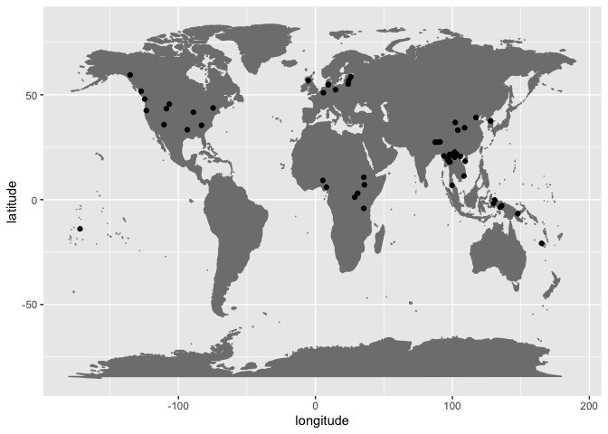

Tonogenesis database checks
================
Steven Moran

13 August, 2023

# Overview

This is an [R markdown](https://rmarkdown.rstudio.com/) report that does
things like check fields in the database, creates tables and graphs of
the data, and integrates [Glottolog
metadata](https://glottolog.org/meta/downloads).

It’s also set up so that we can easily cite references in the [BibTeX
biblography](referencs.bib). For example: Kristoffersen (2000) will now
appear below in the references section.

First, let’s load some useful R libraries.

``` r
library(tidyverse)
library(knitr)
```

We’ve downloaded the data from the private [Google
sheets](https://docs.google.com/spreadsheets/d/1qkmyyNiTWilIxG6bZRDJ8eUef8ox7N_Q7seKCV0WGRo/edit#gid=0)
document and placed it in the [data](data) folder.

Let’s load the index.

``` r
index <- read.csv('data/Tonogenesis - Index.csv')
```

And let’s have a look at it.

``` r
kable(index) %>% head()
```

    ## [1] "|  ID|LanguageVariety                                           |Glottocode |Family                         |Area          |Notes                                                                  |BibTex                    |X                                                                                                                      |"
    ## [2] "|---:|:---------------------------------------------------------|:----------|:------------------------------|:-------------|:----------------------------------------------------------------------|:-------------------------|:----------------------------------------------------------------------------------------------------------------------|"
    ## [3] "|   1|Proto-Nordic                                              |nort3160   |Indoeuropean                   |Europe        |Glottocode for North Germanic                                          |kristoffersen2000         |                                                                                                                       |"
    ## [4] "|   2|Yabem                                                     |yabe1254   |Austronesian                   |Papunesia     |                                                                       |kingston2011              |                                                                                                                       |"
    ## [5] "|   3|Kammu                                                     |khmu1256   |Austroasiatic                  |Asia          |                                                                       |kingston2011              |                                                                                                                       |"
    ## [6] "|   4|Phan Rang Cham                                            |east2563   |Austronesian                   |Asia          |                                                                       |kingston2011              |                                                                                                                       |"

Currently, we have parentheses in the `Glottocode` column that denote
non-leaf nodes. These will be changed in the future, but for now let’s
strip those out, so that we can merge our index with the Glottolog
metadata.

``` r
index$Glottocode <- index$Glottocode %>% str_replace("\\(", "")
index$Glottocode <- index$Glottocode %>% str_replace("\\)", "")
index$Glottocode
```

    ##   [1] "nort3160" "yabe1254" "khmu1256" "east2563" "viet1252" "sind1278"
    ##   [7] "nucl1310" "lahu1253" "midd1344" "cher1273" "atha1247" "atha1247"
    ##  [13] "nort3160" "cemu1238" "utsa1239" "baim1244" "uuuu1243" "lugb1240"
    ##  [19] "khal1275" "kurt1248" "moha1257" "heil1246" "iraq1241" "podo1243"
    ##  [25] "bila1255" "ndak1241" "dzon1239" "kohu1244" "kore1280" "pwon1235"
    ##  [31] "hmon1333" "hopi1249" ""         "huuu1240" "esto1258" "benc1235"
    ##  [37] "sout2746" "nort2740" "shan1277" ""         "midd1319" "newc1243"
    ##  [43] "extr1245" "taik1256" "samo1305" "dani1285" "dani1285" "scot1245"
    ##  [49] "limb1263" "tian1238" "tsat1238" "thai1261" "slav1255" "yeni1252"
    ##  [55] "bwek1238" "chey1247" "kick1244" "boro1277" "pwoo1239" "sgaw1245"
    ##  [61] "prus1238" "walu1241" "zhuo1234" "cent2346" "zhon1235" "tuuu1240"
    ##  [67] "raja1258" "matb1237" "morm1235" "ires1239" "east2280" "latv1249"
    ##  [73] "lith1251" "auks1239" "metn1237" "cant1236" "nupe1254" "arap1274"
    ##  [79] "moha1258" "cadd1256" "kere1287" "take1257" "quil1240" "geba1237"
    ##  [85] "coas1300" "tlin1245" ""         "mang1393" "moba1244" "brok1248"
    ##  [91] "kwam1249" "opuu1239" "uspa1245" "moch1257" "yuca1254" "tzot1259"
    ##  [97] "orej1242" "tere1281" "cube1242" "bara1380" "tatu1247" "hupd1244"

We’ve now removed the trailing parentheses, but we can see 1) that some
Glottocodes have spaces, e.g. ” dani1285”, and some are empty strings.
We need to fix the spaces in the input data (another reason why we don’t
want to have to maintain multiple columns in different sheets with the
same information!). For the time being, we will simply strip the
whitespace here, because otherwise when we join in the metadata, ”
dani1285” will not match Glottolog metadata “dani1285”.

``` r
index$Glottocode <- index$Glottocode %>% str_trim()
index$Glottocode
```

    ##   [1] "nort3160" "yabe1254" "khmu1256" "east2563" "viet1252" "sind1278"
    ##   [7] "nucl1310" "lahu1253" "midd1344" "cher1273" "atha1247" "atha1247"
    ##  [13] "nort3160" "cemu1238" "utsa1239" "baim1244" "uuuu1243" "lugb1240"
    ##  [19] "khal1275" "kurt1248" "moha1257" "heil1246" "iraq1241" "podo1243"
    ##  [25] "bila1255" "ndak1241" "dzon1239" "kohu1244" "kore1280" "pwon1235"
    ##  [31] "hmon1333" "hopi1249" ""         "huuu1240" "esto1258" "benc1235"
    ##  [37] "sout2746" "nort2740" "shan1277" ""         "midd1319" "newc1243"
    ##  [43] "extr1245" "taik1256" "samo1305" "dani1285" "dani1285" "scot1245"
    ##  [49] "limb1263" "tian1238" "tsat1238" "thai1261" "slav1255" "yeni1252"
    ##  [55] "bwek1238" "chey1247" "kick1244" "boro1277" "pwoo1239" "sgaw1245"
    ##  [61] "prus1238" "walu1241" "zhuo1234" "cent2346" "zhon1235" "tuuu1240"
    ##  [67] "raja1258" "matb1237" "morm1235" "ires1239" "east2280" "latv1249"
    ##  [73] "lith1251" "auks1239" "metn1237" "cant1236" "nupe1254" "arap1274"
    ##  [79] "moha1258" "cadd1256" "kere1287" "take1257" "quil1240" "geba1237"
    ##  [85] "coas1300" "tlin1245" ""         "mang1393" "moba1244" "brok1248"
    ##  [91] "kwam1249" "opuu1239" "uspa1245" "moch1257" "yuca1254" "tzot1259"
    ##  [97] "orej1242" "tere1281" "cube1242" "bara1380" "tatu1247" "hupd1244"

Now it looks good.

Let’s load the Glottolog metadata.

``` r
glottolog <- read_csv('https://cdstar.shh.mpg.de/bitstreams/EAEA0-D501-DBB8-65C4-0/languages_and_dialects_geo.csv')
```

    ## Rows: 20930 Columns: 7
    ## ── Column specification ────────────────────────────────────────────────────────
    ## Delimiter: ","
    ## chr (5): glottocode, name, isocodes, level, macroarea
    ## dbl (2): latitude, longitude
    ## 
    ## ℹ Use `spec()` to retrieve the full column specification for this data.
    ## ℹ Specify the column types or set `show_col_types = FALSE` to quiet this message.

And have a look if it downloaded and loaded correctly.

``` r
glottolog %>% head() %>% kable()
```

| glottocode | name       | isocodes | level    | macroarea | latitude | longitude |
|:-----------|:-----------|:---------|:---------|:----------|---------:|----------:|
| 3adt1234   | 3Ad-Tekles | NA       | dialect  | Africa    |       NA |        NA |
| aala1237   | Aalawa     | NA       | dialect  | Papunesia |       NA |        NA |
| aant1238   | Aantantara | NA       | dialect  | Papunesia |       NA |        NA |
| aari1239   | Aari       | aiw      | language | Africa    |  5.95034 |   36.5721 |
| aari1240   | Aariya     | aay      | language | Eurasia   |       NA |        NA |
| aasa1238   | Aasax      | aas      | language | Africa    | -4.00679 |   36.8648 |

Let’s merge it into our index. We have to use the `by` parameter because
the column names are different.

``` r
index_glottolog <- left_join(index, glottolog, by=c("Glottocode"="glottocode"))
```

And have a look.

``` r
index_glottolog %>% head() %>% kable()
```

|  ID | LanguageVariety | Glottocode | Family        | Area      | Notes                         | BibTex            | X   | name         | isocodes | level    | macroarea | latitude | longitude |
|----:|:----------------|:-----------|:--------------|:----------|:------------------------------|:------------------|:----|:-------------|:---------|:---------|:----------|---------:|----------:|
|   1 | Proto-Nordic    | nort3160   | Indoeuropean  | Europe    | Glottocode for North Germanic | kristoffersen2000 |     | NA           | NA       | NA       | NA        |       NA |        NA |
|   2 | Yabem           | yabe1254   | Austronesian  | Papunesia |                               | kingston2011      |     | Yabem        | jae      | language | Papunesia | -6.67052 |  147.8100 |
|   3 | Kammu           | khmu1256   | Austroasiatic | Asia      |                               | kingston2011      |     | Khmu         | kjg      | language | Eurasia   | 20.24630 |  101.6710 |
|   4 | Phan Rang Cham  | east2563   | Austronesian  | Asia      |                               | kingston2011      |     | Eastern Cham | cjm      | language | Eurasia   | 11.28530 |  108.4900 |
|   5 | Vietnamese      | viet1252   | Austroasiatic | Asia      |                               | kingston2011      |     | Vietnamese   | vie      | language | Eurasia   | 20.68119 |  105.7741 |
|   6 | Punjabi         | sind1278   | Indoeuropean  | Asia      | Glottocode for Sindhi-Lahnda  | yip2002           |     | NA           | NA       | NA       | NA        |       NA |        NA |

Glottolog has two different metadata files. This one is for the language
name, level, macroareas, and geo-corrdinates. It only contains present
day languages, i.e. leaf nodes in the tree, and hence not reconstructed
or intermediate level nodes like “Proto-Nordic”.

The other Glottolog metadata file is the [languoids
file](https://cdstar.shh.mpg.de/bitstreams/EAEA0-D501-DBB8-65C4-0/glottolog_languoid.csv.zip),
which needs to be downloaded and unzipped. We have put it in the `data`
file for the time being.

Let’s have a look at it.

``` r
glottolog_languoids <- read_csv('data/languoid.csv')
```

    ## Rows: 25439 Columns: 15
    ## ── Column specification ────────────────────────────────────────────────────────
    ## Delimiter: ","
    ## chr (7): id, family_id, parent_id, name, level, iso639P3code, country_ids
    ## dbl (5): latitude, longitude, child_family_count, child_language_count, chil...
    ## lgl (3): bookkeeping, description, markup_description
    ## 
    ## ℹ Use `spec()` to retrieve the full column specification for this data.
    ## ℹ Specify the column types or set `show_col_types = FALSE` to quiet this message.

``` r
glottolog_languoids %>% glimpse()
```

    ## Rows: 25,439
    ## Columns: 15
    ## $ id                   <chr> "3adt1234", "aala1237", "aant1238", "aari1238", "…
    ## $ family_id            <chr> "afro1255", "aust1307", "nucl1709", "sout2845", "…
    ## $ parent_id            <chr> "nort3292", "ramo1244", "nort2920", "ahkk1235", "…
    ## $ name                 <chr> "3Ad-Tekles", "Aalawa", "Aantantara", "Aari-Gayil…
    ## $ bookkeeping          <lgl> FALSE, FALSE, FALSE, FALSE, FALSE, TRUE, FALSE, F…
    ## $ level                <chr> "dialect", "dialect", "dialect", "family", "langu…
    ## $ latitude             <dbl> NA, NA, NA, NA, 5.950340, NA, -4.006790, NA, NA, …
    ## $ longitude            <dbl> NA, NA, NA, NA, 36.57210, NA, 36.86480, NA, NA, N…
    ## $ iso639P3code         <chr> NA, NA, NA, "aiz", "aiw", "aay", "aas", NA, NA, N…
    ## $ description          <lgl> NA, NA, NA, NA, NA, NA, NA, NA, NA, NA, NA, NA, N…
    ## $ markup_description   <lgl> NA, NA, NA, NA, NA, NA, NA, NA, NA, NA, NA, NA, N…
    ## $ child_family_count   <dbl> 0, 0, 0, 0, 0, 0, 0, 0, 0, 0, 0, 13, 0, 0, 0, 0, …
    ## $ child_language_count <dbl> 0, 0, 0, 2, 0, 0, 0, 0, 0, 0, 0, 22, 0, 0, 0, 0, …
    ## $ child_dialect_count  <dbl> 0, 0, 0, 0, 0, 0, 0, 0, 0, 0, 0, 29, 0, 0, 0, 0, …
    ## $ country_ids          <chr> NA, NA, NA, NA, "ET", "IN", "TZ", NA, NA, NA, NA,…

We can see that it also contains information such as the language family
ID, ISO code, etc. It use to contain more information, such as
endangerment status, so for now let’s just work with our index.

Let’s see how our language names differ.

``` r
index_glottolog %>% filter(LanguageVariety != name) %>% select(ID, LanguageVariety, name) %>% kable()
```

|  ID | LanguageVariety                   | name               |
|----:|:----------------------------------|:-------------------|
|   3 | Kammu                             | Khmu               |
|   4 | Phan Rang Cham                    | Eastern Cham       |
|  14 | Cem                               | Cemuhî             |
|  16 | Baima Tibetan                     | Baima              |
|  18 | Western Lugbara                   | Lugbara            |
|  20 | Kurtöp                            | Kurtokha           |
|  22 | Heiltsuk                          | Heiltsuk-Oowekyala |
|  26 | Bantu D30                         | Ndaka              |
|  30 | Phlong                            | Pwo Northern Karen |
|  31 | White Hmong                       | Hmong Daw          |
|  36 | Gimira                            | Bench              |
|  37 | Nakhon Si Thammarat Thai          | Southern Thai      |
|  38 | Yung Chiang Kam                   | Northern Thai      |
|  46 | Zealand Danish                    | Danish             |
|  47 | East Slesvig                      | Danish             |
|  48 | Scottish gaelic (Bernera)         | Scottish Gaelic    |
|  49 | Limburgish                        | Limburgan          |
|  50 | T’ientsin                         | Tianjin Mandarin   |
|  51 | Utsat                             | Tsat               |
|  52 | Proto-Tai                         | Thai               |
|  55 | Chitabu (bwe)                     | Bwe Karen          |
|  58 | Shinasha                          | Boro (Ethiopia)    |
|  60 | Sgaw Karen                        | S’gaw Karen        |
|  61 | West Baltic (Prussian)            | Old Prussian       |
|  62 | Tokpe Gola (Tibetan)              | Walungge           |
|  63 | Zhuoni Tibetan                    | Zhuoni             |
|  66 | Zhibo Tibetan                     | Zhongu             |
|  67 | Mongour                           | Tu                 |
|  69 | Magey Matbat                      | Matbat             |
|  70 | Moor                              | Mor (Mor Islands)  |
|  75 | Auktaitian dialects of Lithuanian | Aukshtaitish       |
|  76 | Metnyo Ambel                      | Metnyo             |
|  78 | Nupe                              | Nupe-Nupe-Tako     |
|  85 | Geba                              | Geba Karen         |
|  87 | Sanya-Henya Tlingit               | Tlingit            |
|  91 | Brokpa                            | Brokpake           |
|  92 | Proto-Gwama                       | Gwama              |
|  93 | Proto-Opo                         | Opo                |
|  94 | Uspanteko                         | Uspanteco          |
|  95 | Mocho’                            | Mocho              |
|  96 | Yucatec                           | Yucatec Maya       |
|  97 | San Bartolo Tzotzil               | Tzotzil            |
|  99 | Terena                            | Terena             |
| 100 | Kubeo                             | Cubeo              |
| 101 | Barasana                          | Barasana-Eduria    |
| 103 | Eastern Naduhup                   | Hup                |

Or how our areas differ.

``` r
index_glottolog %>% filter(Area != macroarea) %>% select(Area, macroarea) %>% distinct() %>% kable()
```

| Area   | macroarea |
|:-------|:----------|
| Asia   | Eurasia   |
| Europe | Eurasia   |

Not bad.

Let’s have a look at the area distribution. The parameter
`exclude = FALSE` will return any NAs in the data.

``` r
table(index_glottolog$Area, exclude = FALSE)
```

    ## 
    ##        Africa          Asia        Europe North America     Papunesia 
    ##            13            39            14            20            10 
    ## South America 
    ##             6

Since we’re missing some connections with Glottolog, we’ll have a few
NAs here.

``` r
table(index_glottolog$macroarea, exclude = FALSE)
```

    ## 
    ##        Africa       Eurasia North America     Papunesia South America 
    ##            11            40            16             7             6 
    ##          <NA> 
    ##            22

Given the data that do overlap, we can create a quick map. There will be
a warning for where we’re missing geo-coordinates.

``` r
ggplot(data=index_glottolog, aes(x=longitude,y=latitude)) + 
  borders("world", colour="gray50", fill="gray50") + 
  geom_point()
```

    ## Warning: Removed 29 rows containing missing values (`geom_point()`).

<!-- -->

We can also write some tests to make sure that our input data are valid.
For example, do all of our Glottocodes follow their format?

``` r
library(testthat)
```

    ## 
    ## Attaching package: 'testthat'

    ## The following object is masked from 'package:dplyr':
    ## 
    ##     matches

    ## The following object is masked from 'package:purrr':
    ## 
    ##     is_null

    ## The following objects are masked from 'package:readr':
    ## 
    ##     edition_get, local_edition

    ## The following object is masked from 'package:tidyr':
    ## 
    ##     matches

``` r
glottocode <- "([a-z0-9]{4})([0-9]{4})"
which(!(str_detect(index$Glottocode, glottocode)))
```

    ## [1] 33 40 87

``` r
# When the above codes are fixed, then we can uncomment this test -- otherwise the code fails here.
# expect_equal(length(which(!(str_detect(index$Glottocode, glottocode)))), 0)
```

``` r
data <- read.csv('data/Tonogenesis - Database.csv')
```

``` r
table(data$TriggeringContext)
```

    ## 
    ##                                                                                                                                                                                                                                                                                                            +ATR with high tone 
    ##                                                                                                                                                                                                                                                                                                                              1 
    ##                                                                                                                                                                                                                                                                                                            -ATR with high tone 
    ##                                                                                                                                                                                                                                                                                                                              1 
    ##                                                                                                                                                                                                                          -h, -s (< *-hs), preaspiration on the following syllable onset, or a voiceless semivowel or sonorant. 
    ##                                                                                                                                                                                                                                                                                                                              1 
    ##                                                                                                                                                                                                                                                                                                                         *CVhC  
    ##                                                                                                                                                                                                                                                                                                                              1 
    ##                                                                                                                                                                                                                                                      *VʔC sequences develope a copy vowel V1ʔV1C, then loose the glottal stop  
    ##                                                                                                                                                                                                                                                                                                                              1 
    ##                                                                                                                                                                                                                                                                                                           /s/ + sonorant onset 
    ##                                                                                                                                                                                                                                                                                                                              1 
    ##                                                                                                                                                                         a high tone developed from PM *VhC sequences and an copy vowel as well as high tone on the first vowel from PM *VʔC sequences, yielding Yucatec V́1ʔV1C 
    ##                                                                                                                                                                                                                                                                                                                              1 
    ##                                                                                                                                                                                                                                                                                                         addition of a syllable 
    ##                                                                                                                                                                                                                                                                                                                              2 
    ##                                                                                                                                                                                                                                                                   analogical alenghtening of vowel in singular to match plural 
    ##                                                                                                                                                                                                                                                                                                                              1 
    ##                                                                                                                                                                                                                                                                                    antepenultimate preceding light penultimate 
    ##                                                                                                                                                                                                                                                                                                                              1 
    ##                                                                                                                                                                                                                                                                              apocope causes tonal differences on monosyllables 
    ##                                                                                                                                                                                                                                                                                                                              1 
    ##                                                                                                                                                                                                                                 Apocope leads to new distinction in monosyllables after loss of accent 1/ accent 2 distinction 
    ##                                                                                                                                                                                                                                                                                                                              1 
    ##                                                                                              As a result of the loss of antevocalic *i, a High tone (i.e. stress) on this vowel was retracted to the preceding syllable in East Baltic, yielding a rising (=Low–High) tone. The stress was similarly retracted from final *–a. 
    ##                                                                                                                                                                                                                                                                                                                              1 
    ##                                                                                                                                                                                                                                                                  aspirated voiceless stop or preaspirated nasal onset + tone A 
    ##                                                                                                                                                                                                                                                                                                                              1 
    ##                                                                                                                                                                                                 aspirated voiceless stop or preaspirated nasal onset + tone A OR aspirated voiceless stop or preaspirated nasal onset + tone B 
    ##                                                                                                                                                                                                                                                                                                                              1 
    ##                                                                                                                                                                                                                                                                  aspirated voiceless stop or preaspirated nasal onset + tone B 
    ##                                                                                                                                                                                                                                                                                                                              1 
    ##                                                                                                                                                                                                                                                                  aspirated voiceless stop or preaspirated nasal onset + tone C 
    ##                                                                                                                                                                                                                                                                                                                              2 
    ##                                                                                                                                                                                                                                               Aspirated voiceless stop or prenasalized aspirated voiceless stop onset + tone A 
    ##                                                                                                                                                                                                                                                                                                                              1 
    ##                                                                                                                                                                                                                                               Aspirated voiceless stop or prenasalized aspirated voiceless stop onset + tone B 
    ##                                                                                                                                                                                                                                                                                                                              1 
    ##                                                                                                                                                           Aspirated voiceless stop or prenasalized aspirated voiceless stop onset + tone C OR aspirated voiceless stop or prenasalized aspirated voiceless stop onset + tone D 
    ##                                                                                                                                                                                                                                                                                                                              1 
    ##                                                                                                                                                                                                                                                                                     before preaspirate obstruent OR before /h/ 
    ##                                                                                                                                                                                                                                                                                                                              1 
    ##                                                                                                                                                                                                                                    boundary intonation: high tone at the end of a phrase, becomes lexicalised in some suffixes 
    ##                                                                                                                                                                                                                                                                                                                              1 
    ##                                                                                                                                                                                             Case marker "ia" dissappears and leads to high tone on the last syllable of the word immediatly preceeding the absolutive argument 
    ##                                                                                                                                                                                                                                                                                                                              1 
    ##                                                                                                                                                                                                                                                          cluster Obstuent+voiced obstruent OR voiced onset OR initial sonorant 
    ##                                                                                                                                                                                                                                                                                                                              1 
    ##                                                                                                                                                                                                                                                                                       coda consonants other than /-r/ and /-l/ 
    ##                                                                                                                                                                                                                                                                                                                              1 
    ##                                                                                                                                                                                                                                                                                                depressor consonant + high tone 
    ##                                                                                                                                                                                                                                                                                                                              1 
    ##                                                                                                                                                                                                                                                                                             destressing after loss of syllable 
    ##                                                                                                                                                                                                                                                                                                                              1 
    ##                                                                                                                                                                                                                                                                                               disyllable that stays disyllabic 
    ##                                                                                                                                                                                                                                                                                                                              1 
    ##                                                                                                                                                                                                                                                                                                               extra long vowel 
    ##                                                                                                                                                                                                                                                                                                                              1 
    ##                                                                                                                                                                                                                                                                                                           final -h + high tone 
    ##                                                                                                                                                                                                                                                                                                                              1 
    ##                                                                                                                                                                                                                                                                                                                      final /h/ 
    ##                                                                                                                                                                                                                                                                                                                              2 
    ##                                                                                                                                                                                                                                                                                                             final glottal stop 
    ##                                                                                                                                                                                                                                                                                                                              5 
    ##                                                                                                                                                                                                                                                                                                                final oral stop 
    ##                                                                                                                                                                                                                                                                                                                              2 
    ##                                                                                                                                                                                                                                                                                            Final oral stop, final glottal stop 
    ##                                                                                                                                                                                                                                                                                                                              1 
    ##                                                                                                                                                                                                                                                                                                final sonorant or open syllable 
    ##                                                                                                                                                                                                                                                                                                                              1 
    ##                                                                                                                                                                                                                                                                                        final stop + high tone, voiceless final 
    ##                                                                                                                                                                                                                                                                                                                              1 
    ##                                                                                                                                                                                                                                                                                                      Final voiceless fricative 
    ##                                                                                                                                                                                                                                                                                                                              1 
    ##                                                                                                                                                                                                                                                                                                           final voiceless stop 
    ##                                                                                                                                                                                                                                                                                                                              1 
    ##                                                                                                                                                                                 glottalic sonorants which become syllablic sonorants without glottalic realisation, but still avoid stress, which is assosiated with high tone 
    ##                                                                                                                                                                                                                                                                                                                              1 
    ##                                                                                                                                                                                                                                                                                                                 glottalization 
    ##                                                                                                                                                                                                                                                                                                                              1 
    ##                                                                                                                                                                                                 Glottalized voiced consonant or voiceless stop onset + tona B OR Glottalized voiced consonant or voiceless stop onset + tona A 
    ##                                                                                                                                                                                                                                                                                                                              1 
    ##                                                                                                                                                                                                                                                                  Glottalized voiced consonant or voiceless stop onset + tona C 
    ##                                                                                                                                                                                                                                                                                                                              1 
    ##                                                                                                                                                                                                                         H tones are rised when followed by L tones, loss of final vowels leads this rise to become contrastive 
    ##                                                                                                                                                                                                                                                                                                                              1 
    ##                                                                                                                                                                                                                                                                     heavy penultimate syllable (CVV or CVVC) (indicative mood) 
    ##                                                                                                                                                                                                                                                                                                                              1 
    ##                                                                                                                                                                                                                                                                                                   high level tone + high vowel 
    ##                                                                                                                                                                                                                                                                                                                              1 
    ##                                                                                                                                                                                                                                                                                                    high level tone + low vowel 
    ##                                                                                                                                                                                                                                                                                                                              1 
    ##                                                                                                                                                                                                                                                      high long vowel, diphthong or short vowel + any consonant but /r, ŋ/ coda 
    ##                                                                                                                                                                                                                                                                                                                              1 
    ##                                                                                                                                                                                                                                                                                                       high tone + glottal stop 
    ##                                                                                                                                                                                                                                                                                                                              1 
    ##                                                                                                                                                                                                                                                                                                        high tone +glottal stop 
    ##                                                                                                                                                                                                                                                                                                                              1 
    ##                                                                                                                                                                                                                                                                                                            high tone plus -ATR 
    ##                                                                                                                                                                                                                                                                                                                              1 
    ##                                                                                                                                                                                                                                                                                                            high tone plus +ATR 
    ##                                                                                                                                                                                                                                                                                                                              1 
    ##                                                                                                                                                                                                                                                                                                 high tone without glottal stop 
    ##                                                                                                                                                                                                                                                                                                                              1 
    ##                                                                                                                                                                                                                                                                                                                    high vowels 
    ##                                                                                                                                                                                                                                                                                                                              1 
    ##                                                                                                                                                                                                        in the default case Heiltsuk assigns stress, normally realized as high tone, to the leftmost vowel or syllabic sonorant 
    ##                                                                                                                                                                                                                                                                                                                              1 
    ##                                                                                                                                                                                                                                                             inital aspirated voiceless or unaspirated voiceless + proto-tone B 
    ##                                                                                                                                                                                                                                                                                                                              1 
    ##                                                                                                                                                                 inital aspirated voiceless/unaspirated voiceless + proto-tone A OR inital aspirated voiceless/initial unaspirated voiceless + proto-tone C (Checked syllables) 
    ##                                                                                                                                                                                                                                                                                                                              1 
    ##                                                                                                                                                                                                                                                                                        inital glide or final glottal consonant 
    ##                                                                                                                                                                                                                                                                                                                              1 
    ##                                                                                                                                                                                                                                                                                               initial brethy voiced consonants 
    ##                                                                                                                                                                                                                                                                                                                              1 
    ##                                                                                                                                                                                                                                                                                                    initial depressor consonant 
    ##                                                                                                                                                                                                                                                                                                                              1 
    ##                                                                                                                                                                                                                                                                                                   initial depressor consonants 
    ##                                                                                                                                                                                                                                                                                                                              1 
    ##                                                                                                                                                                                                                                                                                    initial other than voiced stop or affricate 
    ##                                                                                                                                                                                                                                                                                                                              1 
    ##                                                                                                                                                                                                                                                                                                       initial voiced consonant 
    ##                                                                                                                                                                                                                                                                                                                              1 
    ##                                                                                                                                                                                                                                                                                                            Initial voiced stop 
    ##                                                                                                                                                                                                                                                                                                                              1 
    ##                                                                                                                                                                                                                                                                                             Initial voiced stop + Falling tone 
    ##                                                                                                                                                                                                                                                                                                                              1 
    ##                                                                                                                                                                                                                                                                                              Initial voiced stop + Level tone  
    ##                                                                                                                                                                                                                                                                                                                              1 
    ##                                                                                                                                                                                                                                                                                              Initial voiced stop + Rising tone 
    ##                                                                                                                                                                                                                                                                                                                              1 
    ##                                                                                                                                                                                                                                                                                                Initial voiced stop or sonorant 
    ##                                                                                                                                                                                                                                                                                                                              1 
    ##                                                                                                                                                                                                                                                                                                         Initial voiceless stop 
    ##                                                                                                                                                                                                                                                                                                                              1 
    ##                                                                                                                                                                                                                                                                                          Initial voiceless stop + Falling tone 
    ##                                                                                                                                                                                                                                                                                                                              1 
    ##                                                                                                                                                                                                                                                                                           Initial voiceless stop + Level tone  
    ##                                                                                                                                                                                                                                                                                                                              1 
    ##                                                                                                                                                                                                                                                                                           Initial voiceless stop + Rising tone 
    ##                                                                                                                                                                                                                                                                                                                              1 
    ##                                                                                                                                                                                                                                                                                   Initial voiceless stop or voiceless sonorant 
    ##                                                                                                                                                                                                                                                                                                                              1 
    ##                                                                                                                                                                                                                                                                                                 introduction of word-final /a/ 
    ##                                                                                                                                                                                                                                                                                                                              1 
    ##                                                                                                                                                                                                                                                                                                                 laryngeal coda 
    ##                                                                                                                                                                                                                                                                                                                              6 
    ##                                                                                                                                                                                                                                   lengthened accented vowel followed by a glottal stop or by * / h / plus a resonant consonant 
    ##                                                                                                                                                                                                                                                                                                                              1 
    ##                                                                                                                                                                                                                                                                                                                     long vowel 
    ##                                                                                                                                                                                                                                                                                                                              1 
    ##                                                                                                                                                                                                                                                                                                       long vowel + voiced coda 
    ##                                                                                                                                                                                                                                                                                                                              1 
    ##                                                                                                                                                                                                                                                                                                    long vowel + voiceless coda 
    ##                                                                                                                                                                                                                                                                                                                              1 
    ##                                                                                                                                                                                                                                                                                                                    long vowels 
    ##                                                                                                                                                                                                                                                                                                                              1 
    ##                                                                                                                                                                                                                                                                                                       Loss of a coda consonant 
    ##                                                                                                                                                                                                                                                                                                                              1 
    ##                                                                                                                                                                                                                                                                      loss of a second syllable OR loss of a coda /-r/ or /-l/. 
    ##                                                                                                                                                                                                                                                                                                                              1 
    ##                                                                                                                                                                                                                                                               Loss of final ə: Hoppe > hop (developed after the stød contrast) 
    ##                                                                                                                                                                                                                                                                                                                              1 
    ##                                                                                                                                                                                                                                                                                                           Loss of glottal stop 
    ##                                                                                                                                                                                                                                                                                                                              4 
    ##                                                                                                                                                                                                                                                            loss of glottalization in originally stressed constricted syllables 
    ##                                                                                                                                                                                                                                                                                                                              1 
    ##                                                                                                                                                                                                                                                                              loss of suffix beginning with depressor consonant 
    ##                                                                                                                                                                                                                                                                                                                              1 
    ##                                                                                                                                                                                                                                                                       loss of the glottal constriction (in stressed syllables) 
    ##                                                                                                                                                                                                                                                                                                                              1 
    ##                                                                                                                                                                                                                                                                                                        low tone + glottal stop 
    ##                                                                                                                                                                                                                                                                                                                              1 
    ##                                                                                                                                                                                                                                                                           low tone + onset other than voiced stop or affricate 
    ##                                                                                                                                                                                                                                                                                                                              1 
    ##                                                                                                                                                                                                                                                                                      low tone + voiced stop or affricate onset 
    ##                                                                                                                                                                                                                                                                                                                              1 
    ##                                                                                                                                                                                                                                                                    lower high tone + onset other than voiced stop or affricate 
    ##                                                                                                                                                                                                                                                                                                                              1 
    ##                                                                                                                                                                                                                                                                               lower high tone + voiced stop or affricate onset 
    ##                                                                                                                                                                                                                                                                                                                              1 
    ##                                                                                                                              mid tone + low long vowel, short vowel + /r, ŋ/ OR long high vowel, diphthong or short vowel followed by a sonorant consonant get a falling tone if the next syllable has undergone Schwa Apocope 
    ##                                                                                                                                                                                                                                                                                                                              1 
    ##                                                                                                                                                                                                                                                                                                 non-glottalized coda obstruent 
    ##                                                                                                                                                                                                                                                                                                                              1 
    ##                                                                                                                                                                                                                                                                                  Obstruent coda OR disyllable --> monosyllable 
    ##                                                                                                                                                                                                                                                                                                                              1 
    ##                                                                                                                                                                                                                                         obstruent+sonorant cluster OR voiceless onset OR obstruent+voiceless obstruent cluster 
    ##                                                                                                                                                                                                                                                                                                                              1 
    ##                                                                                                                                                                                                                                                                                                                       onset *p 
    ##                                                                                                                                                                                                                                                                                                                              1 
    ##                                                                                                                                                                                                                                                                    Onset *q, word-final *R (most likely a voiced uvular trill) 
    ##                                                                                                                                                                                                                                                                                                                              1 
    ##                                                                                                                                                                                                                                                                                                                  open syllable 
    ##                                                                                                                                                                                                                                                                                                                              1 
    ##                                                                                                                                                                                                                                                                                                   open syllable or final nasal 
    ##                                                                                                                                                                                                                                                                                                                              1 
    ##                                                                                                                                                                                                               original bisyllables or words where the loss of an intervocalic consonant turns a bisyllable into a monosyllable 
    ##                                                                                                                                                                                                                                                                                                                              1 
    ##                                                                                                                                                                                                                                                            Originally stressed unconstricted syllables developed a rising tone 
    ##                                                                                                                                                                                                                                                                                                                              1 
    ##                                                                                                                                                                                                                                                                                                                       PAN *-H1 
    ##                                                                                                                                                                                                                                                                                                                              1 
    ##                                                                                                                                                                                                                                                                                                                   PAN *-R, *-X 
    ##                                                                                                                                                                                                                                                                                                                              1 
    ##                                                                                                                                                                                                                                                                                                             penultimate stress 
    ##                                                                                                                                                                                                                                                                                                                              1 
    ##                                                                                                                                                                                                                                    plain voiced continuant, stop or fricative: m, n, ɲ, l,(*b>)p,(*d>)t,(*g>)k,(*ʀ>)j + Tone A 
    ##                                                                                                                                                                                                                                                                                                                              1 
    ##                                                                                                                                                                                                                                    plain voiced continuant, stop or fricative: m, n, ɲ, l,(*b>)p,(*d>)t,(*g>)k,(*ʀ>)j + Tone B 
    ##                                                                                                                                                                                                                                                                                                                              1 
    ##                                                                                                                                                                                                                                    plain voiced continuant, stop or fricative: m, n, ɲ, l,(*b>)p,(*d>)t,(*g>)k,(*ʀ>)j + Tone C 
    ##                                                                                                                                                                                                                                                                                                                              1 
    ##                                                                                                                                                                                                                                                                                       plain voiceless or voiced onset + tone A 
    ##                                                                                                                                                                                                                                                                                                                              1 
    ##                                                                                                                                                                                                                                                                                                     prefixed sonorant initials 
    ##                                                                                                                                                                                                                                                                                                                              1 
    ##                                                                                                                                                                                                                                preglottalized, or plain unvoiced stop: (*ɓ>)m,(*ʔm>)m,(*ʔn>)n,(*ɗ>)l,(*ʔʀ>)j, k, t, p + tone A 
    ##                                                                                                                                                                                                                                                                                                                              1 
    ##                                                                                                                                                                                                                                preglottalized, or plain unvoiced stop: (*ɓ>)m,(*ʔm>)m,(*ʔn>)n,(*ɗ>)l,(*ʔʀ>)j, k, t, p + Tone B 
    ##                                                                                                                                                                                                                                                                                                                              1 
    ##                                                                                                                                                                                                                                preglottalized, or plain unvoiced stop: (*ɓ>)m,(*ʔm>)m,(*ʔn>)n,(*ɗ>)l,(*ʔʀ>)j, k, t, p + Tone C 
    ##                                                                                                                                                                                                                                                                                                                              1 
    ##                                                                                                                                                                                                                                                                                                                 primary stress 
    ##                                                                                                                                                                                                                                                                                                                              1 
    ##                                                                                                                                                                                                                                                                                           Probably due to loss of coda  [h ʔ]  
    ##                                                                                                                                                                                                                                                                                                                              1 
    ##                                                                                                                                                                                                                 rise of distinctive Low tone on initial syllables of “unstressed” word forms versus High tone under the stress 
    ##                                                                                                                                                                                                                                                                                                                              1 
    ##                                                                                                                        short syllables (Old Tibetan open and checked) with voiced initial OR  Long syllables (Old Tibetan sonorant coda and contracted disyllables) in most cases, except syllables with non-nasal preradcials 
    ##                                                                                                                                                                                                                                                                                                                              1 
    ##                                                                                                                                                        short syllables (Old Tibetan open and checked) with voiceless initial . Long syllables (Old Tibetan sonorant coda and contracted disyllables) with non-nasal preradical 
    ##                                                                                                                                                                                                                                                                                                                              1 
    ##                                                                                                                                                                                                                                                                                                                    short vowel 
    ##                                                                                                                                                                                                                                                                                                                              2 
    ##                                                                                                                                                                                               short vowel + glottalic stop or sonorant OR long non-glottalic vowel + glottalic sonorants or fricatives OR glottalic full vowel 
    ##                                                                                                                                                                                                                                                                                                                              2 
    ##                                                                                                                                                                        short vowel + glottalized coda obstruent OR monosyllable that originally contained a full (i.e., long, perhaps originally diphthongized?) vowel nucleus 
    ##                                                                                                                                                                                                                                                                                                                              1 
    ##                                                                                                                                                                                                                                               Short vowel + stop or sononrant OR long vowel + glottalic stop, stop or sonorant 
    ##                                                                                                                                                                                                                                                                                                                              2 
    ##                                                                                                                                                                                                                                                                                                                   short vowels 
    ##                                                                                                                                                                                                                                                                                                                              2 
    ##                                                                                                                                                                                                                                                                                                                  sonorant coda 
    ##                                                                                                                                                                                                                                                                                                                              1 
    ##                                                                                                                                                                                                                                            sonorant endings (vowels, semi-vowels, nasals, liquids) and Proto-Austronesian *-H2 
    ##                                                                                                                                                                                                                                                                                                                              1 
    ##                                                                                                                                                                                                                                                                         stressed constricted syllable (previously rising tone) 
    ##                                                                                                                                                                                                                                                                                                                              1 
    ##                                                                                                                                                                                                                                                                                stressed syllable with glottal stop or /h/ coda 
    ##                                                                                                                                                                                                                                                                                                                              1 
    ##                                                                                                                                                                                                                                                                       stressed unconstricted syllable (previously rising tone) 
    ##                                                                                                                                                                                                                                                                                                                              1 
    ##                                                                                                                                                                                                                                                   Syllables with H tone not follwed by a L tone on a vowel that was later lost 
    ##                                                                                                                                                                                                                                                                                                                              1 
    ##                                                                                                                                                                                                                                                                                                  the absence of glottalization 
    ##                                                                                                                                                                                                                                                                                                                              1 
    ##                                      The default prosodic pattern in SEM places lexical stress, which is realized by a raised tone melody, typically on the last syllable of the word. The raised tone melody is absent under two circumstances: in utterance-final syllables and in final syllables of certain lexical pairs. 
    ##                                                                                                                                                                                                                                                                                                                              1 
    ##                                                                                                                                                                              the glottalization of originally stressed constricted syllables was weakened and developed into creaky voice quality, resulting in a falling tone 
    ##                                                                                                                                                                                                                                                                                                                              1 
    ##                                                                                                                                                                                                                                       There is (weak) relationship between tone 3 and words that become (or remain) disyllabic 
    ##                                                                                                                                                                                                                                                                                                                              1 
    ##                                                                                                                                                                                                                                                                                             toneless syllable with high vowels 
    ##                                                                                                                                                                                                                                                                                                                              1 
    ##                                                                                                                                                                                                                                                                                         toneless syllable with non-high vowels 
    ##                                                                                                                                                                                                                                                                                                                              1 
    ##                                                                                                                                                                                                                                      trisyllable > disyllable, disyllable with secondarily lenghtened vowel in second syllable 
    ##                                                                                                                                                                                                                                                                                                                              1 
    ##                                                                                                                                                                                                                                                                                                            unaccented syllable 
    ##                                                                                                                                                                                                                                                                                                                              1 
    ##                                                                                                                                                                                                                                                                                                         voiced aspirateed coda 
    ##                                                                                                                                                                                                                                                                                                                              1 
    ##                                                                                                                                                                                                                                                                                                                   voiced final 
    ##                                                                                                                                                                                                                                                                                                                              1 
    ##                                                                                                                                                                                                                                                                                                    voiced initial + level tone 
    ##                                                                                                                                                                                                                                                                                                                              1 
    ##                                                                                                                                                                                                                                                                                                  Voiced initial + proto-tone A 
    ##                                                                                                                                                                                                                                                                                                                              1 
    ##                                                                                                                                                                                                                                                                                                   voiced initial + rising tone 
    ##                                                                                                                                                                                                                                                                                                                              1 
    ##                                                                                                                                                                                                                                                                                              Voiced initial consonant + tone A 
    ##                                                                                                                                                                                                                                                                                                                              1 
    ##                                                                                                                                                                                                                                                                                              Voiced initial consonant + tone B 
    ##                                                                                                                                                                                                                                                                                                                              1 
    ##                                                                                                                                                                                                                                                                                              Voiced initial consonant + tone C 
    ##                                                                                                                                                                                                                                                                                                                              1 
    ##                                                                                                                                                                                                                                                                       voiced initial obstruent OR unprefixexd sonorant initial 
    ##                                                                                                                                                                                                                                                                                                                              1 
    ##                                                                                                                                                                                                 voiced initials with nasal preradical in short syllables OR voiced initial in long syllables OR all continuant codas except -r 
    ##                                                                                                                                                                                                                                                                                                                              1 
    ##                                                                                                                                                                                                                                                                                                   voiced intial + falling tone 
    ##                                                                                                                                                                                                                                                                                                                              1 
    ##                                                                                                                                                                                                                                                         Voiced intial + proto-tone B OR voiced intial + proto-tone C (checked) 
    ##                                                                                                                                                                                                                                                                                                                              1 
    ##                                                                                                                                                                                                                                                                                                voiced intial stop or affricate 
    ##                                                                                                                                                                                                                                                                                                                              1 
    ##                                                                                                                                                                                                                                                                                                                   voiced onset 
    ##                                                                                                                                                                                                                                                                                                                              1 
    ##                                                                                                                                                                                                                                                                                                               voiced onset + L 
    ##                                                                                                                                                                                                                                                                                                                              2 
    ##                                                                                                                                                                                                                                                                                                          voiced onset + tone 1 
    ##                                                                                                                                                                                                                                                                                                                              1 
    ##                                                                                                                                                                                                                                                                                                          voiced onset + tone 2 
    ##                                                                                                                                                                                                                                                                                                                              1 
    ##                                                                                                                                                                                                                                                                                                          voiced onset + tone 3 
    ##                                                                                                                                                                                                                                                                                                                              1 
    ##                                                                                                                                                                                                                                                                                                          voiced onset + tone A 
    ##                                                                                                                                                                                                                                                                                                                              1 
    ##                                                                                                                                                                                                                                                                                                          voiced onset + tone B 
    ##                                                                                                                                                                                                                                                                                                                              1 
    ##                                                                                                                                                                                                                                                                                                          Voiced onset + tone B 
    ##                                                                                                                                                                                                                                                                                                                              2 
    ##                                                                                                                                                                                                                                                                                                          Voiced onset + tone C 
    ##                                                                                                                                                                                                                                                                                                                              1 
    ##                                                                                                                                                                                                                                                                                                voiced onset + tone C (checked) 
    ##                                                                                                                                                                                                                                                                                                                              1 
    ##                                                                                                                                                                                                                                                                                                       voiced palatal fricative 
    ##                                                                                                                                                                                                                                                                                                                              1 
    ##                                                                                                                                                                                                                                                                                                           voiced stop + tone C 
    ##                                                                                                                                                                                                                                                                                                                              1 
    ##                                                                                                                                                                                                                                                                                                           voiced stop + tone D 
    ##                                                                                                                                                                                                                                                                                                                              1 
    ##                                                                                                                                                                                                                                                                                                     voiced stop onset + tone A 
    ##                                                                                                                                                                                                                                                                                                                              4 
    ##                                                                                                                                                                                                                                                                                                     voiced stop onset + tone B 
    ##                                                                                                                                                                                                                                                                                                                              4 
    ##                                                                                                                                                                                                                                                                                                     voiced stop onset + tone C 
    ##                                                                                                                                                                                                                                                                                                                              2 
    ##                                                                                                                                                                                                                                                                                                     Voiced stop onset + tone C 
    ##                                                                                                                                                                                                                                                                                                                              1 
    ##                                                                                                                                                                                                  voiced unaspirated or voiceless aspirated onset consonants OR prenazalised stop initals OR often occur with breathy phonation 
    ##                                                                                                                                                                                                                                                                                                                              1 
    ##                                                                                                                                                                                                                                                                                 voiceless aspirate or voiceless onset + tone A 
    ##                                                                                                                                                                                                                                                                                                                              1 
    ##                                                                                                                                                                                                                                                                                 voiceless aspirate or voiceless onset + tone B 
    ##                                                                                                                                                                                                                                                                                                                              1 
    ##                                                                                                                                                                                                                                                                                 voiceless aspirate or voiceless onset + tone C 
    ##                                                                                                                                                                                                                                                                                                                              1 
    ##                                                                                                                                                                                                                                                              voiceless aspirated initial, at the beginning of accentual phrase 
    ##                                                                                                                                                                                                                                                                                                                              1 
    ##                                                                                                                                                                                                                                                                                             voiceless aspirated onset + tone A 
    ##                                                                                                                                                                                                                                                                                                                              1 
    ##                                                                                                                                                                                                                                                                          voiceless aspirated or plain voiceless onset + tone B 
    ##                                                                                                                                                                                                                                                                                                                              1 
    ##                                                                                                                                                                                                                                                                voiceless aspirated or plain voiceless onset + tone C (checked) 
    ##                                                                                                                                                                                                                                                                                                                              1 
    ##                                                                                                                                                                                                                                     voiceless continuant, or aspirated stop: (*m̥>)m,(*n̥>)n,(*ɲ̊>)ɲj,(*ŋ̊>)∅, kʰ, tʰ, pʰ + Tone A 
    ##                                                                                                                                                                                                                                                                                                                              1 
    ##                                                                                                                                                                                                                                     voiceless continuant, or aspirated stop: (*m̥>)m,(*n̥>)n,(*ɲ̊>)ɲj,(*ŋ̊>)∅, kʰ, tʰ, pʰ + Tone B 
    ##                                                                                                                                                                                                                                                                                                                              1 
    ##                                                                                                                                                                                                                                     voiceless continuant, or aspirated stop: (*m̥>)m,(*n̥>)n,(*ɲ̊>)ɲj,(*ŋ̊>)∅, kʰ, tʰ, pʰ + Tone C 
    ##                                                                                                                                                                                                                                                                                                                              1 
    ##                                                                                                                                                                                                                                                 voiceless geminate consonants become aspirated: reduplication CVCV > CCV > ChV 
    ##                                                                                                                                                                                                                                                                                                                              2 
    ##                                                                                                                                                                                                                                                                                                 voiceless initial + level tone 
    ##                                                                                                                                                                                                                                                                                                                              1 
    ##                                                                                                                                                                                                                                                                                                voiceless initial + rising tone 
    ##                                                                                                                                                                                                                                                                                                                              1 
    ##                                                                                                                                                                                                                                                                                           Voiceless initial consonant + tone A 
    ##                                                                                                                                                                                                                                                                                                                              1 
    ##                                                                                                                                                                                                                                                                                           Voiceless initial consonant + tone B 
    ##                                                                                                                                                                                                                                                                                                                              1 
    ##                                                                                                                                                                                                                                                                                           Voiceless initial consonant + tone C 
    ##                                                                                                                                                                                                                                                                                                                              1 
    ##                                                                                                                                                                                                                                                                        voiceless initial, at the beginning of accentual phrase 
    ##                                                                                                                                                                                                                                                                                                                              1 
    ##                                                                                                                                                                                                                              voiceless initials with nasal preradical in short syllables OR voiceless initial in long syllable 
    ##                                                                                                                                                                                                                                                                                                                              1 
    ##                                                                                                                                                                                                                                                                                                voiceless intial + falling tone 
    ##                                                                                                                                                                                                                                                                                                                              1 
    ##                                                                                                                                                                                                                                                                                                                voiceless onset 
    ##                                                                                                                                                                                                                                                                                                                              1 
    ##                                                                                                                                                                                                                                                                                     voiceless onset + [+high +ATR] nucleus + H 
    ##                                                                                                                                                                                                                                                                                                                              1 
    ##                                                                                                                                                                                                                                                                                                            voiceless onset + L 
    ##                                                                                                                                                                                                                                                                                                                              2 
    ##                                                                                                                                                                                                                                                                                 voiceless onset + not [+high +ATR] nucleus + H 
    ##                                                                                                                                                                                                                                                                                                                              1 
    ##                                                                                                                                                                                                                                                                                                       voiceless onset + tone 1 
    ##                                                                                                                                                                                                                                                                                                                              1 
    ##                                                                                                                                                                                                                                                                                                       voiceless onset + tone 2 
    ##                                                                                                                                                                                                                                                                                                                              1 
    ##                                                                                                                                                                                                                                                                                                       voiceless onset + tone 3 
    ##                                                                                                                                                                                                                                                                                                                              1 
    ##                                                                                                                                                                                                                                                                                                       voiceless onset + tone A 
    ##                                                                                                                                                                                                                                                                                                                              1 
    ##                                                                                                                                                                                                                                                                                       Voiceless onset + tone B/voiced + tone A 
    ##                                                                                                                                                                                                                                                                                                                              1 
    ##                                                                                                                                                                                                                                                                                                    voiceless palatal fricative 
    ##                                                                                                                                                                                                                                                                                                                              1 
    ##                                                                                                                                                                                                                                                                            voiceless stop or preaspirated nasal onset + tone A 
    ##                                                                                                                                                                                                                                                                                                                              1 
    ##                                                                                                                                                                                                                                                                            voiceless stop or preaspirated nasal onset + tone B 
    ##                                                                                                                                                                                                                                                                                                                              1 
    ##                                                                                                                                                                                                                                                                            voiceless stop or preaspirated nasal onset + tone C 
    ##                                                                                                                                                                                                                                                                                                                              1 
    ##                                                                                                                                                                                                                                                                    voiceless stop or voiced preglottalized stop onset + tone A 
    ##                                                                                                                                                                                                                                                                                                                              1 
    ##                                                                                                                                                                                                                                                                    voiceless stop or voiced preglottalized stop onset + tone B 
    ##                                                                                                                                                                                                                                                                                                                              1 
    ##                                                                                                                                                                                                                                                                    voiceless stop or voiced preglottalized stop onset + tone C 
    ##                                                                                                                                                                                                                                                                                                                              1 
    ##                                                                                                                                                                                                                                            voiceless stop, preglottalized nasal or prenasalised voiceless stop onset  + tone A 
    ##                                                                                                                                                                                                                                                                                                                              1 
    ##                                                                                                                                                                                                                                             voiceless stop, preglottalized nasal or prenasalised voiceless stop onset + tone B 
    ##                                                                                                                                                                                                                                                                                                                              1 
    ##                                                                                                                                                                                                                                             voiceless stop, preglottalized nasal or prenasalised voiceless stop onset + tone C 
    ##                                                                                                                                                                                                                                                                                                                              1 
    ##                                                                                                                                                                                                                                             voiceless stop, preglottalized nasal or prenasalised voiceless stop onset + tone D 
    ##                                                                                                                                                                                                                                                                                                                              1 
    ##                                                                                                                                                                                                                                              voiceless unaspirated or voiceless aspirated onset consonants and modal phonation 
    ##                                                                                                                                                                                                                                                                                                                              1 
    ##                                                                                                                                                                                                                                                      Voiceless/ uper register + tone B/C OR voiced/lower register + tone A/B/C 
    ##                                                                                                                                                                                                                                                                                                                              2 
    ##                                                                                                                                                                                                                                                                                              voiceless/upper register + tone A 
    ##                                                                                                                                                                                                                                                                                                                              2 
    ##                                                                                                                                                                                                                                                                                  vowel deletion, two tones attached to one TBU 
    ##                                                                                                                                                                                                                                                                                                                              1 
    ##                                                                                                                                                                                                                                                                                                                  vowel syncope 
    ##                                                                                                                                                                                                                                                                                                                              1 
    ##                                                                                                                                         When the newly stressed syllabic nucleus was constricted, the glottalization was lost in Lithuanian, but not in Latvian, where it was weakened and developed into creaky voice quality 
    ##                                                                                                                                                                                                                                                                                                                              1 
    ##                                                                                                                                                                                                                                                                                 words that become (or remain) monosyllablic re 
    ##                                                                                                                                                                                                                                                                                                                              1 
    ##                                                                                                                                                                                                                                       words where epenthesis turns a monosyllable into a bisyllable, or original monosyllables 
    ##                                                                                                                                                                                                                                                                                                                              1 
    ##                                                                                                                                                                                                                                  words which had not undergone reduplication, therefore did not develop aspirated consonants . 
    ##                                                                                                                                                                                                                                                                                                                              2 
    ## words with an aspirated consonant (or a fricative), not initially but in intervocalic position, generally got a low tone in Cem (first from a mid-high sequence) OR  The vocalic sound [a] would seem to be involved as well in the appearance of the low tone, judging by the number of low-tone monosyllables containing [a] 
    ##                                                                                                                                                                                                                                                                                                                              1

Let’s check values in columns.

``` r
table(data$Tone, exclude = FALSE)
```

    ## 
    ##                                                    extra high 
    ##                             62                              5 
    ##                      extra low                        falling 
    ##                              1                             24 
    ##                        Falling      falling OR rising-falling 
    ##                              1                              1 
    ##                              H                           high 
    ##                              1                             42 
    ##                  high (rising)                    high creaky 
    ##                              1                              1 
    ##                   high falling                     high level 
    ##                              5                              4 
    ##                       high mid                    high rising 
    ##                              1                              4 
    ##            High/rising-falling                             HL 
    ##                              1                              1 
    ##                          level                             LH 
    ##                              5                              1 
    ##                      long high                            low 
    ##                              1                             36 
    ##  low creaky or glottal-stopped                    low falling 
    ##                              1                              5 
    ##                      low level                        low mid 
    ##                              2                              1 
    ## low register version of tone B                     low rising 
    ##                              1                              3 
    ##                            mid  mid creaky or glottal-stopped 
    ##                             11                              1 
    ##                    mid falling                     mid rising 
    ##                              1                              1 
    ##        Mid-falling glottalised         Mid-rising glottalised 
    ##                              1                              1 
    ##          not clear from source                         rising 
    ##                              2                             13 
    ##                 rising-falling                       toneless 
    ##                              2                              1 
    ##            unclear from source 
    ##                              5

``` r
table(data$Height, exclude = FALSE)
```

    ## 
    ##      high  low  mid 
    ##  121   61   49   19

``` r
table(data$Contour, exclude = FALSE)
```

    ## 
    ##                       falling          level         rising rising-falling 
    ##            175             37             14             22              2

``` r
table(data$EffectOnPitch, exclude = FALSE)
```

    ## 
    ##                                 elevating              falling 
    ##                   25                   84                   31 
    ##                level             lowering  lowering, elevating 
    ##                    6                   74                    1 
    ##                  mid            no change no change, elevating 
    ##                    7                    3                    1 
    ##               rising       rising-falling 
    ##                   17                    1

``` r
table(data$Type, exclude = FALSE)
```

    ## 
    ##                                coda       coda, onset    coda, wordtype 
    ##                 3                59                 1                 4 
    ##           nucleus    nucleus, onset             onset       onset, coda 
    ##                18                 1               128                 1 
    ##      onset, other             other            stress           stress? 
    ##                 2                 2                 9                 1 
    ##          wordtype wordtype, nucleus 
    ##                20                 1

``` r
table(data$Onset, exclude = FALSE)
```

    ## 
    ##                                                                   
    ##                                                               128 
    ##                                                         aspirated 
    ##                                                                 1 
    ##                                              aspirated, fricative 
    ##                                                                 1 
    ##                                                    breathy voiced 
    ##                                                                 1 
    ##                                                           cluster 
    ##                                                                 1 
    ##                                                     no aspiration 
    ##                                                                 2 
    ##                                              not voiced obstruent 
    ##                                                                 1 
    ##                                                             other 
    ##                                                                 4 
    ##                                                          sonorant 
    ##                                                                 2 
    ##                                                            voiced 
    ##                                                                25 
    ##                                                  voiced fricative 
    ##                                                                 1 
    ##                                           voiced obstruent, other 
    ##                                                                 1 
    ##                                                       voiced stop 
    ##                                                                17 
    ##                                             voiced stop, sonorant 
    ##                                                                 1 
    ##                                     voiced stop, voiced affricate 
    ##                                                                 3 
    ##             voiced unaspirated, voiceless aspirated, prenazalised 
    ##                                                                 1 
    ##                                                   voiced, cluster 
    ##                                                                 1 
    ##                                                 voiced, voiceless 
    ##                                                                 1 
    ##                                                         voiceless 
    ##                                                                17 
    ##                                               voiceless aspirated 
    ##                                                                 3 
    ##                      voiceless aspirated stop, preaspirated nasal 
    ##                                                                 5 
    ##        voiceless aspirated, prenasalized aspirated voiceless stop 
    ##                                                                 3 
    ##                                    voiceless aspirated, voiceless 
    ##                                                                 7 
    ##                                               voiceless fricative 
    ##                                                                 1 
    ##                                                    voiceless stop 
    ##                                                                 4 
    ##                                voiceless stop, glottalized voiced 
    ##                                                                 2 
    ##                                voiceless stop, preaspirated nasal 
    ##                                                                 3 
    ## voiceless stop, preglottalized nasal, prenasalised voiceless stop 
    ##                                                                 4 
    ##                        voiceless stop, voiced preglottalized stop 
    ##                                                                 3 
    ##                                voiceless stop, voiceless sonorant 
    ##                                                                 1 
    ##                                     voiceless unaspirated, voiced 
    ##                                                                 1 
    ##                                                 voiceless,  other 
    ##                                                                 1 
    ##                                                voiceless, cluster 
    ##                                                                 1 
    ##                                                 voiceless, voiced 
    ##                                                                 2

``` r
table(data$Coda, exclude = FALSE)
```

    ## 
    ##                                                                             /h/ 
    ##                                     188                                       3 
    ##                       /h/, glottal stop               absence of glottalization 
    ##                                       2                                       1 
    ##                          breathy voiced                                  creaky 
    ##                                       1                                       2 
    ##                       glottal consonant                    glottal constriction 
    ##                                       1                                       1 
    ##                            glottal stop                               glottalic 
    ##                                      12                                       2 
    ##                             glottalized                               laryngeal 
    ##                                       2                                       6 
    ##                  loss of glottalization                        no glotalic coda 
    ##                                       1                                       2 
    ##                         no glottal stop                         not glottalized 
    ##                                       1                                       1 
    ##                               obstruent                                    open 
    ##                                       2                                       1 
    ##                             open, nasal        open, semivowel, sonorant, other 
    ##                                       1                                       1 
    ##                                   other                       preaspirated, /h/ 
    ##                                       5                                       1 
    ##                                sonorant                          sonorant, open 
    ##                                       2                                       1 
    ##                                    stop                      stop, glottal stop 
    ##                                       3                                       1 
    ##                                  voiced                               voiceless 
    ##                                       2                                       1 
    ##                     voiceless fricative voiceless fricative, voiceless sonorant 
    ##                                       1                                       1 
    ##                          voiceless stop 
    ##                                       1

``` r
table(data$Nucleus, exclude = FALSE)
```

    ## 
    ##                        -ATR, non-high vowel                  +ATR 
    ##                   230                     1                     1 
    ##      +ATR, high vowel                  -ATR                   /a/ 
    ##                     1                     1                     1 
    ##            high vowel            long vowel             low vowel 
    ##                     4                     4                     2 
    ##                 other           short vowel 
    ##                     1                     4

# References

<div id="refs" class="references csl-bib-body hanging-indent">

<div id="ref-kristoffersen2000" class="csl-entry">

Kristoffersen, Gjert. 2000. *The Phonology of Norwegian*. Oxford
University Press.

</div>

</div>
